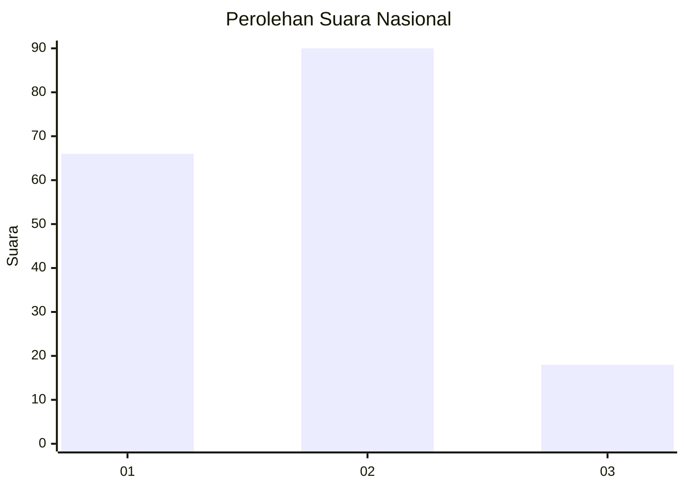
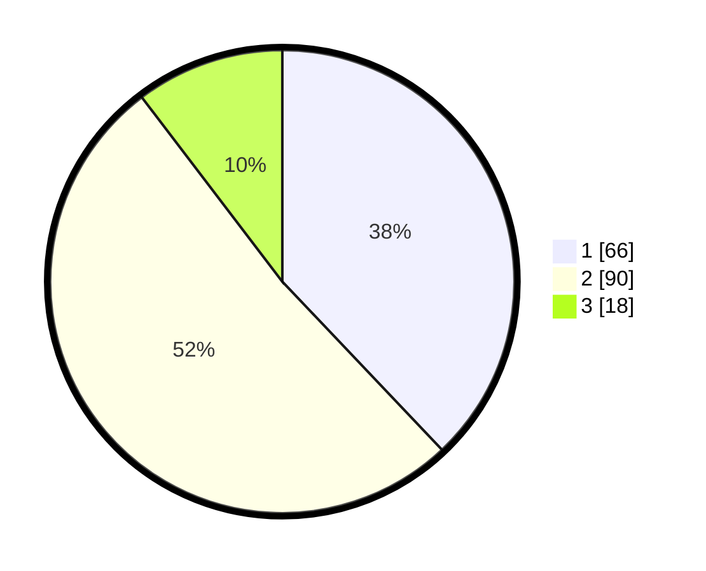

# Hasil

## Grafik

## Tabel

| No. | Nama Paslon    | Suara | Suara (raw) | Persentase |
|:--- |:-------------- | -----:| -----------:| ----------:|
| 1   | ANIES MUHAIMIN | 66    | [66][p-1]   | 37,93      |
| 2   | PRABOWO GIBRAN | 90    | [90][p-2]   | 51,72      |
| 3   | GANJAR MAHFUD  | 18    | [18][p-3]   | 10,34      |

[p-1]: https://github.com/gigit-pemilu/pemilu-2024/blob/main/pilpres/hitung-suara/sub/16-sumatera-selatan/sub/71-kota-palembang/sub/08-sako/sub/1002-sako/sub/091-tps/sub/paslon-1.txt
[p-2]: https://github.com/gigit-pemilu/pemilu-2024/blob/main/pilpres/hitung-suara/sub/16-sumatera-selatan/sub/71-kota-palembang/sub/08-sako/sub/1002-sako/sub/091-tps/sub/paslon-2.txt
[p-3]: https://github.com/gigit-pemilu/pemilu-2024/blob/main/pilpres/hitung-suara/sub/16-sumatera-selatan/sub/71-kota-palembang/sub/08-sako/sub/1002-sako/sub/091-tps/sub/paslon-3.txt

## Foto C Plano

https://sirekap-obj-formc.kpu.go.id/a6b9/pemilu/ppwp/16/71/08/10/02/1671081002091-20240220-140638--fcbd381e-cb73-48e6-8b45-ddaa2488e70c.jpg

https://sirekap-obj-formc.kpu.go.id/a6b9/pemilu/ppwp/16/71/08/10/02/1671081002091-20240220-140727--25b4d6d3-704a-4e28-9853-3d541b4a5ee3.jpg

https://sirekap-obj-formc.kpu.go.id/a6b9/pemilu/ppwp/16/71/08/10/02/1671081002091-20240220-140755--5eed982f-0e2b-4dbe-acb6-8a6eacc7844b.jpg

## Metadata

| Key        | Value               |
| ---------- | ------------------- |
| Time Stamp | 2024-02-20 15:00:00 |

## DATA PEMILIH TETAP

Jumlah pemilih dalam DPT: **228**.
 * L: **98**.
 * P: **630**.

## DATA PENGGUNA HAK PILIH

Jumlah pengguna hak pilih dalam DPT: **370**.
 * L: **76**.
 * P: **600**.

Jumlah pengguna hak pilih dalam DPTb: **3**.
 * L: **2**.
 * P: **1**.

Jumlah pengguna hak pilih dalam DPK: **3**.
 * L: **2**.
 * P: **4**.

Jumlah pengguna hak pilih: **176**.
 * L: **74**.
 * P: **502**.

## JUMLAH SUARA SAH DAN TIDAK SAH

JUMLAH SELURUH SUARA SAH: **874**.

JUMLAH SUARA TIDAK SAH: **2**.

JUMLAH SELURUH SUARA SAH DAN SUARA TIDAK SAH: **626**.

