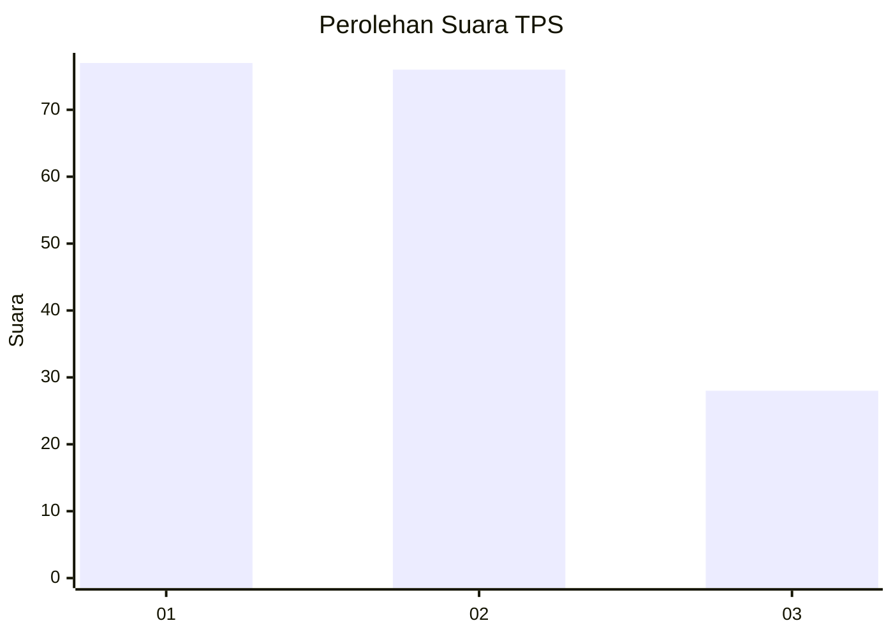
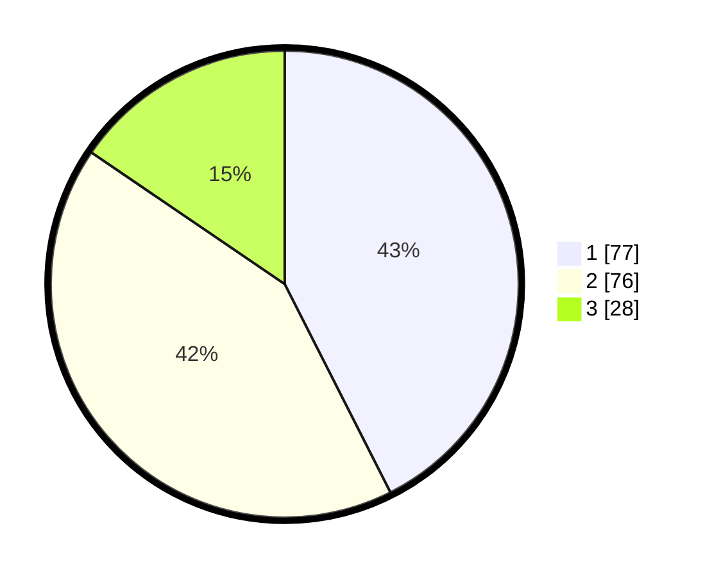

# Hasil

## Grafik

## Tabel

| No. | Nama Paslon    | Suara | Suara (raw) | Persentase |
|:--- |:-------------- | -----:| -----------:| ----------:|
| 1   | ANIES MUHAIMIN | 77    | [77][p-1]   | 42,54      |
| 2   | PRABOWO GIBRAN | 76    | [76][p-2]   | 41,99      |
| 3   | GANJAR MAHFUD  | 28    | [28][p-3]   | 15,47      |

[p-1]: https://github.com/gigit-pemilu/pemilu-2024-16-sumatera-selatan/blob/main/pilpres/hitung-suara/sub/16-sumatera-selatan/sub/71-kota-palembang/sub/08-sako/sub/1002-sako/sub/093-tps/sub/paslon-1.txt
[p-2]: https://github.com/gigit-pemilu/pemilu-2024-16-sumatera-selatan/blob/main/pilpres/hitung-suara/sub/16-sumatera-selatan/sub/71-kota-palembang/sub/08-sako/sub/1002-sako/sub/093-tps/sub/paslon-2.txt
[p-3]: https://github.com/gigit-pemilu/pemilu-2024-16-sumatera-selatan/blob/main/pilpres/hitung-suara/sub/16-sumatera-selatan/sub/71-kota-palembang/sub/08-sako/sub/1002-sako/sub/093-tps/sub/paslon-3.txt

## Foto C Plano

https://sirekap-obj-formc.kpu.go.id/b0c5/pemilu/ppwp/16/71/08/10/02/1671081002093-20240220-141352--6282f766-fe64-4088-a1e4-a823104a7411.jpg

https://sirekap-obj-formc.kpu.go.id/b0c5/pemilu/ppwp/16/71/08/10/02/1671081002093-20240220-141421--a53e7b0a-7b62-4230-9dc7-2fc845b4825d.jpg

https://sirekap-obj-formc.kpu.go.id/b0c5/pemilu/ppwp/16/71/08/10/02/1671081002093-20240220-141727--891de551-9821-4a59-a1ea-caad94840ad2.jpg

## Metadata

| Key        | Value               |
| ---------- | ------------------- |
| Time Stamp | 2024-02-20 15:00:00 |

## DATA PEMILIH TETAP

Jumlah pemilih dalam DPT: **245**.
 * L: **667**.
 * P: **824**.

## DATA PENGGUNA HAK PILIH

Jumlah pengguna hak pilih dalam DPT: **573**.
 * L: **86**.
 * P: **95**.

Jumlah pengguna hak pilih dalam DPTb: **832**.
 * L: **82**.
 * P: **8**.

Jumlah pengguna hak pilih dalam DPK: **5**.
 * L: **0**.
 * P: **6**.

Jumlah pengguna hak pilih: **585**.
 * L: **88**.
 * P: **93**.

## JUMLAH SUARA SAH DAN TIDAK SAH

JUMLAH SELURUH SUARA SAH: **588**.

JUMLAH SUARA TIDAK SAH: **0**.

JUMLAH SELURUH SUARA SAH DAN SUARA TIDAK SAH: **685**.

