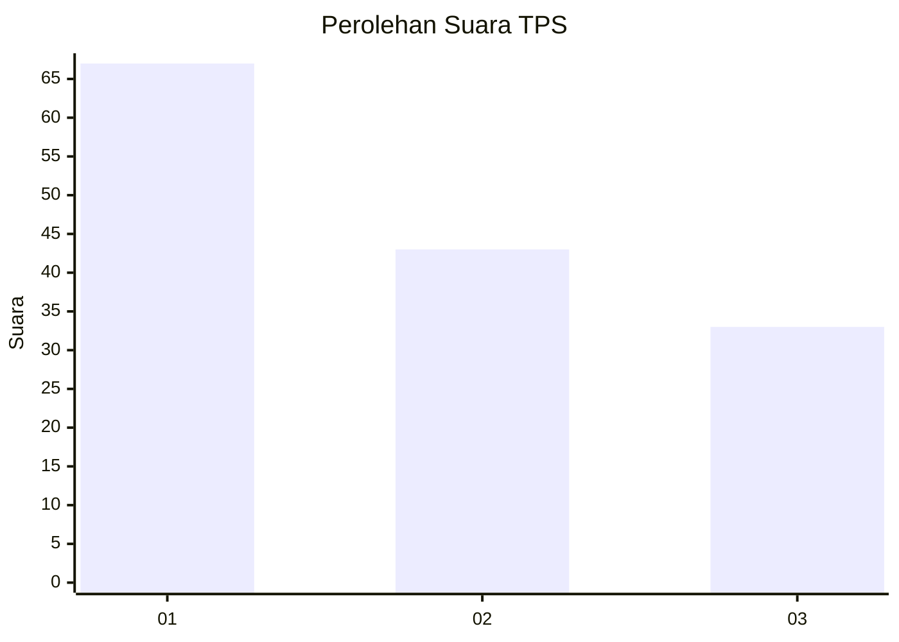
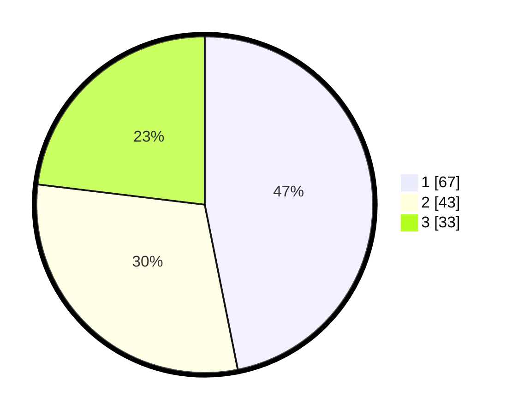

# Hasil

## Grafik

## Tabel

| No. | Nama Paslon    | Suara | Suara (raw) | Persentase |
|:--- |:-------------- | -----:| -----------:| ----------:|
| 1   | ANIES MUHAIMIN | 67    | [67][p-1]   | 46,85      |
| 2   | PRABOWO GIBRAN | 43    | [43][p-2]   | 30,07      |
| 3   | GANJAR MAHFUD  | 33    | [33][p-3]   | 23,08      |

[p-1]: https://github.com/gigit-pemilu/pemilu-2024-16-sumatera-selatan/blob/main/pilpres/hitung-suara/sub/16-sumatera-selatan/sub/71-kota-palembang/sub/08-sako/sub/1002-sako/sub/099-tps/sub/paslon-1.txt
[p-2]: https://github.com/gigit-pemilu/pemilu-2024-16-sumatera-selatan/blob/main/pilpres/hitung-suara/sub/16-sumatera-selatan/sub/71-kota-palembang/sub/08-sako/sub/1002-sako/sub/099-tps/sub/paslon-2.txt
[p-3]: https://github.com/gigit-pemilu/pemilu-2024-16-sumatera-selatan/blob/main/pilpres/hitung-suara/sub/16-sumatera-selatan/sub/71-kota-palembang/sub/08-sako/sub/1002-sako/sub/099-tps/sub/paslon-3.txt

## Foto C Plano

https://sirekap-obj-formc.kpu.go.id/d7ed/pemilu/ppwp/16/71/08/10/02/1671081002099-20240220-142312--59acbcbe-acb4-4f8c-b205-b7dfb6626684.jpg

https://sirekap-obj-formc.kpu.go.id/d7ed/pemilu/ppwp/16/71/08/10/02/1671081002099-20240220-142434--b93f4a79-3aee-46cc-8bdd-0d21e5e94cf7.jpg

https://sirekap-obj-formc.kpu.go.id/d7ed/pemilu/ppwp/16/71/08/10/02/1671081002099-20240220-142349--7cb8d462-1f13-40f6-8de1-f1e9efcf7f68.jpg

## Metadata

| Key        | Value               |
| ---------- | ------------------- |
| Time Stamp | 2024-02-20 15:00:00 |

## DATA PEMILIH TETAP

Jumlah pemilih dalam DPT: **229**.
 * L: **843**.
 * P: **536**.

## DATA PENGGUNA HAK PILIH

Jumlah pengguna hak pilih dalam DPT: **225**.
 * L: **409**.
 * P: **452**.

Jumlah pengguna hak pilih dalam DPTb: **5**.
 * L: **6**.
 * P: **0**.

Jumlah pengguna hak pilih dalam DPK: **80**.
 * L: **0**.
 * P: **0**.

Jumlah pengguna hak pilih: **222**.
 * L: **250**.
 * P: **652**.

## JUMLAH SUARA SAH DAN TIDAK SAH

JUMLAH SELURUH SUARA SAH: **213**.

JUMLAH SUARA TIDAK SAH: **9**.

JUMLAH SELURUH SUARA SAH DAN SUARA TIDAK SAH: **222**.

