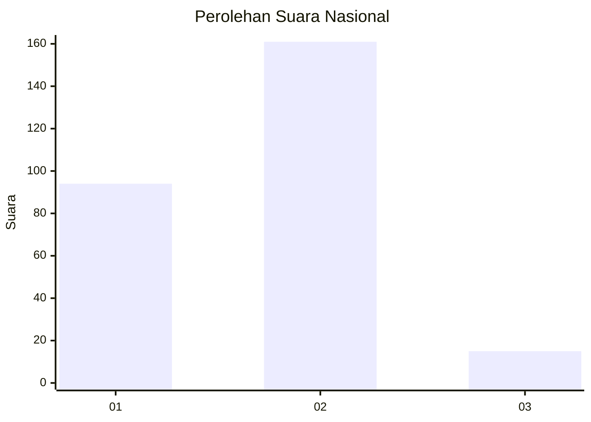
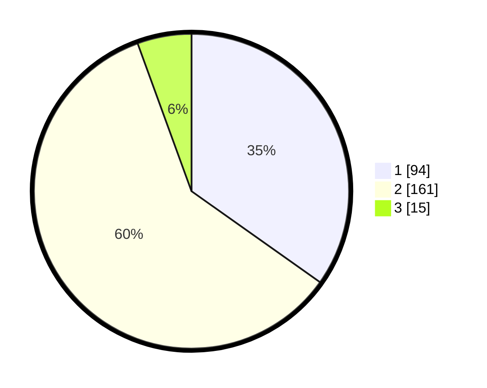

# Hasil

## Grafik

## Tabel

| No. | Nama Paslon    | Suara | Suara (raw) | Persentase |
|:--- |:-------------- | -----:| -----------:| ----------:|
| 1   | ANIES MUHAIMIN | 94    | [94][p-1]   | 34,81      |
| 2   | PRABOWO GIBRAN | 161   | [161][p-2]  | 59,63      |
| 3   | GANJAR MAHFUD  | 15    | [15][p-3]   | 5,56       |

[p-1]: https://github.com/gigit-pemilu/pemilu-2024/blob/main/pilpres/hitung-suara/sub/16-sumatera-selatan/sub/71-kota-palembang/sub/08-sako/sub/1006-sialang/sub/007-tps/sub/paslon-1.txt
[p-2]: https://github.com/gigit-pemilu/pemilu-2024/blob/main/pilpres/hitung-suara/sub/16-sumatera-selatan/sub/71-kota-palembang/sub/08-sako/sub/1006-sialang/sub/007-tps/sub/paslon-2.txt
[p-3]: https://github.com/gigit-pemilu/pemilu-2024/blob/main/pilpres/hitung-suara/sub/16-sumatera-selatan/sub/71-kota-palembang/sub/08-sako/sub/1006-sialang/sub/007-tps/sub/paslon-3.txt

## Foto C Plano

https://sirekap-obj-formc.kpu.go.id/836c/pemilu/ppwp/16/71/08/10/06/1671081006007-20240219-104101--8fd91162-5c13-4cb4-819a-fad3cd706f9d.jpg

https://sirekap-obj-formc.kpu.go.id/836c/pemilu/ppwp/16/71/08/10/06/1671081006007-20240219-103924--89acadc1-b483-498e-a94f-af9903b8d952.jpg

https://sirekap-obj-formc.kpu.go.id/836c/pemilu/ppwp/16/71/08/10/06/1671081006007-20240219-104009--cf751c97-b42b-4710-8d8b-cd406e04aea6.jpg

## Metadata

| Key        | Value               |
| ---------- | ------------------- |
| Time Stamp | 2024-02-19 11:00:00 |

## DATA PEMILIH TETAP

Jumlah pemilih dalam DPT: **149**.
 * L: **105**.
 * P: **550**.

## DATA PENGGUNA HAK PILIH

Jumlah pengguna hak pilih dalam DPT: **405**.
 * L: **780**.
 * P: **21**.

Jumlah pengguna hak pilih dalam DPTb: **425**.
 * L: **0**.
 * P: **4**.

Jumlah pengguna hak pilih dalam DPK: **0**.
 * L: **0**.
 * P: **0**.

Jumlah pengguna hak pilih: **220**.
 * L: **0**.
 * P: **6**.

## JUMLAH SUARA SAH DAN TIDAK SAH

JUMLAH SELURUH SUARA SAH: **220**.

JUMLAH SUARA TIDAK SAH: **5**.

JUMLAH SELURUH SUARA SAH DAN SUARA TIDAK SAH: **225**.

