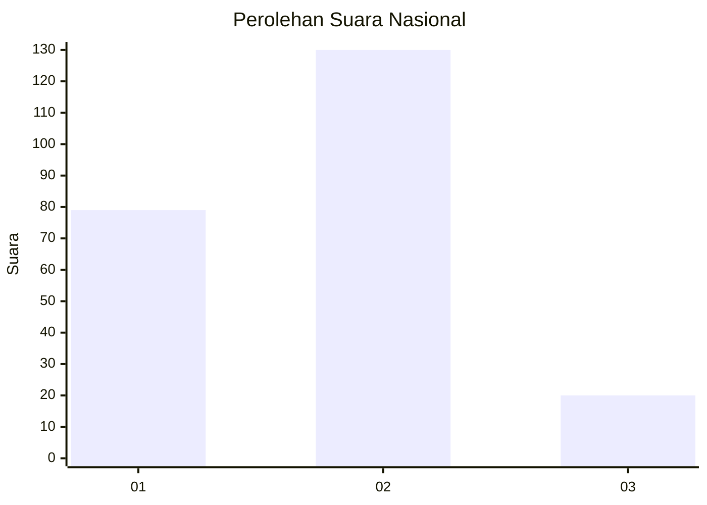
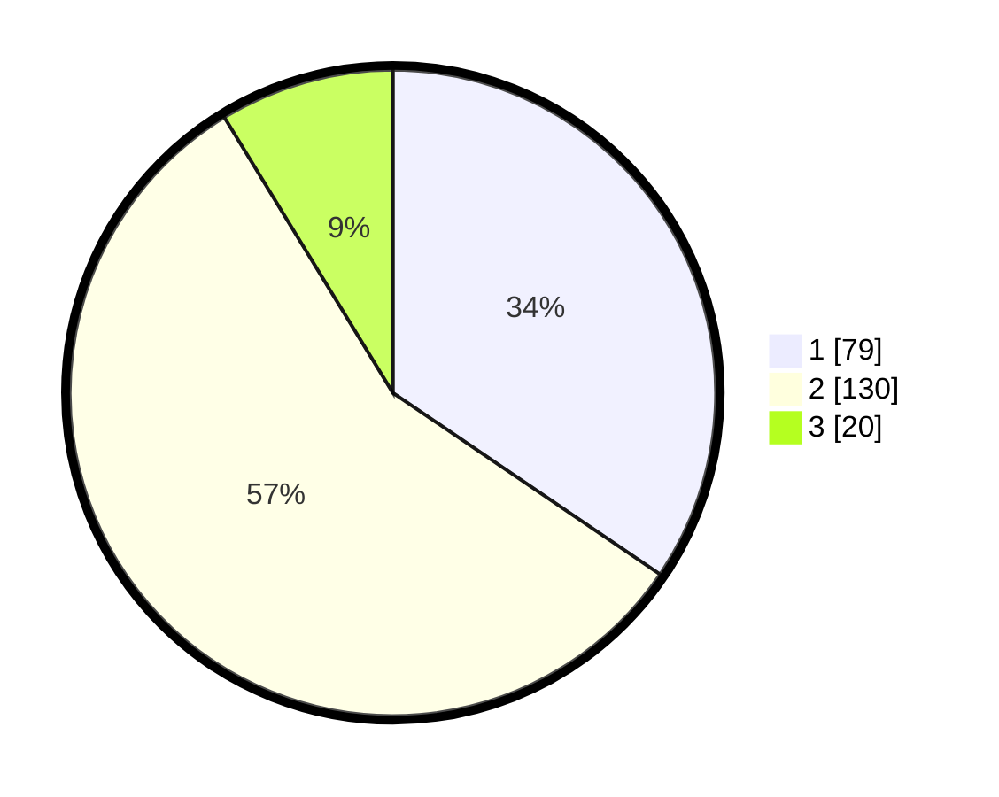

# Hasil

## Grafik

## Tabel

| No. | Nama Paslon    | Suara | Suara (raw) | Persentase |
|:--- |:-------------- | -----:| -----------:| ----------:|
| 1   | ANIES MUHAIMIN | 79    | [79][p-1]   | 34,50      |
| 2   | PRABOWO GIBRAN | 130   | [130][p-2]  | 56,77      |
| 3   | GANJAR MAHFUD  | 20    | [20][p-3]   | 8,73       |

[p-1]: https://github.com/gigit-pemilu/pemilu-2024/blob/main/pilpres/hitung-suara/sub/16-sumatera-selatan/sub/71-kota-palembang/sub/08-sako/sub/1007-sako-baru/sub/023-tps/sub/paslon-1.txt
[p-2]: https://github.com/gigit-pemilu/pemilu-2024/blob/main/pilpres/hitung-suara/sub/16-sumatera-selatan/sub/71-kota-palembang/sub/08-sako/sub/1007-sako-baru/sub/023-tps/sub/paslon-2.txt
[p-3]: https://github.com/gigit-pemilu/pemilu-2024/blob/main/pilpres/hitung-suara/sub/16-sumatera-selatan/sub/71-kota-palembang/sub/08-sako/sub/1007-sako-baru/sub/023-tps/sub/paslon-3.txt

## Foto C Plano

https://sirekap-obj-formc.kpu.go.id/997a/pemilu/ppwp/16/71/08/10/07/1671081007023-20240218-180514--8169e376-1ab6-422e-9a2f-2743f6a5ed86.jpg

https://sirekap-obj-formc.kpu.go.id/997a/pemilu/ppwp/16/71/08/10/07/1671081007023-20240218-175202--9f7b40c8-f054-4eb9-b7be-8b41010462f6.jpg

https://sirekap-obj-formc.kpu.go.id/997a/pemilu/ppwp/16/71/08/10/07/1671081007023-20240218-180132--5cfda80b-8747-4476-9f2d-226ddf2d2404.jpg

## Metadata

| Key        | Value               |
| ---------- | ------------------- |
| Time Stamp | 2024-02-19 06:16:00 |

## DATA PEMILIH TETAP

Jumlah pemilih dalam DPT: **213**.
 * L: **2**.
 * P: **20**.

## DATA PENGGUNA HAK PILIH

Jumlah pengguna hak pilih dalam DPT: **227**.
 * L: **777**.
 * P: **502**.

Jumlah pengguna hak pilih dalam DPTb: **202**.
 * L: **777**.
 * P: **325**.

Jumlah pengguna hak pilih dalam DPK: **204**.
 * L: **772**.
 * P: **732**.

Jumlah pengguna hak pilih: **533**.
 * L: **0**.
 * P: **2**.

## JUMLAH SUARA SAH DAN TIDAK SAH

JUMLAH SELURUH SUARA SAH: **229**.

JUMLAH SUARA TIDAK SAH: **4**.

JUMLAH SELURUH SUARA SAH DAN SUARA TIDAK SAH: **233**.

