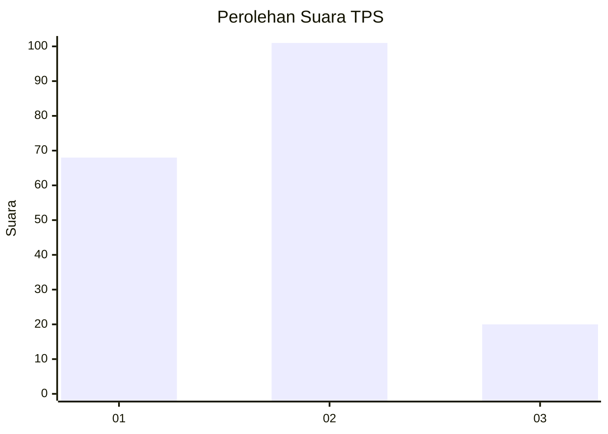
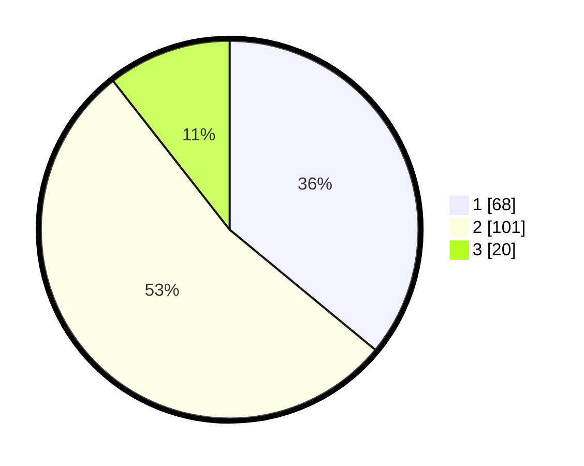

# Hasil

## Grafik

## Tabel

| No. | Nama Paslon    | Suara | Suara (raw) | Persentase |
|:--- |:-------------- | -----:| -----------:| ----------:|
| 1   | ANIES MUHAIMIN | 68    | [68][p-1]   | 35,98      |
| 2   | PRABOWO GIBRAN | 101   | [101][p-2]  | 53,44      |
| 3   | GANJAR MAHFUD  | 20    | [20][p-3]   | 10,58      |

[p-1]: https://github.com/gigit-pemilu/pemilu-2024-16-sumatera-selatan/blob/main/pilpres/hitung-suara/sub/16-sumatera-selatan/sub/71-kota-palembang/sub/09-kemuning/sub/1001-dua-puluh-ilir-dua/sub/003-tps/sub/paslon-1.txt
[p-2]: https://github.com/gigit-pemilu/pemilu-2024-16-sumatera-selatan/blob/main/pilpres/hitung-suara/sub/16-sumatera-selatan/sub/71-kota-palembang/sub/09-kemuning/sub/1001-dua-puluh-ilir-dua/sub/003-tps/sub/paslon-2.txt
[p-3]: https://github.com/gigit-pemilu/pemilu-2024-16-sumatera-selatan/blob/main/pilpres/hitung-suara/sub/16-sumatera-selatan/sub/71-kota-palembang/sub/09-kemuning/sub/1001-dua-puluh-ilir-dua/sub/003-tps/sub/paslon-3.txt

## Foto C Plano

https://sirekap-obj-formc.kpu.go.id/d8ef/pemilu/ppwp/16/71/09/10/01/1671091001003-20240215-013653--6cb74583-adc9-4242-85ec-87e48796fb92.jpg

https://sirekap-obj-formc.kpu.go.id/d8ef/pemilu/ppwp/16/71/09/10/01/1671091001003-20240215-013816--2c23cbe4-5741-4f3c-9f53-afbd1500645c.jpg

https://sirekap-obj-formc.kpu.go.id/d8ef/pemilu/ppwp/16/71/09/10/01/1671091001003-20240215-013911--80721f6f-9911-49c7-9584-b0bf0c34852f.jpg

## Metadata

| Key        | Value               |
| ---------- | ------------------- |
| Time Stamp | 2024-02-25 21:00:00 |

