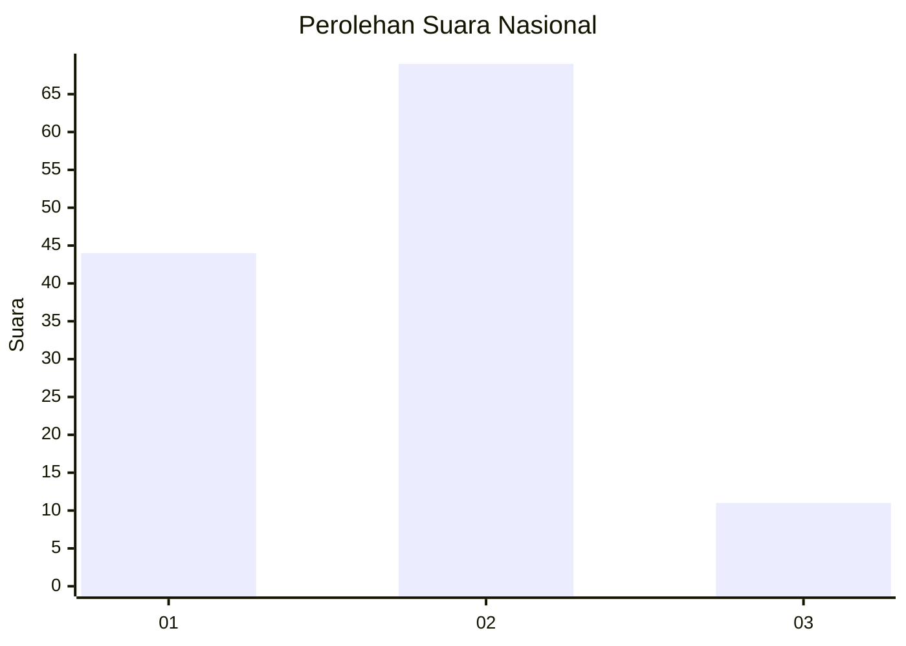
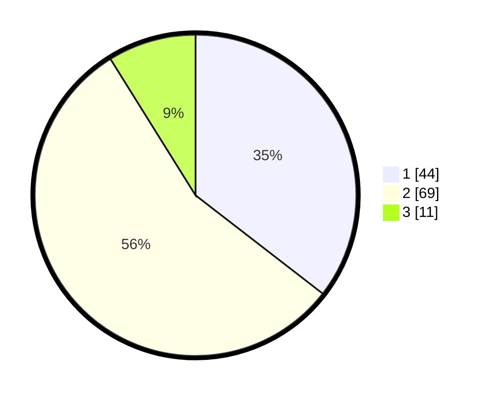

# Hasil

## Grafik

## Tabel

| No. | Nama Paslon    | Suara | Suara (raw) | Persentase |
|:--- |:-------------- | -----:| -----------:| ----------:|
| 1   | ANIES MUHAIMIN | 44    | [44][p-1]   | 35,48      |
| 2   | PRABOWO GIBRAN | 69    | [69][p-2]   | 55,65      |
| 3   | GANJAR MAHFUD  | 11    | [11][p-3]   | 8,87       |

[p-1]: https://github.com/gigit-pemilu/pemilu-2024/blob/main/pilpres/hitung-suara/sub/16-sumatera-selatan/sub/71-kota-palembang/sub/09-kemuning/sub/1001-dua-puluh-ilir-dua/sub/017-tps/sub/paslon-1.txt
[p-2]: https://github.com/gigit-pemilu/pemilu-2024/blob/main/pilpres/hitung-suara/sub/16-sumatera-selatan/sub/71-kota-palembang/sub/09-kemuning/sub/1001-dua-puluh-ilir-dua/sub/017-tps/sub/paslon-2.txt
[p-3]: https://github.com/gigit-pemilu/pemilu-2024/blob/main/pilpres/hitung-suara/sub/16-sumatera-selatan/sub/71-kota-palembang/sub/09-kemuning/sub/1001-dua-puluh-ilir-dua/sub/017-tps/sub/paslon-3.txt

## Foto C Plano

https://sirekap-obj-formc.kpu.go.id/72a5/pemilu/ppwp/16/71/09/10/01/1671091001017-20240219-151528--0e10f8fd-bf74-471b-bd44-ae7694f5d74c.jpg

https://sirekap-obj-formc.kpu.go.id/72a5/pemilu/ppwp/16/71/09/10/01/1671091001017-20240215-223242--12a2cd02-a60e-4af3-96ee-ef4baa096e73.jpg

https://sirekap-obj-formc.kpu.go.id/72a5/pemilu/ppwp/16/71/09/10/01/1671091001017-20240215-232144--1ec47113-1ad8-4433-9f88-f48dc95d8ec6.jpg

## Metadata

| Key        | Value               |
| ---------- | ------------------- |
| Time Stamp | 2024-02-19 16:00:00 |

