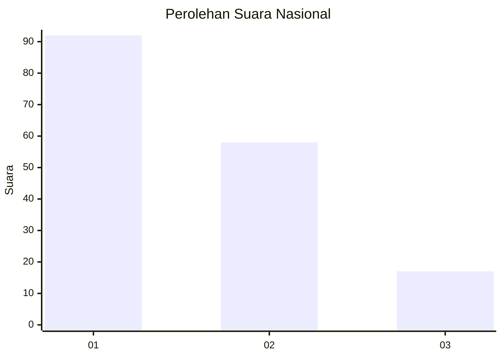
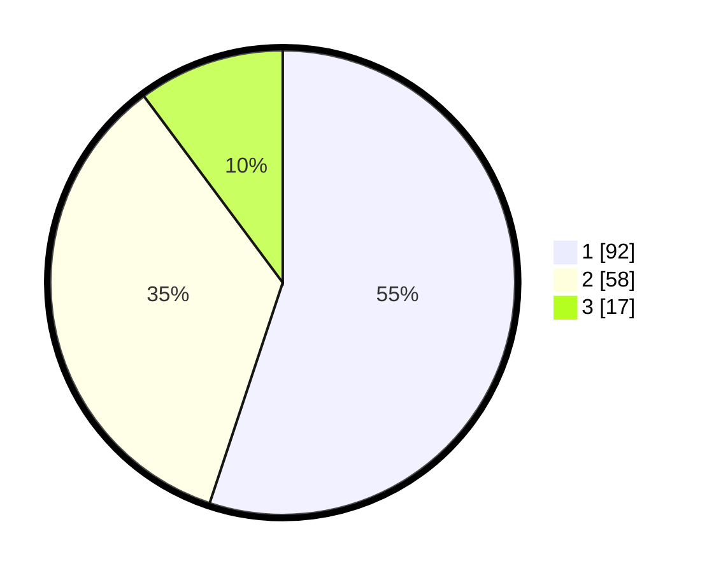

# Hasil

## Grafik

## Tabel

| No. | Nama Paslon    | Suara | Suara (raw) | Persentase |
|:--- |:-------------- | -----:| -----------:| ----------:|
| 1   | ANIES MUHAIMIN | 92    | [92][p-1]   | 55,09      |
| 2   | PRABOWO GIBRAN | 58    | [58][p-2]   | 34,73      |
| 3   | GANJAR MAHFUD  | 17    | [17][p-3]   | 10,18      |

[p-1]: https://github.com/gigit-pemilu/pemilu-2024/blob/main/pilpres/hitung-suara/sub/16-sumatera-selatan/sub/71-kota-palembang/sub/09-kemuning/sub/1001-dua-puluh-ilir-dua/sub/037-tps/sub/paslon-1.txt
[p-2]: https://github.com/gigit-pemilu/pemilu-2024/blob/main/pilpres/hitung-suara/sub/16-sumatera-selatan/sub/71-kota-palembang/sub/09-kemuning/sub/1001-dua-puluh-ilir-dua/sub/037-tps/sub/paslon-2.txt
[p-3]: https://github.com/gigit-pemilu/pemilu-2024/blob/main/pilpres/hitung-suara/sub/16-sumatera-selatan/sub/71-kota-palembang/sub/09-kemuning/sub/1001-dua-puluh-ilir-dua/sub/037-tps/sub/paslon-3.txt

## Foto C Plano

https://sirekap-obj-formc.kpu.go.id/366a/pemilu/ppwp/16/71/09/10/01/1671091001037-20240214-222632--593c9a81-d663-4f41-8f94-83c1e257aea3.jpg

https://sirekap-obj-formc.kpu.go.id/366a/pemilu/ppwp/16/71/09/10/01/1671091001037-20240214-222914--eb085311-5b12-4ccd-8639-21203658fa19.jpg

https://sirekap-obj-formc.kpu.go.id/366a/pemilu/ppwp/16/71/09/10/01/1671091001037-20240214-223102--3800a2ec-3ad9-4f45-b26a-57c49c596322.jpg

## Metadata

| Key        | Value               |
| ---------- | ------------------- |
| Time Stamp | 2024-02-24 22:31:28 |

