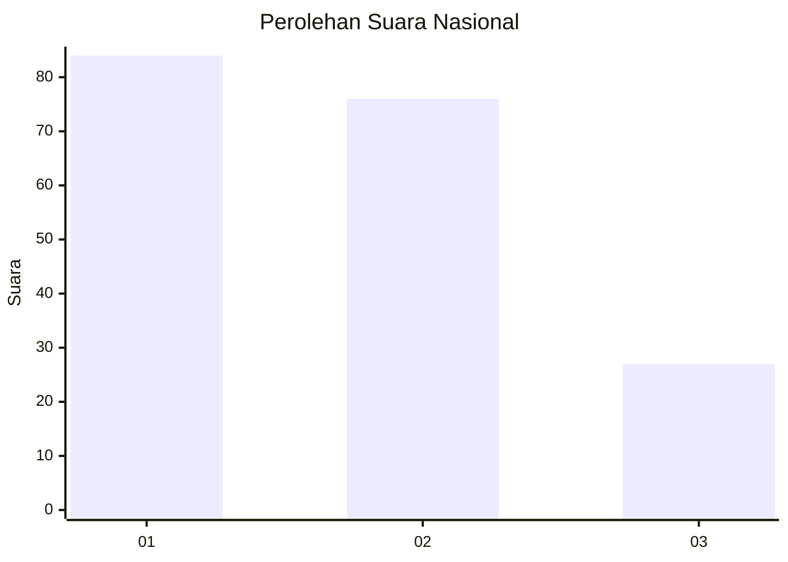
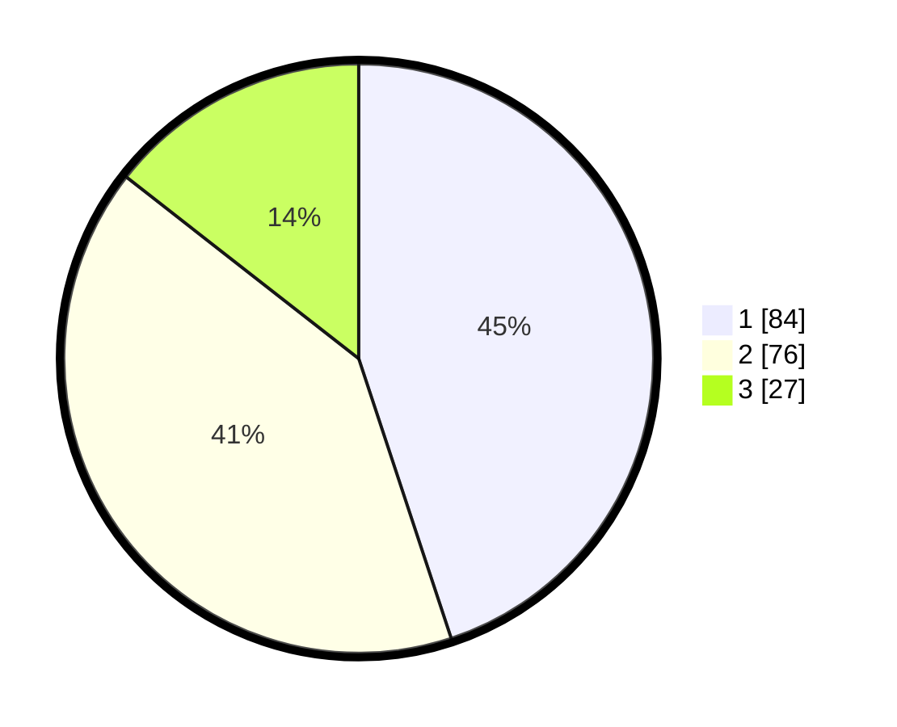

# Hasil

## Grafik

## Tabel

| No. | Nama Paslon    | Suara | Suara (raw) | Persentase |
|:--- |:-------------- | -----:| -----------:| ----------:|
| 1   | ANIES MUHAIMIN | 84    | [84][p-1]   | 44,92      |
| 2   | PRABOWO GIBRAN | 76    | [76][p-2]   | 40,64      |
| 3   | GANJAR MAHFUD  | 27    | [27][p-3]   | 14,44      |

[p-1]: https://github.com/gigit-pemilu/pemilu-2024/blob/main/pilpres/hitung-suara/sub/16-sumatera-selatan/sub/71-kota-palembang/sub/09-kemuning/sub/1001-dua-puluh-ilir-dua/sub/043-tps/sub/paslon-1.txt
[p-2]: https://github.com/gigit-pemilu/pemilu-2024/blob/main/pilpres/hitung-suara/sub/16-sumatera-selatan/sub/71-kota-palembang/sub/09-kemuning/sub/1001-dua-puluh-ilir-dua/sub/043-tps/sub/paslon-2.txt
[p-3]: https://github.com/gigit-pemilu/pemilu-2024/blob/main/pilpres/hitung-suara/sub/16-sumatera-selatan/sub/71-kota-palembang/sub/09-kemuning/sub/1001-dua-puluh-ilir-dua/sub/043-tps/sub/paslon-3.txt

## Foto C Plano

https://sirekap-obj-formc.kpu.go.id/f927/pemilu/ppwp/16/71/09/10/01/1671091001043-20240215-042200--8ea452c1-ab02-473a-b37b-7a6f4a5b9ac0.jpg

https://sirekap-obj-formc.kpu.go.id/f927/pemilu/ppwp/16/71/09/10/01/1671091001043-20240215-042320--4cc0b81a-2edc-498f-8fdc-0ef8c4efb729.jpg

https://sirekap-obj-formc.kpu.go.id/f927/pemilu/ppwp/16/71/09/10/01/1671091001043-20240215-042443--17d9d336-a2f0-46a8-8d11-269973df49c5.jpg

## Metadata

| Key        | Value               |
| ---------- | ------------------- |
| Time Stamp | 2024-02-25 20:00:00 |

