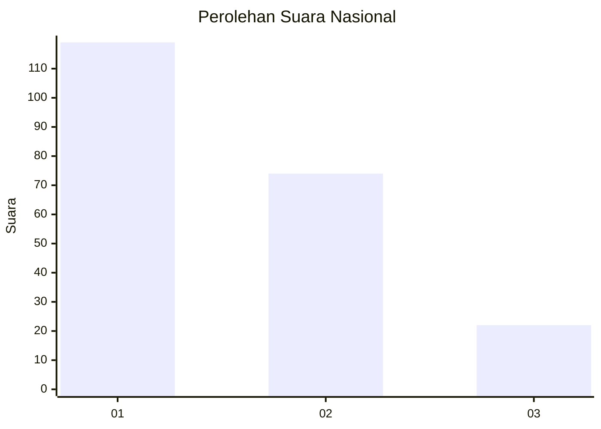
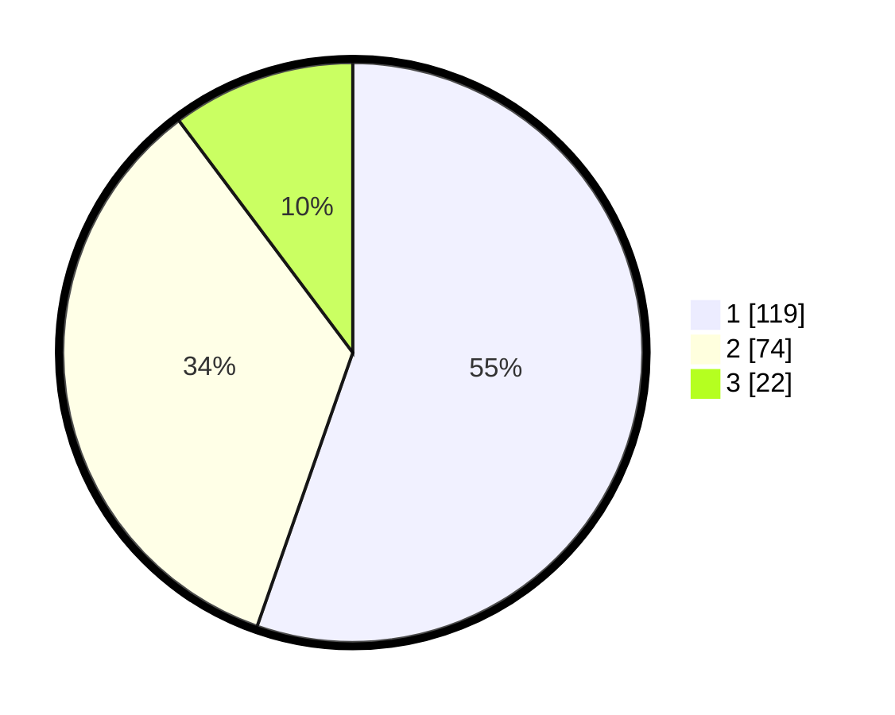

# Hasil

## Grafik

## Tabel

| No. | Nama Paslon    | Suara | Suara (raw) | Persentase |
|:--- |:-------------- | -----:| -----------:| ----------:|
| 1   | ANIES MUHAIMIN | 119   | [119][p-1]  | 55,35      |
| 2   | PRABOWO GIBRAN | 74    | [74][p-2]   | 34,42      |
| 3   | GANJAR MAHFUD  | 22    | [22][p-3]   | 10,23      |

[p-1]: https://github.com/gigit-pemilu/pemilu-2024/blob/main/pilpres/hitung-suara/sub/16-sumatera-selatan/sub/71-kota-palembang/sub/09-kemuning/sub/1003-sekipjaya/sub/015-tps/sub/paslon-1.txt
[p-2]: https://github.com/gigit-pemilu/pemilu-2024/blob/main/pilpres/hitung-suara/sub/16-sumatera-selatan/sub/71-kota-palembang/sub/09-kemuning/sub/1003-sekipjaya/sub/015-tps/sub/paslon-2.txt
[p-3]: https://github.com/gigit-pemilu/pemilu-2024/blob/main/pilpres/hitung-suara/sub/16-sumatera-selatan/sub/71-kota-palembang/sub/09-kemuning/sub/1003-sekipjaya/sub/015-tps/sub/paslon-3.txt

## Foto C Plano

https://sirekap-obj-formc.kpu.go.id/1b2e/pemilu/ppwp/16/71/09/10/03/1671091003015-20240214-223743--20edc51b-94a3-4187-810c-e0f9e2a37af8.jpg

https://sirekap-obj-formc.kpu.go.id/1b2e/pemilu/ppwp/16/71/09/10/03/1671091003015-20240215-025449--81f4bea7-af30-4c4a-87cb-dc7c23093cf6.jpg

https://sirekap-obj-formc.kpu.go.id/1b2e/pemilu/ppwp/16/71/09/10/03/1671091003015-20240214-211709--e75352ae-0d6d-4c2d-ad52-4abb1dab837b.jpg

## Metadata

| Key        | Value               |
| ---------- | ------------------- |
| Time Stamp | 2024-02-26 16:00:00 |

