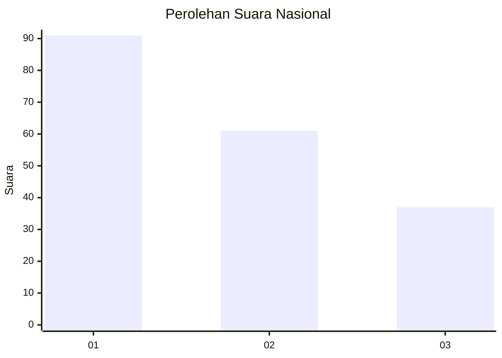
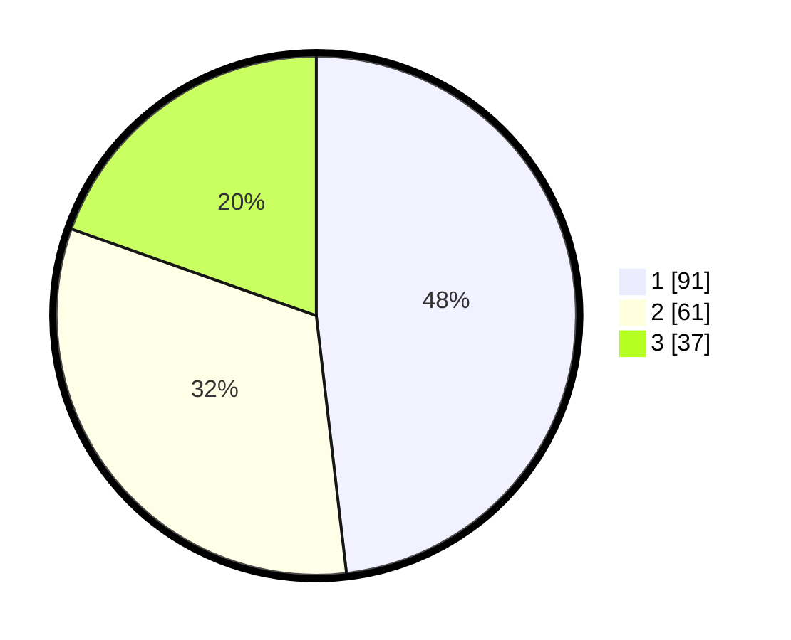

# Hasil

## Grafik

## Tabel

| No. | Nama Paslon    | Suara | Suara (raw) | Persentase |
|:--- |:-------------- | -----:| -----------:| ----------:|
| 1   | ANIES MUHAIMIN | 91    | [91][p-1]   | 48,15      |
| 2   | PRABOWO GIBRAN | 61    | [61][p-2]   | 32,28      |
| 3   | GANJAR MAHFUD  | 37    | [37][p-3]   | 19,58      |

[p-1]: https://github.com/gigit-pemilu/pemilu-2024/blob/main/pilpres/hitung-suara/sub/16-sumatera-selatan/sub/71-kota-palembang/sub/09-kemuning/sub/1003-sekipjaya/sub/023-tps/sub/paslon-1.txt
[p-2]: https://github.com/gigit-pemilu/pemilu-2024/blob/main/pilpres/hitung-suara/sub/16-sumatera-selatan/sub/71-kota-palembang/sub/09-kemuning/sub/1003-sekipjaya/sub/023-tps/sub/paslon-2.txt
[p-3]: https://github.com/gigit-pemilu/pemilu-2024/blob/main/pilpres/hitung-suara/sub/16-sumatera-selatan/sub/71-kota-palembang/sub/09-kemuning/sub/1003-sekipjaya/sub/023-tps/sub/paslon-3.txt

## Foto C Plano

https://sirekap-obj-formc.kpu.go.id/96ff/pemilu/ppwp/16/71/09/10/03/1671091003023-20240218-210850--01509a76-b271-480c-8879-ab86e01d2180.jpg

https://sirekap-obj-formc.kpu.go.id/96ff/pemilu/ppwp/16/71/09/10/03/1671091003023-20240214-193452--44e076a5-f2ae-4ecc-be7e-95dab189b12b.jpg

https://sirekap-obj-formc.kpu.go.id/96ff/pemilu/ppwp/16/71/09/10/03/1671091003023-20240214-193459--79389aa2-4a17-494c-ae83-a88f3f7ee94c.jpg

## Metadata

| Key        | Value               |
| ---------- | ------------------- |
| Time Stamp | 2024-02-24 22:31:28 |

