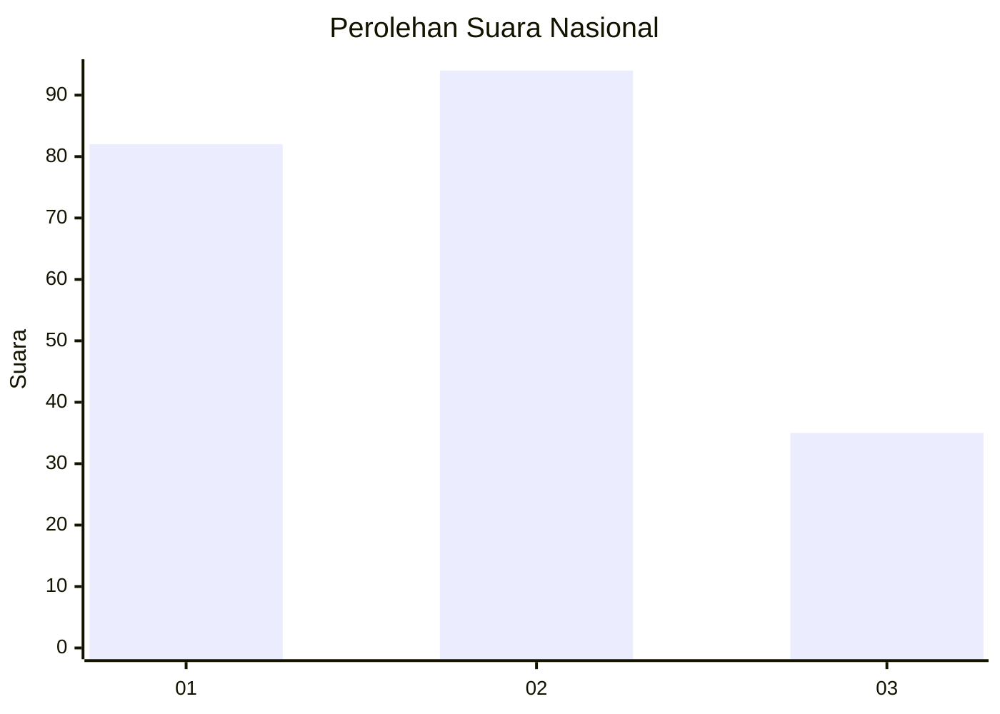
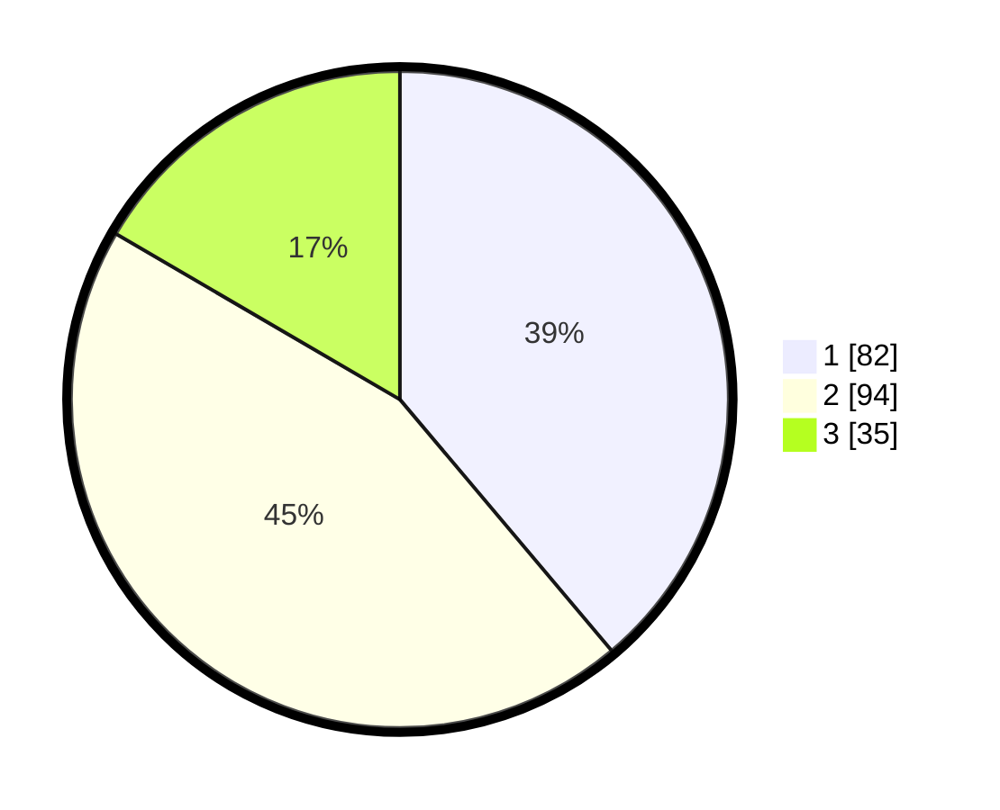

# Hasil

## Grafik

## Tabel

| No. | Nama Paslon    | Suara | Suara (raw) | Persentase |
|:--- |:-------------- | -----:| -----------:| ----------:|
| 1   | ANIES MUHAIMIN | 82    | [82][p-1]   | 38,86      |
| 2   | PRABOWO GIBRAN | 94    | [94][p-2]   | 44,55      |
| 3   | GANJAR MAHFUD  | 35    | [35][p-3]   | 16,59      |

[p-1]: https://github.com/gigit-pemilu/pemilu-2024/blob/main/pilpres/hitung-suara/sub/16-sumatera-selatan/sub/71-kota-palembang/sub/09-kemuning/sub/1004-pahlawan/sub/012-tps/sub/paslon-1.txt
[p-2]: https://github.com/gigit-pemilu/pemilu-2024/blob/main/pilpres/hitung-suara/sub/16-sumatera-selatan/sub/71-kota-palembang/sub/09-kemuning/sub/1004-pahlawan/sub/012-tps/sub/paslon-2.txt
[p-3]: https://github.com/gigit-pemilu/pemilu-2024/blob/main/pilpres/hitung-suara/sub/16-sumatera-selatan/sub/71-kota-palembang/sub/09-kemuning/sub/1004-pahlawan/sub/012-tps/sub/paslon-3.txt

## Foto C Plano

https://sirekap-obj-formc.kpu.go.id/e7d7/pemilu/ppwp/16/71/09/10/04/1671091004012-20240218-172302--cce60531-a345-4748-a90c-2a90052451e6.jpg

https://sirekap-obj-formc.kpu.go.id/e7d7/pemilu/ppwp/16/71/09/10/04/1671091004012-20240218-172351--9ac01aa0-fbb4-420d-a70e-b273362b3f3e.jpg

https://sirekap-obj-formc.kpu.go.id/e7d7/pemilu/ppwp/16/71/09/10/04/1671091004012-20240218-172448--df5a664e-1036-4c65-b0cf-6d87e9be000c.jpg

## Metadata

| Key        | Value               |
| ---------- | ------------------- |
| Time Stamp | 2024-02-25 17:00:00 |

