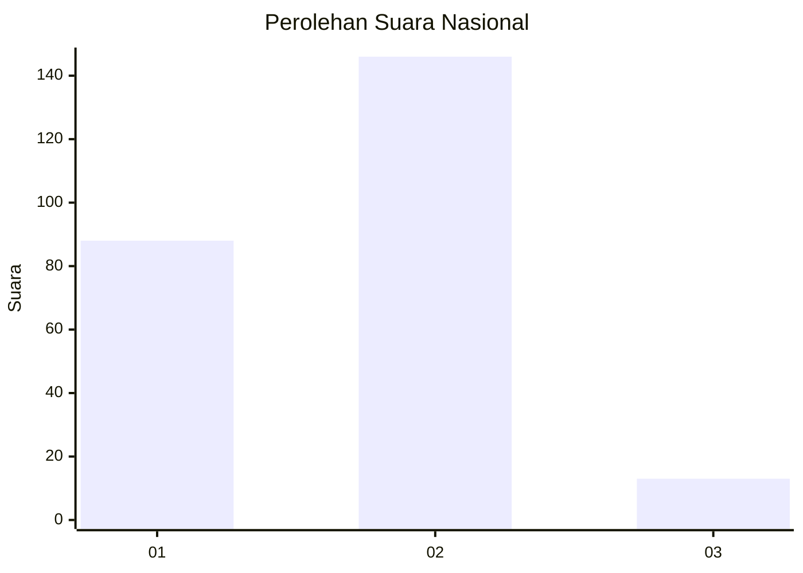
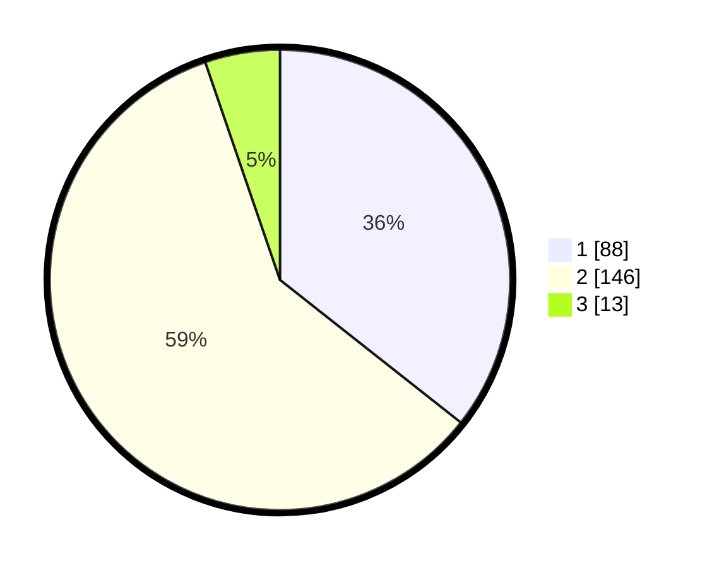

# Hasil

## Grafik

## Tabel

| No. | Nama Paslon    | Suara | Suara (raw) | Persentase |
|:--- |:-------------- | -----:| -----------:| ----------:|
| 1   | ANIES MUHAIMIN | 88    | [88][p-1]   | 35,63      |
| 2   | PRABOWO GIBRAN | 146   | [146][p-2]  | 59,11      |
| 3   | GANJAR MAHFUD  | 13    | [13][p-3]   | 5,26       |

[p-1]: https://github.com/gigit-pemilu/pemilu-2024/blob/main/pilpres/hitung-suara/sub/16-sumatera-selatan/sub/71-kota-palembang/sub/09-kemuning/sub/1005-pipareja/sub/025-tps/sub/paslon-1.txt
[p-2]: https://github.com/gigit-pemilu/pemilu-2024/blob/main/pilpres/hitung-suara/sub/16-sumatera-selatan/sub/71-kota-palembang/sub/09-kemuning/sub/1005-pipareja/sub/025-tps/sub/paslon-2.txt
[p-3]: https://github.com/gigit-pemilu/pemilu-2024/blob/main/pilpres/hitung-suara/sub/16-sumatera-selatan/sub/71-kota-palembang/sub/09-kemuning/sub/1005-pipareja/sub/025-tps/sub/paslon-3.txt

## Foto C Plano

https://sirekap-obj-formc.kpu.go.id/bc5b/pemilu/ppwp/16/71/09/10/05/1671091005025-20240219-103434--2797bc1f-b978-4ae1-9a80-bb83c58b8333.jpg

https://sirekap-obj-formc.kpu.go.id/bc5b/pemilu/ppwp/16/71/09/10/05/1671091005025-20240214-162222--b5b4dd04-9ea1-4237-9745-e32c06d267a4.jpg

https://sirekap-obj-formc.kpu.go.id/bc5b/pemilu/ppwp/16/71/09/10/05/1671091005025-20240214-162230--a3c1de82-2bec-4809-a76d-11267fe96ac9.jpg

## Metadata

| Key        | Value               |
| ---------- | ------------------- |
| Time Stamp | 2024-02-25 22:00:00 |

