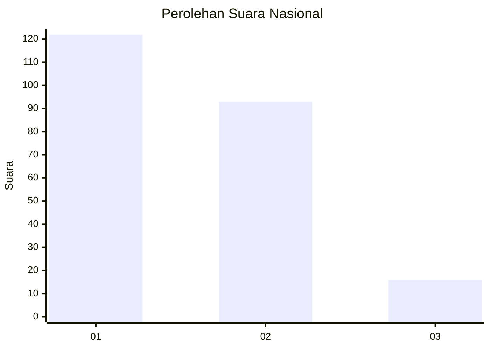
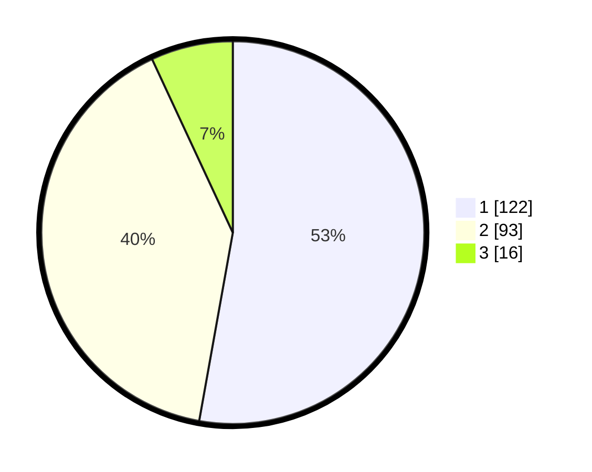

# Hasil

## Grafik

## Tabel

| No. | Nama Paslon    | Suara | Suara (raw) | Persentase |
|:--- |:-------------- | -----:| -----------:| ----------:|
| 1   | ANIES MUHAIMIN | 122   | [122][p-1]  | 52,81      |
| 2   | PRABOWO GIBRAN | 93    | [93][p-2]   | 40,26      |
| 3   | GANJAR MAHFUD  | 16    | [16][p-3]   | 6,93       |

[p-1]: https://github.com/gigit-pemilu/pemilu-2024/blob/main/pilpres/hitung-suara/sub/16-sumatera-selatan/sub/71-kota-palembang/sub/09-kemuning/sub/1006-talangaman/sub/014-tps/sub/paslon-1.txt
[p-2]: https://github.com/gigit-pemilu/pemilu-2024/blob/main/pilpres/hitung-suara/sub/16-sumatera-selatan/sub/71-kota-palembang/sub/09-kemuning/sub/1006-talangaman/sub/014-tps/sub/paslon-2.txt
[p-3]: https://github.com/gigit-pemilu/pemilu-2024/blob/main/pilpres/hitung-suara/sub/16-sumatera-selatan/sub/71-kota-palembang/sub/09-kemuning/sub/1006-talangaman/sub/014-tps/sub/paslon-3.txt

## Foto C Plano

https://sirekap-obj-formc.kpu.go.id/13af/pemilu/ppwp/16/71/09/10/06/1671091006014-20240218-224524--bdf088e8-c1b1-4334-9f76-4b68307c32e4.jpg

https://sirekap-obj-formc.kpu.go.id/13af/pemilu/ppwp/16/71/09/10/06/1671091006014-20240218-224609--93a51a66-a5f4-42e7-9eb3-bc39cf8d809f.jpg

https://sirekap-obj-formc.kpu.go.id/13af/pemilu/ppwp/16/71/09/10/06/1671091006014-20240218-224701--89a3d70b-e6c6-468d-b649-c265460f367b.jpg

## Metadata

| Key        | Value               |
| ---------- | ------------------- |
| Time Stamp | 2024-02-25 17:00:00 |

