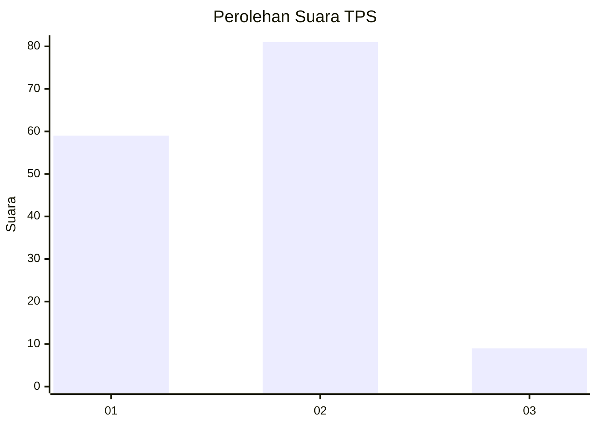
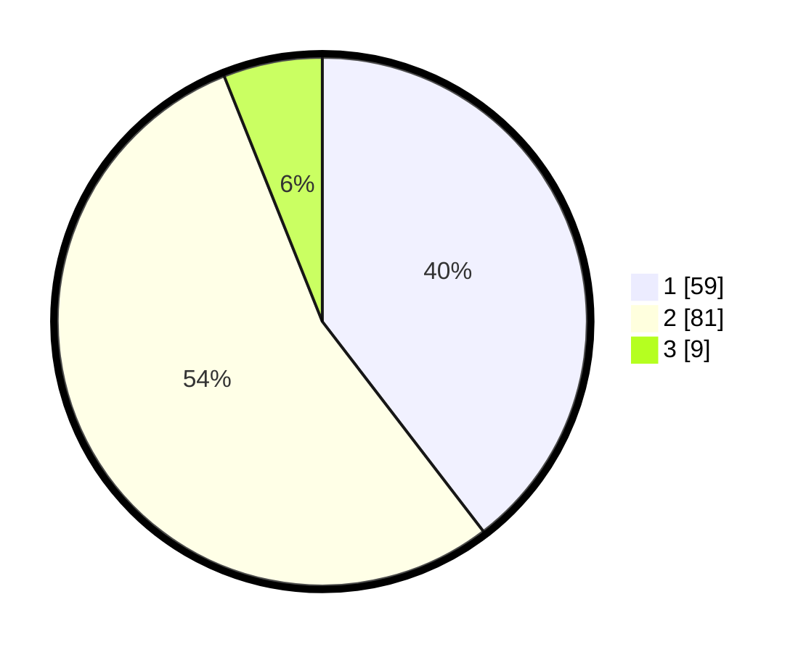

# Hasil

## Grafik

## Tabel

| No. | Nama Paslon    | Suara | Suara (raw) | Persentase |
|:--- |:-------------- | -----:| -----------:| ----------:|
| 1   | ANIES MUHAIMIN | 59    | [59][p-1]   | 39,60      |
| 2   | PRABOWO GIBRAN | 81    | [81][p-2]   | 54,36      |
| 3   | GANJAR MAHFUD  | 9     | [9][p-3]    | 6,04       |

[p-1]: https://github.com/gigit-pemilu/pemilu-2024-16-sumatera-selatan/blob/main/pilpres/hitung-suara/sub/16-sumatera-selatan/sub/71-kota-palembang/sub/09-kemuning/sub/1006-talangaman/sub/019-tps/sub/paslon-1.txt
[p-2]: https://github.com/gigit-pemilu/pemilu-2024-16-sumatera-selatan/blob/main/pilpres/hitung-suara/sub/16-sumatera-selatan/sub/71-kota-palembang/sub/09-kemuning/sub/1006-talangaman/sub/019-tps/sub/paslon-2.txt
[p-3]: https://github.com/gigit-pemilu/pemilu-2024-16-sumatera-selatan/blob/main/pilpres/hitung-suara/sub/16-sumatera-selatan/sub/71-kota-palembang/sub/09-kemuning/sub/1006-talangaman/sub/019-tps/sub/paslon-3.txt

## Foto C Plano

https://sirekap-obj-formc.kpu.go.id/10b2/pemilu/ppwp/16/71/09/10/06/1671091006019-20240218-225347--176bc478-62d0-40f1-986a-c4c07f8794b2.jpg

https://sirekap-obj-formc.kpu.go.id/10b2/pemilu/ppwp/16/71/09/10/06/1671091006019-20240218-225438--35a23f7d-fa81-4d71-83e6-d342b1bda3b6.jpg

https://sirekap-obj-formc.kpu.go.id/10b2/pemilu/ppwp/16/71/09/10/06/1671091006019-20240218-225540--1277f3d7-44b8-41b1-b897-6c39e0b46e54.jpg

## Metadata

| Key        | Value               |
| ---------- | ------------------- |
| Time Stamp | 2024-02-25 01:00:00 |

