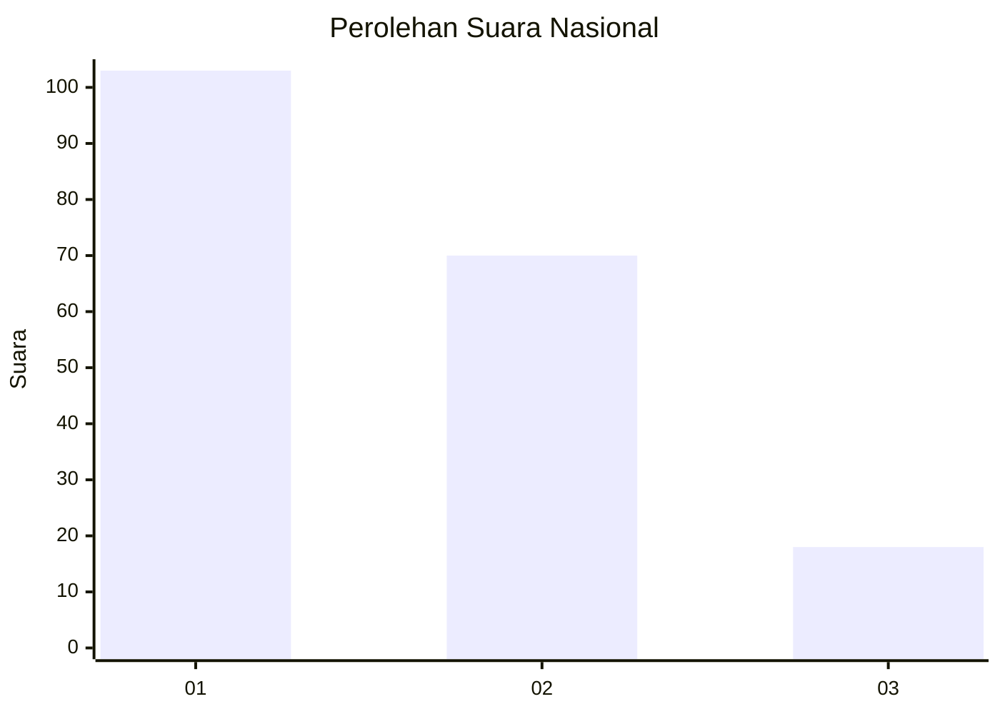
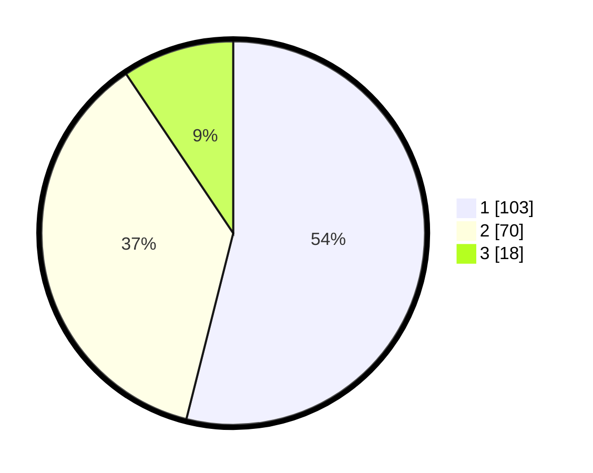

# Hasil

## Grafik

## Tabel

| No. | Nama Paslon    | Suara | Suara (raw) | Persentase |
|:--- |:-------------- | -----:| -----------:| ----------:|
| 1   | ANIES MUHAIMIN | 103   | [103][p-1]  | 53,93      |
| 2   | PRABOWO GIBRAN | 70    | [70][p-2]   | 36,65      |
| 3   | GANJAR MAHFUD  | 18    | [18][p-3]   | 9,42       |

[p-1]: https://github.com/gigit-pemilu/pemilu-2024/blob/main/pilpres/hitung-suara/sub/16-sumatera-selatan/sub/71-kota-palembang/sub/09-kemuning/sub/1006-talangaman/sub/024-tps/sub/paslon-1.txt
[p-2]: https://github.com/gigit-pemilu/pemilu-2024/blob/main/pilpres/hitung-suara/sub/16-sumatera-selatan/sub/71-kota-palembang/sub/09-kemuning/sub/1006-talangaman/sub/024-tps/sub/paslon-2.txt
[p-3]: https://github.com/gigit-pemilu/pemilu-2024/blob/main/pilpres/hitung-suara/sub/16-sumatera-selatan/sub/71-kota-palembang/sub/09-kemuning/sub/1006-talangaman/sub/024-tps/sub/paslon-3.txt

## Foto C Plano

https://sirekap-obj-formc.kpu.go.id/54d5/pemilu/ppwp/16/71/09/10/06/1671091006024-20240215-012459--36cc6103-1890-40ee-9d2b-3ad3a1c7d58c.jpg

https://sirekap-obj-formc.kpu.go.id/54d5/pemilu/ppwp/16/71/09/10/06/1671091006024-20240214-204304--55f6f347-c304-4874-8575-0a791f328ea0.jpg

https://sirekap-obj-formc.kpu.go.id/54d5/pemilu/ppwp/16/71/09/10/06/1671091006024-20240214-204526--88166b0c-43ed-4cc8-998b-7662af0d2858.jpg

## Metadata

| Key        | Value               |
| ---------- | ------------------- |
| Time Stamp | 2024-02-25 15:00:00 |

