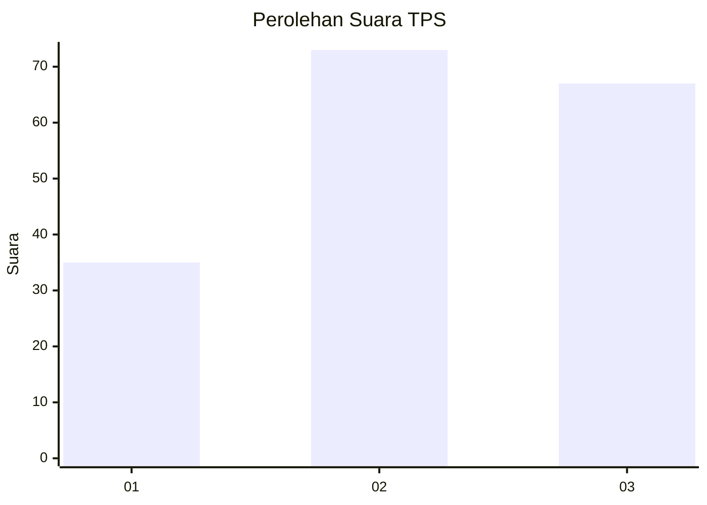
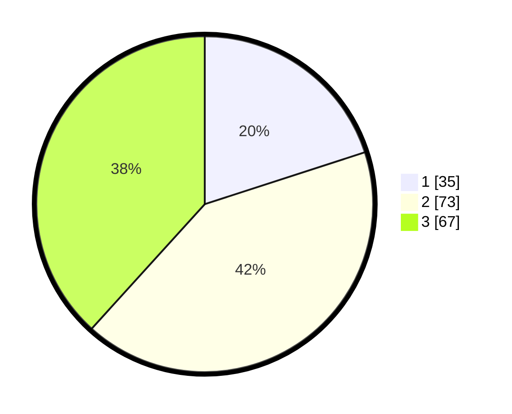

# Hasil

## Grafik

## Tabel

| No. | Nama Paslon    | Suara | Suara (raw) | Persentase |
|:--- |:-------------- | -----:| -----------:| ----------:|
| 1   | ANIES MUHAIMIN | 35    | [35][p-1]   | 20,00      |
| 2   | PRABOWO GIBRAN | 73    | [73][p-2]   | 41,71      |
| 3   | GANJAR MAHFUD  | 67    | [67][p-3]   | 38,29      |

[p-1]: https://github.com/gigit-pemilu/pemilu-2024-16-sumatera-selatan/blob/main/pilpres/hitung-suara/sub/16-sumatera-selatan/sub/71-kota-palembang/sub/10-kalidoni/sub/1001-bukitsangkal/sub/012-tps/sub/paslon-1.txt
[p-2]: https://github.com/gigit-pemilu/pemilu-2024-16-sumatera-selatan/blob/main/pilpres/hitung-suara/sub/16-sumatera-selatan/sub/71-kota-palembang/sub/10-kalidoni/sub/1001-bukitsangkal/sub/012-tps/sub/paslon-2.txt
[p-3]: https://github.com/gigit-pemilu/pemilu-2024-16-sumatera-selatan/blob/main/pilpres/hitung-suara/sub/16-sumatera-selatan/sub/71-kota-palembang/sub/10-kalidoni/sub/1001-bukitsangkal/sub/012-tps/sub/paslon-3.txt

## Foto C Plano

https://sirekap-obj-formc.kpu.go.id/ee78/pemilu/ppwp/16/71/10/10/01/1671101001012-20240214-195613--7573a2b8-e610-4304-a3f3-446a2397f3f9.jpg

https://sirekap-obj-formc.kpu.go.id/ee78/pemilu/ppwp/16/71/10/10/01/1671101001012-20240214-204633--e683daa0-3967-4acd-8c9a-9fe59f089602.jpg

https://sirekap-obj-formc.kpu.go.id/ee78/pemilu/ppwp/16/71/10/10/01/1671101001012-20240214-220912--8c5e70ee-28e7-4d9b-8f89-8ee43daf7fbc.jpg

## Metadata

| Key        | Value               |
| ---------- | ------------------- |
| Time Stamp | 2024-02-15 00:41:44 |

