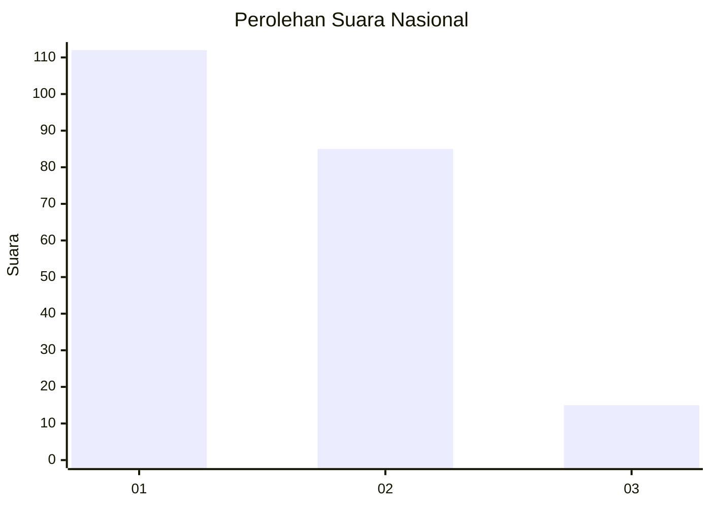
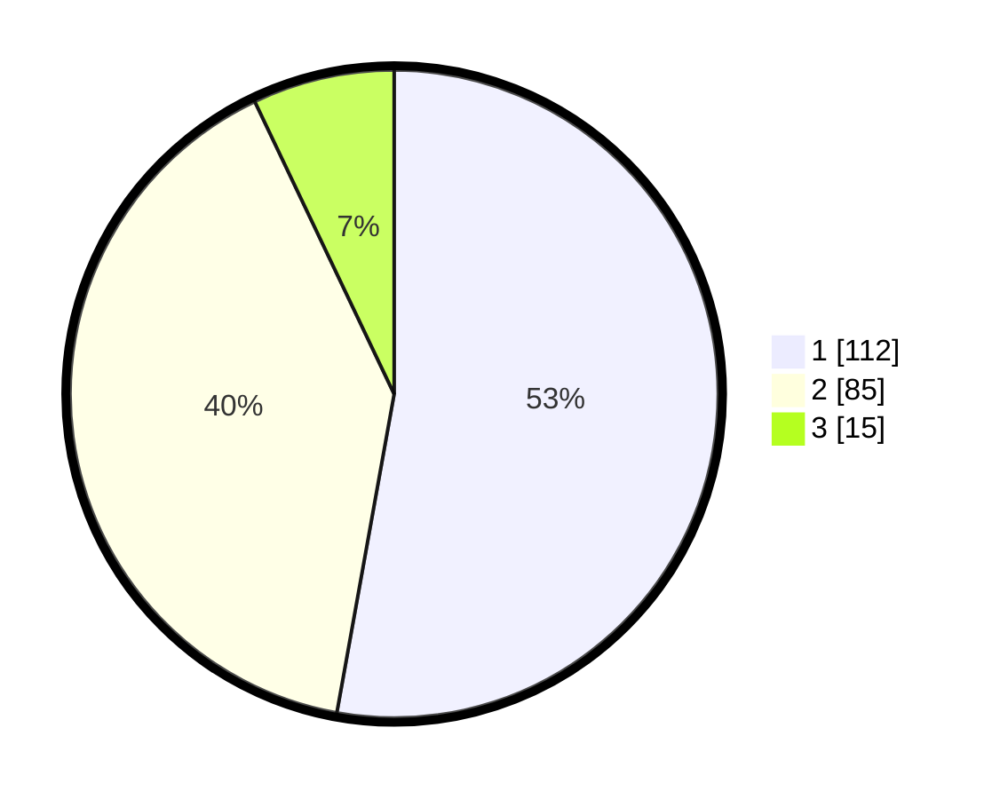

# Hasil

## Grafik

## Tabel

| No. | Nama Paslon    | Suara | Suara (raw) | Persentase |
|:--- |:-------------- | -----:| -----------:| ----------:|
| 1   | ANIES MUHAIMIN | 112   | [112][p-1]  | 52,83      |
| 2   | PRABOWO GIBRAN | 85    | [85][p-2]   | 40,09      |
| 3   | GANJAR MAHFUD  | 15    | [15][p-3]   | 7,08       |

[p-1]: https://github.com/gigit-pemilu/pemilu-2024/blob/main/pilpres/hitung-suara/sub/16-sumatera-selatan/sub/71-kota-palembang/sub/10-kalidoni/sub/1002-kalidoni/sub/009-tps/sub/paslon-1.txt
[p-2]: https://github.com/gigit-pemilu/pemilu-2024/blob/main/pilpres/hitung-suara/sub/16-sumatera-selatan/sub/71-kota-palembang/sub/10-kalidoni/sub/1002-kalidoni/sub/009-tps/sub/paslon-2.txt
[p-3]: https://github.com/gigit-pemilu/pemilu-2024/blob/main/pilpres/hitung-suara/sub/16-sumatera-selatan/sub/71-kota-palembang/sub/10-kalidoni/sub/1002-kalidoni/sub/009-tps/sub/paslon-3.txt

## Foto C Plano

https://sirekap-obj-formc.kpu.go.id/dd88/pemilu/ppwp/16/71/10/10/02/1671101002009-20240214-202828--89b3c8b5-93e1-4f0b-bbe7-da27c3889783.jpg

https://sirekap-obj-formc.kpu.go.id/dd88/pemilu/ppwp/16/71/10/10/02/1671101002009-20240214-193715--f00ee983-bed1-4e86-bc38-d2e8d07a11ce.jpg

https://sirekap-obj-formc.kpu.go.id/dd88/pemilu/ppwp/16/71/10/10/02/1671101002009-20240214-194521--cd34d539-cc7f-4f21-bd8c-a5b74683a403.jpg

## Metadata

| Key        | Value               |
| ---------- | ------------------- |
| Time Stamp | 2024-02-25 19:00:00 |

