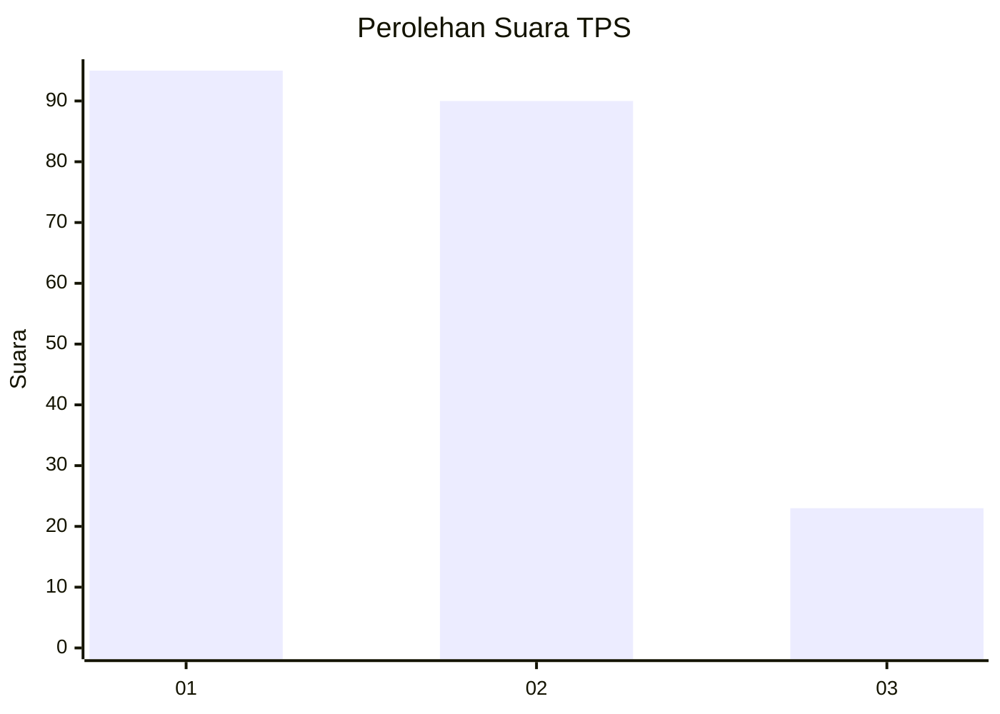
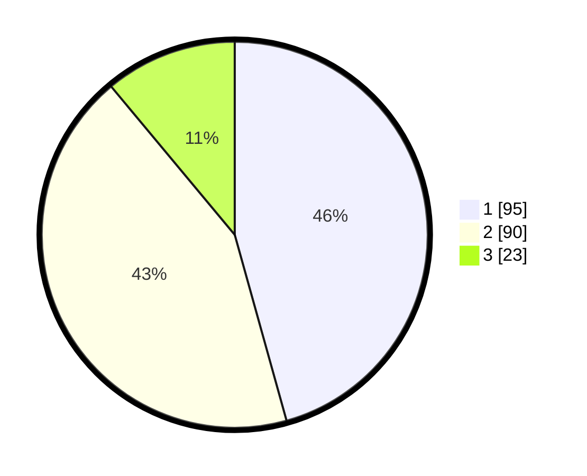

# Hasil

## Grafik

## Tabel

| No. | Nama Paslon    | Suara | Suara (raw) | Persentase |
|:--- |:-------------- | -----:| -----------:| ----------:|
| 1   | ANIES MUHAIMIN | 95    | [95][p-1]   | 45,67      |
| 2   | PRABOWO GIBRAN | 90    | [90][p-2]   | 43,27      |
| 3   | GANJAR MAHFUD  | 23    | [23][p-3]   | 11,06      |

[p-1]: https://github.com/gigit-pemilu/pemilu-2024-16-sumatera-selatan/blob/main/pilpres/hitung-suara/sub/16-sumatera-selatan/sub/71-kota-palembang/sub/10-kalidoni/sub/1002-kalidoni/sub/014-tps/sub/paslon-1.txt
[p-2]: https://github.com/gigit-pemilu/pemilu-2024-16-sumatera-selatan/blob/main/pilpres/hitung-suara/sub/16-sumatera-selatan/sub/71-kota-palembang/sub/10-kalidoni/sub/1002-kalidoni/sub/014-tps/sub/paslon-2.txt
[p-3]: https://github.com/gigit-pemilu/pemilu-2024-16-sumatera-selatan/blob/main/pilpres/hitung-suara/sub/16-sumatera-selatan/sub/71-kota-palembang/sub/10-kalidoni/sub/1002-kalidoni/sub/014-tps/sub/paslon-3.txt

## Foto C Plano

https://sirekap-obj-formc.kpu.go.id/fa5e/pemilu/ppwp/16/71/10/10/02/1671101002014-20240218-160531--d9b46e61-1e22-4657-8cfd-3d0fe347b748.jpg

https://sirekap-obj-formc.kpu.go.id/fa5e/pemilu/ppwp/16/71/10/10/02/1671101002014-20240218-160621--f8e877ad-5579-4ed1-92e3-6293aab72c1b.jpg

https://sirekap-obj-formc.kpu.go.id/fa5e/pemilu/ppwp/16/71/10/10/02/1671101002014-20240218-160705--8b4c6eec-e050-486a-a9a8-6581d6089617.jpg

## Metadata

| Key        | Value               |
| ---------- | ------------------- |
| Time Stamp | 2024-02-25 18:00:00 |

