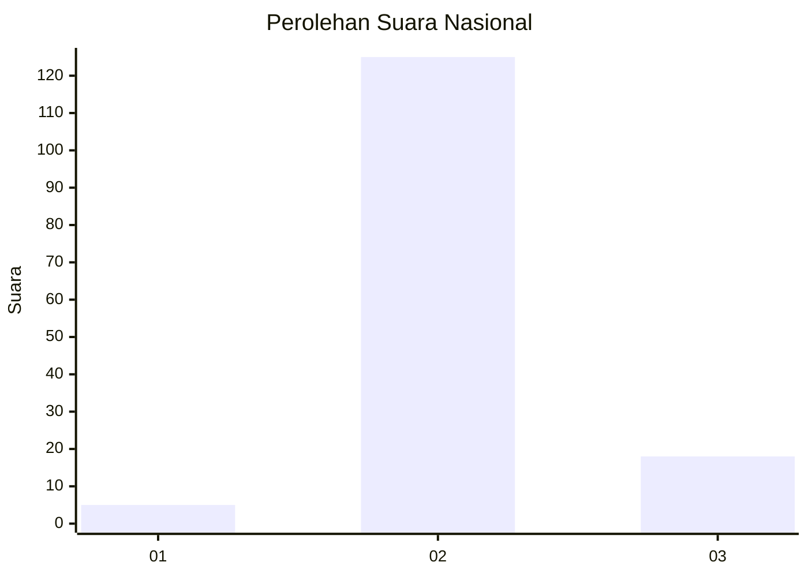
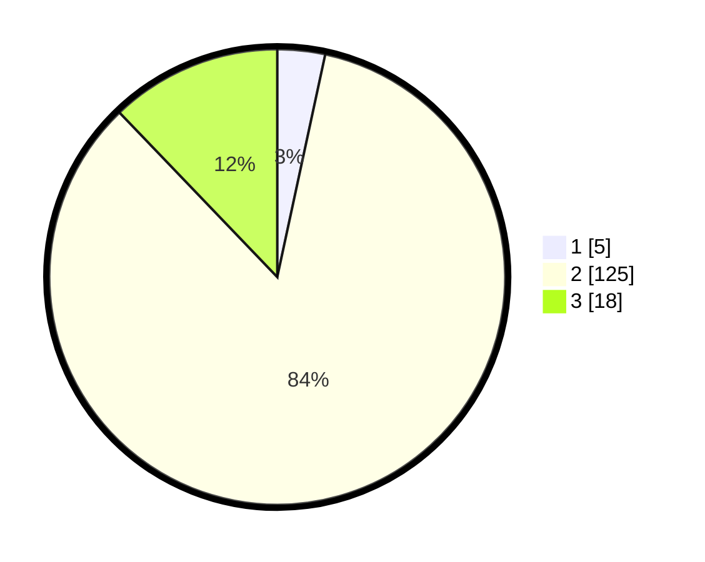

# Hasil

## Grafik

## Tabel

| No. | Nama Paslon    | Suara | Suara (raw) | Persentase |
|:--- |:-------------- | -----:| -----------:| ----------:|
| 1   | ANIES MUHAIMIN | 5     | [5][p-1]    | 3,38       |
| 2   | PRABOWO GIBRAN | 125   | [125][p-2]  | 84,46      |
| 3   | GANJAR MAHFUD  | 18    | [18][p-3]   | 12,16      |

[p-1]: https://github.com/gigit-pemilu/pemilu-2024/blob/main/pilpres/hitung-suara/sub/16-sumatera-selatan/sub/71-kota-palembang/sub/10-kalidoni/sub/1002-kalidoni/sub/017-tps/sub/paslon-1.txt
[p-2]: https://github.com/gigit-pemilu/pemilu-2024/blob/main/pilpres/hitung-suara/sub/16-sumatera-selatan/sub/71-kota-palembang/sub/10-kalidoni/sub/1002-kalidoni/sub/017-tps/sub/paslon-2.txt
[p-3]: https://github.com/gigit-pemilu/pemilu-2024/blob/main/pilpres/hitung-suara/sub/16-sumatera-selatan/sub/71-kota-palembang/sub/10-kalidoni/sub/1002-kalidoni/sub/017-tps/sub/paslon-3.txt

## Foto C Plano

https://sirekap-obj-formc.kpu.go.id/88a6/pemilu/ppwp/16/71/10/10/02/1671101002017-20240218-163038--2e04842c-682d-44bc-ae08-3af3691355e5.jpg

https://sirekap-obj-formc.kpu.go.id/88a6/pemilu/ppwp/16/71/10/10/02/1671101002017-20240218-162958--13cada4c-1561-4bd7-8530-2ee5f52a9e4a.jpg

https://sirekap-obj-formc.kpu.go.id/88a6/pemilu/ppwp/16/71/10/10/02/1671101002017-20240218-163113--bf1eca74-9358-489d-bf8f-a35869f0a3c2.jpg

## Metadata

| Key        | Value               |
| ---------- | ------------------- |
| Time Stamp | 2024-02-19 06:16:00 |

## DATA PEMILIH TETAP

Jumlah pemilih dalam DPT: **274**.
 * L: **121**.
 * P: **153**.

## DATA PENGGUNA HAK PILIH

Jumlah pengguna hak pilih dalam DPT: **212**.
 * L: **95**.
 * P: **117**.

Jumlah pengguna hak pilih dalam DPTb: **488**.
 * L: **88**.
 * P: **288**.

Jumlah pengguna hak pilih dalam DPK: **808**.
 * L: **4**.
 * P: **848**.

Jumlah pengguna hak pilih: **212**.
 * L: **888**.
 * P: **488**.

## JUMLAH SUARA SAH DAN TIDAK SAH

JUMLAH SELURUH SUARA SAH: **212**.

JUMLAH SUARA TIDAK SAH: **801**.

JUMLAH SELURUH SUARA SAH DAN SUARA TIDAK SAH: **213**.

