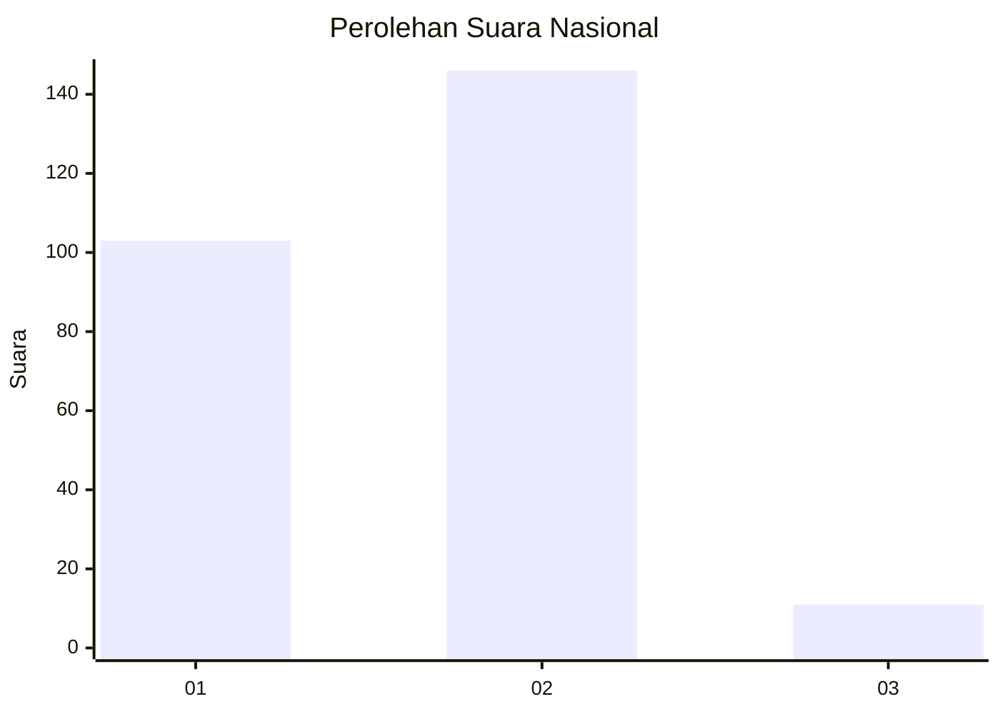
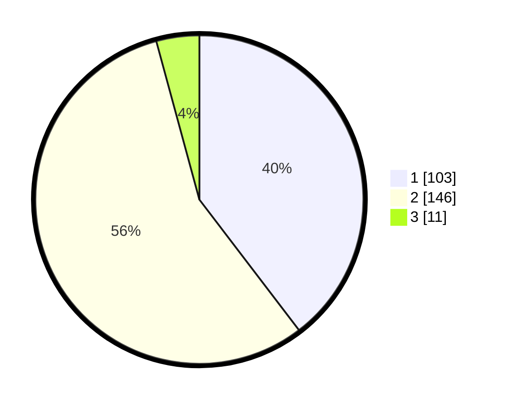

# Hasil

## Grafik

## Tabel

| No. | Nama Paslon    | Suara | Suara (raw) | Persentase |
|:--- |:-------------- | -----:| -----------:| ----------:|
| 1   | ANIES MUHAIMIN | 103   | [103][p-1]  | 39,62      |
| 2   | PRABOWO GIBRAN | 146   | [146][p-2]  | 56,15      |
| 3   | GANJAR MAHFUD  | 11    | [11][p-3]   | 4,23       |

[p-1]: https://github.com/gigit-pemilu/pemilu-2024/blob/main/pilpres/hitung-suara/sub/16-sumatera-selatan/sub/71-kota-palembang/sub/10-kalidoni/sub/1002-kalidoni/sub/026-tps/sub/paslon-1.txt
[p-2]: https://github.com/gigit-pemilu/pemilu-2024/blob/main/pilpres/hitung-suara/sub/16-sumatera-selatan/sub/71-kota-palembang/sub/10-kalidoni/sub/1002-kalidoni/sub/026-tps/sub/paslon-2.txt
[p-3]: https://github.com/gigit-pemilu/pemilu-2024/blob/main/pilpres/hitung-suara/sub/16-sumatera-selatan/sub/71-kota-palembang/sub/10-kalidoni/sub/1002-kalidoni/sub/026-tps/sub/paslon-3.txt

## Foto C Plano

https://sirekap-obj-formc.kpu.go.id/c74f/pemilu/ppwp/16/71/10/10/02/1671101002026-20240218-201422--1117ec3b-835c-48f5-8283-ab6ae3dd56cf.jpg

https://sirekap-obj-formc.kpu.go.id/c74f/pemilu/ppwp/16/71/10/10/02/1671101002026-20240218-201510--f9f93dd4-f89f-4db3-a4da-38ba67770de5.jpg

https://sirekap-obj-formc.kpu.go.id/c74f/pemilu/ppwp/16/71/10/10/02/1671101002026-20240218-201550--fc7ef8f8-940f-4aaf-a043-3868e512c1d0.jpg

## Metadata

| Key        | Value               |
| ---------- | ------------------- |
| Time Stamp | 2024-02-19 15:00:00 |

## DATA PEMILIH TETAP

Jumlah pemilih dalam DPT: **298**.
 * L: **154**.
 * P: **144**.

## DATA PENGGUNA HAK PILIH

Jumlah pengguna hak pilih dalam DPT: **299**.
 * L: **111**.
 * P: **138**.

Jumlah pengguna hak pilih dalam DPTb: **11**.
 * L: **408**.
 * P: **3**.

Jumlah pengguna hak pilih dalam DPK: **0**.
 * L: **0**.
 * P: **0**.

Jumlah pengguna hak pilih: **260**.
 * L: **819**.
 * P: **191**.

## JUMLAH SUARA SAH DAN TIDAK SAH

JUMLAH SELURUH SUARA SAH: **260**.

JUMLAH SUARA TIDAK SAH: **0**.

JUMLAH SELURUH SUARA SAH DAN SUARA TIDAK SAH: **260**.

