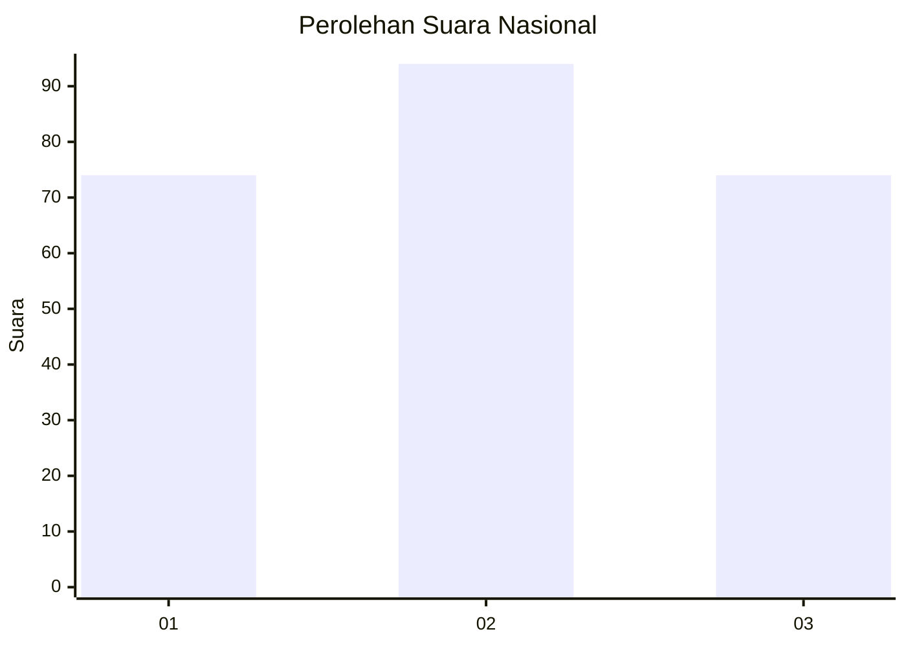
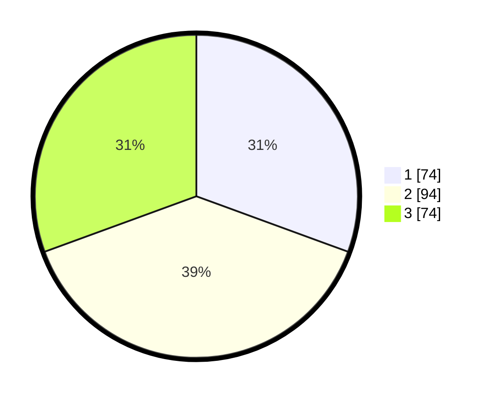

# Hasil

## Grafik

## Tabel

| No. | Nama Paslon    | Suara | Suara (raw) | Persentase |
|:--- |:-------------- | -----:| -----------:| ----------:|
| 1   | ANIES MUHAIMIN | 74    | [74][p-1]   | 30,58      |
| 2   | PRABOWO GIBRAN | 94    | [94][p-2]   | 38,84      |
| 3   | GANJAR MAHFUD  | 74    | [74][p-3]   | 30,58      |

[p-1]: https://github.com/gigit-pemilu/pemilu-2024/blob/main/pilpres/hitung-suara/sub/16-sumatera-selatan/sub/71-kota-palembang/sub/10-kalidoni/sub/1002-kalidoni/sub/042-tps/sub/paslon-1.txt
[p-2]: https://github.com/gigit-pemilu/pemilu-2024/blob/main/pilpres/hitung-suara/sub/16-sumatera-selatan/sub/71-kota-palembang/sub/10-kalidoni/sub/1002-kalidoni/sub/042-tps/sub/paslon-2.txt
[p-3]: https://github.com/gigit-pemilu/pemilu-2024/blob/main/pilpres/hitung-suara/sub/16-sumatera-selatan/sub/71-kota-palembang/sub/10-kalidoni/sub/1002-kalidoni/sub/042-tps/sub/paslon-3.txt

## Foto C Plano

https://sirekap-obj-formc.kpu.go.id/6a99/pemilu/ppwp/16/71/10/10/02/1671101002042-20240218-220131--6c34d5f2-c095-45ca-83d5-7c29bac62232.jpg

https://sirekap-obj-formc.kpu.go.id/6a99/pemilu/ppwp/16/71/10/10/02/1671101002042-20240218-220325--5952a26d-d9ad-416a-894f-ca0ab2a3497d.jpg

https://sirekap-obj-formc.kpu.go.id/6a99/pemilu/ppwp/16/71/10/10/02/1671101002042-20240218-220227--17773281-d19a-4afa-bede-ac271ae84097.jpg

## Metadata

| Key        | Value               |
| ---------- | ------------------- |
| Time Stamp | 2024-02-19 06:16:00 |

## DATA PEMILIH TETAP

Jumlah pemilih dalam DPT: **200**.
 * L: **2**.
 * P: **0**.

## DATA PENGGUNA HAK PILIH

Jumlah pengguna hak pilih dalam DPT: **202**.
 * L: **0**.
 * P: **0**.

Jumlah pengguna hak pilih dalam DPTb: **644**.
 * L: **525**.
 * P: **622**.

Jumlah pengguna hak pilih dalam DPK: **664**.
 * L: **555**.
 * P: **655**.

Jumlah pengguna hak pilih: **524**.
 * L: **255**.
 * P: **555**.

## JUMLAH SUARA SAH DAN TIDAK SAH

JUMLAH SELURUH SUARA SAH: **691**.

JUMLAH SUARA TIDAK SAH: **5**.

JUMLAH SELURUH SUARA SAH DAN SUARA TIDAK SAH: **197**.

