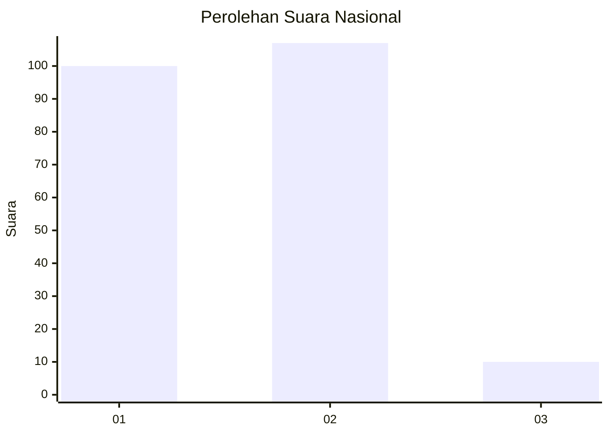
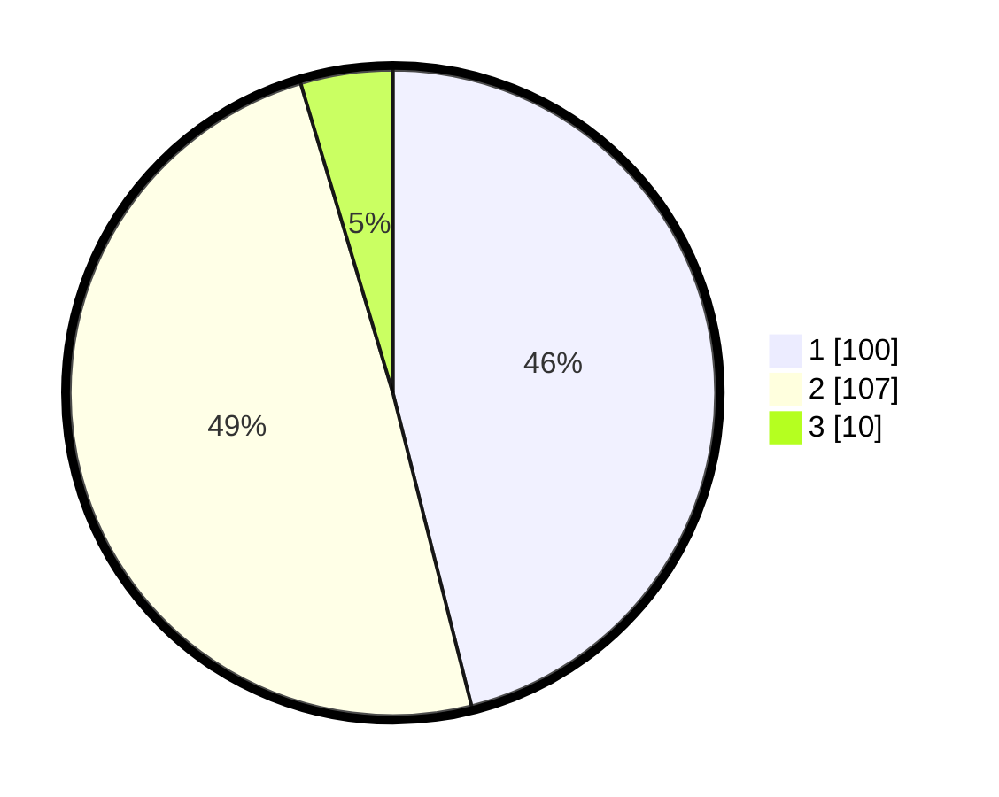

# Hasil

## Grafik

## Tabel

| No. | Nama Paslon    | Suara | Suara (raw) | Persentase |
|:--- |:-------------- | -----:| -----------:| ----------:|
| 1   | ANIES MUHAIMIN | 100   | [100][p-1]  | 46,08      |
| 2   | PRABOWO GIBRAN | 107   | [107][p-2]  | 49,31      |
| 3   | GANJAR MAHFUD  | 10    | [10][p-3]   | 4,61       |

[p-1]: https://github.com/gigit-pemilu/pemilu-2024/blob/main/pilpres/hitung-suara/sub/16-sumatera-selatan/sub/71-kota-palembang/sub/10-kalidoni/sub/1002-kalidoni/sub/078-tps/sub/paslon-1.txt
[p-2]: https://github.com/gigit-pemilu/pemilu-2024/blob/main/pilpres/hitung-suara/sub/16-sumatera-selatan/sub/71-kota-palembang/sub/10-kalidoni/sub/1002-kalidoni/sub/078-tps/sub/paslon-2.txt
[p-3]: https://github.com/gigit-pemilu/pemilu-2024/blob/main/pilpres/hitung-suara/sub/16-sumatera-selatan/sub/71-kota-palembang/sub/10-kalidoni/sub/1002-kalidoni/sub/078-tps/sub/paslon-3.txt

## Foto C Plano

https://sirekap-obj-formc.kpu.go.id/f986/pemilu/ppwp/16/71/10/10/02/1671101002078-20240219-114056--2498368c-5701-418c-84bf-2b4000216c40.jpg

https://sirekap-obj-formc.kpu.go.id/f986/pemilu/ppwp/16/71/10/10/02/1671101002078-20240219-114134--ba7c32ad-e9e2-437c-bf3e-49cbc34a56b3.jpg

https://sirekap-obj-formc.kpu.go.id/f986/pemilu/ppwp/16/71/10/10/02/1671101002078-20240219-114115--66a0d1a9-e926-48ea-9caa-03b396f7306f.jpg

## Metadata

| Key        | Value               |
| ---------- | ------------------- |
| Time Stamp | 2024-02-20 15:00:00 |

## DATA PEMILIH TETAP

Jumlah pemilih dalam DPT: **281**.
 * L: **143**.
 * P: **138**.

## DATA PENGGUNA HAK PILIH

Jumlah pengguna hak pilih dalam DPT: **204**.
 * L: **99**.
 * P: **105**.

Jumlah pengguna hak pilih dalam DPTb: **5**.
 * L: **922**.
 * P: **3**.

Jumlah pengguna hak pilih dalam DPK: **918**.
 * L: **898**.
 * P: **12**.

Jumlah pengguna hak pilih: **223**.
 * L: **199**.
 * P: **818**.

## JUMLAH SUARA SAH DAN TIDAK SAH

JUMLAH SELURUH SUARA SAH: **227**.

JUMLAH SUARA TIDAK SAH: **2**.

JUMLAH SELURUH SUARA SAH DAN SUARA TIDAK SAH: **288**.

