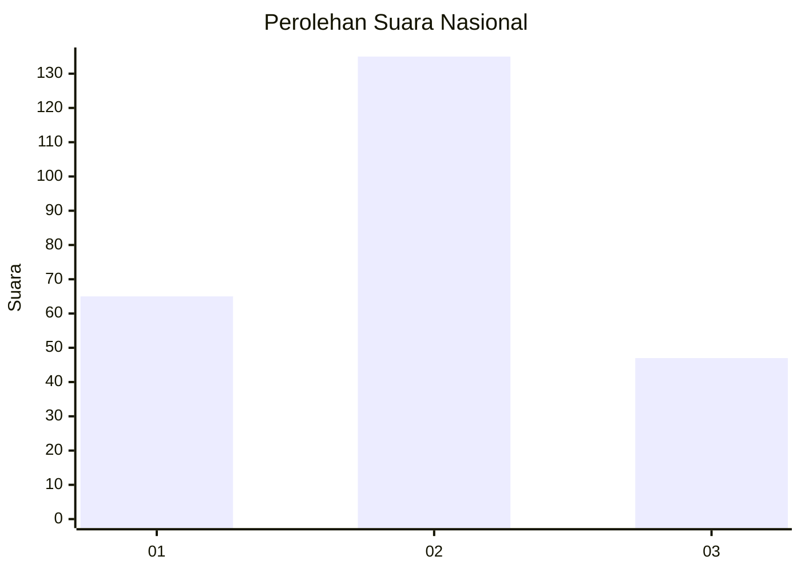
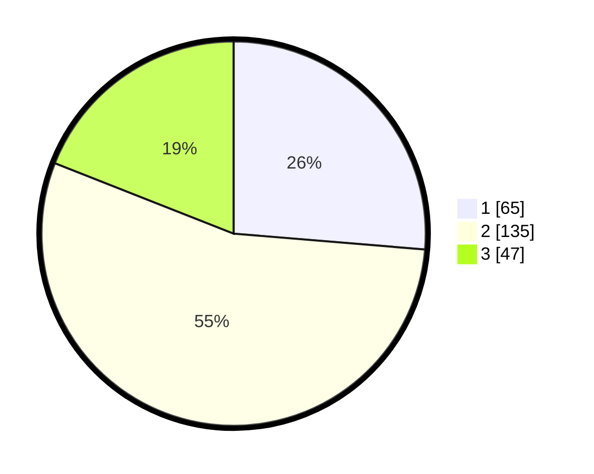

# Hasil

## Grafik

## Tabel

| No. | Nama Paslon    | Suara | Suara (raw) | Persentase |
|:--- |:-------------- | -----:| -----------:| ----------:|
| 1   | ANIES MUHAIMIN | 65    | [65][p-1]   | 26,32      |
| 2   | PRABOWO GIBRAN | 135   | [135][p-2]  | 54,66      |
| 3   | GANJAR MAHFUD  | 47    | [47][p-3]   | 19,03      |

[p-1]: https://github.com/gigit-pemilu/pemilu-2024/blob/main/pilpres/hitung-suara/sub/16-sumatera-selatan/sub/71-kota-palembang/sub/10-kalidoni/sub/1002-kalidoni/sub/081-tps/sub/paslon-1.txt
[p-2]: https://github.com/gigit-pemilu/pemilu-2024/blob/main/pilpres/hitung-suara/sub/16-sumatera-selatan/sub/71-kota-palembang/sub/10-kalidoni/sub/1002-kalidoni/sub/081-tps/sub/paslon-2.txt
[p-3]: https://github.com/gigit-pemilu/pemilu-2024/blob/main/pilpres/hitung-suara/sub/16-sumatera-selatan/sub/71-kota-palembang/sub/10-kalidoni/sub/1002-kalidoni/sub/081-tps/sub/paslon-3.txt

## Foto C Plano

https://sirekap-obj-formc.kpu.go.id/b715/pemilu/ppwp/16/71/10/10/02/1671101002081-20240219-115423--40797813-1920-4f3c-8153-47cd03c65e1a.jpg

https://sirekap-obj-formc.kpu.go.id/b715/pemilu/ppwp/16/71/10/10/02/1671101002081-20240219-115517--f6862bc9-8ca9-492c-9b9e-ec8bacec572b.jpg

https://sirekap-obj-formc.kpu.go.id/b715/pemilu/ppwp/16/71/10/10/02/1671101002081-20240219-115443--0b2fc24d-fb31-4b6a-9634-b5051e4ffc6a.jpg

## Metadata

| Key        | Value               |
| ---------- | ------------------- |
| Time Stamp | 2024-02-19 12:00:00 |

## DATA PEMILIH TETAP

Jumlah pemilih dalam DPT: **254**.
 * L: **121**.
 * P: **123**.

## DATA PENGGUNA HAK PILIH

Jumlah pengguna hak pilih dalam DPT: **200**.
 * L: **22**.
 * P: **108**.

Jumlah pengguna hak pilih dalam DPTb: **0**.
 * L: **2**.
 * P: **2**.

Jumlah pengguna hak pilih dalam DPK: **20**.
 * L: **7**.
 * P: **12**.

Jumlah pengguna hak pilih: **21**.
 * L: **105**.
 * P: **121**.

## JUMLAH SUARA SAH DAN TIDAK SAH

JUMLAH SELURUH SUARA SAH: **217**.

JUMLAH SUARA TIDAK SAH: **4**.

JUMLAH SELURUH SUARA SAH DAN SUARA TIDAK SAH: **1**.

