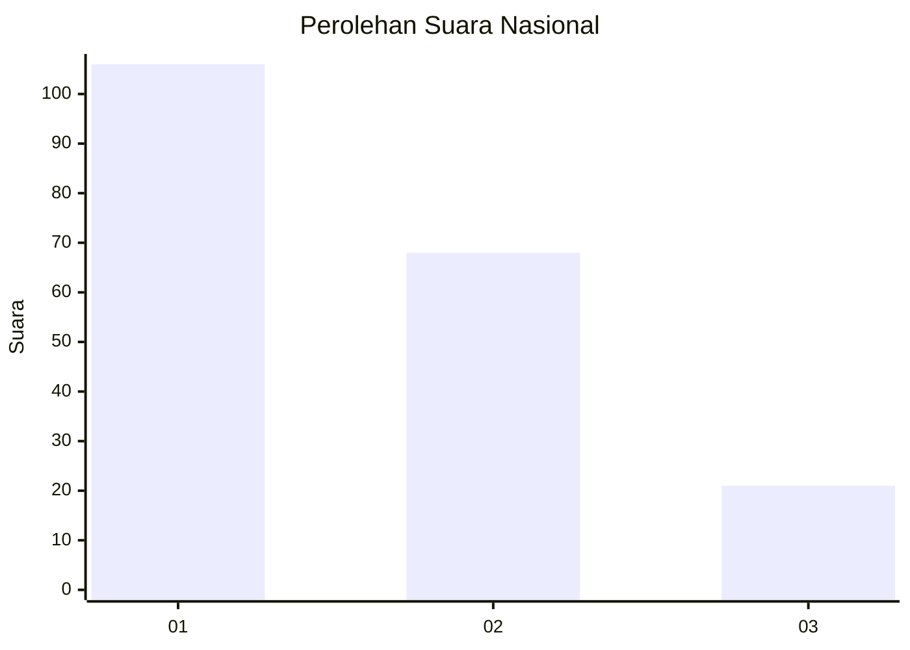
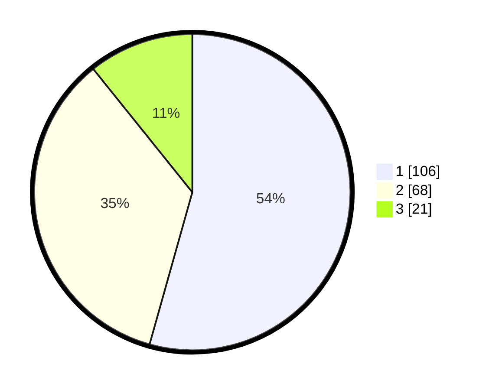

# Hasil

## Grafik

## Tabel

| No. | Nama Paslon    | Suara | Suara (raw) | Persentase |
|:--- |:-------------- | -----:| -----------:| ----------:|
| 1   | ANIES MUHAIMIN | 106   | [106][p-1]  | 54,36      |
| 2   | PRABOWO GIBRAN | 68    | [68][p-2]   | 34,87      |
| 3   | GANJAR MAHFUD  | 21    | [21][p-3]   | 10,77      |

[p-1]: https://github.com/gigit-pemilu/pemilu-2024/blob/main/pilpres/hitung-suara/sub/16-sumatera-selatan/sub/71-kota-palembang/sub/10-kalidoni/sub/1003-sungaiselayur/sub/044-tps/sub/paslon-1.txt
[p-2]: https://github.com/gigit-pemilu/pemilu-2024/blob/main/pilpres/hitung-suara/sub/16-sumatera-selatan/sub/71-kota-palembang/sub/10-kalidoni/sub/1003-sungaiselayur/sub/044-tps/sub/paslon-2.txt
[p-3]: https://github.com/gigit-pemilu/pemilu-2024/blob/main/pilpres/hitung-suara/sub/16-sumatera-selatan/sub/71-kota-palembang/sub/10-kalidoni/sub/1003-sungaiselayur/sub/044-tps/sub/paslon-3.txt

## Foto C Plano

https://sirekap-obj-formc.kpu.go.id/a08d/pemilu/ppwp/16/71/10/10/03/1671101003044-20240215-042351--d2de3648-7954-4f62-8cbe-91555cda6b7e.jpg

https://sirekap-obj-formc.kpu.go.id/a08d/pemilu/ppwp/16/71/10/10/03/1671101003044-20240215-042438--b6b07a69-a0cb-4f46-9a82-7921589c3c32.jpg

https://sirekap-obj-formc.kpu.go.id/a08d/pemilu/ppwp/16/71/10/10/03/1671101003044-20240215-042511--047761b7-ac33-4338-95f6-72a4ee2aaa1e.jpg

## Metadata

| Key        | Value               |
| ---------- | ------------------- |
| Time Stamp | 2024-02-24 22:31:28 |

