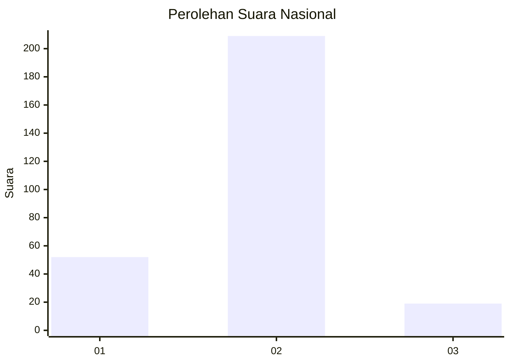
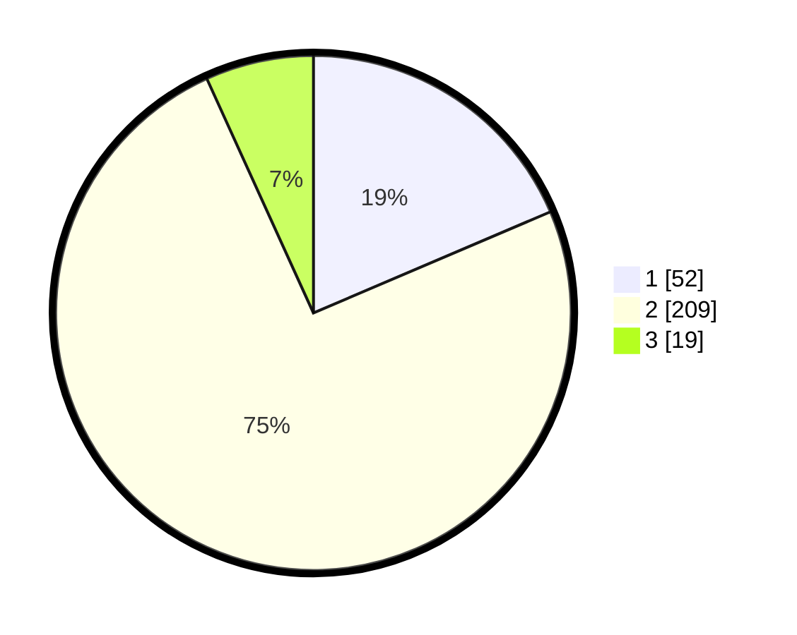

# Hasil

## Grafik

## Tabel

| No. | Nama Paslon    | Suara | Suara (raw) | Persentase |
|:--- |:-------------- | -----:| -----------:| ----------:|
| 1   | ANIES MUHAIMIN | 52    | [52][p-1]   | 18,57      |
| 2   | PRABOWO GIBRAN | 209   | [209][p-2]  | 74,64      |
| 3   | GANJAR MAHFUD  | 19    | [19][p-3]   | 6,79       |

[p-1]: https://github.com/gigit-pemilu/pemilu-2024/blob/main/pilpres/hitung-suara/sub/16-sumatera-selatan/sub/71-kota-palembang/sub/10-kalidoni/sub/1004-sungaiselincah/sub/022-tps/sub/paslon-1.txt
[p-2]: https://github.com/gigit-pemilu/pemilu-2024/blob/main/pilpres/hitung-suara/sub/16-sumatera-selatan/sub/71-kota-palembang/sub/10-kalidoni/sub/1004-sungaiselincah/sub/022-tps/sub/paslon-2.txt
[p-3]: https://github.com/gigit-pemilu/pemilu-2024/blob/main/pilpres/hitung-suara/sub/16-sumatera-selatan/sub/71-kota-palembang/sub/10-kalidoni/sub/1004-sungaiselincah/sub/022-tps/sub/paslon-3.txt

## Foto C Plano

https://sirekap-obj-formc.kpu.go.id/f6ad/pemilu/ppwp/16/71/10/10/04/1671101004022-20240219-170528--ce30ed66-c72a-4354-8db2-0f3f5a293bc9.jpg

https://sirekap-obj-formc.kpu.go.id/f6ad/pemilu/ppwp/16/71/10/10/04/1671101004022-20240219-170651--cc2ba475-f7f4-4e94-9025-706318197914.jpg

https://sirekap-obj-formc.kpu.go.id/f6ad/pemilu/ppwp/16/71/10/10/04/1671101004022-20240219-170716--518e8dc3-2d40-4fbb-929c-ff0da711a091.jpg

## Metadata

| Key        | Value               |
| ---------- | ------------------- |
| Time Stamp | 2024-02-19 18:00:00 |

## DATA PEMILIH TETAP

Jumlah pemilih dalam DPT: **231**.
 * L: **115**.
 * P: **116**.

## DATA PENGGUNA HAK PILIH

Jumlah pengguna hak pilih dalam DPT: **193**.
 * L: **91**.
 * P: **102**.

Jumlah pengguna hak pilih dalam DPTb: **44**.
 * L: **7**.
 * P: **40**.

Jumlah pengguna hak pilih dalam DPK: **3**.
 * L: **454**.
 * P: **42**.

Jumlah pengguna hak pilih: **196**.
 * L: **892**.
 * P: **102**.

## JUMLAH SUARA SAH DAN TIDAK SAH

JUMLAH SELURUH SUARA SAH: **191**.

JUMLAH SUARA TIDAK SAH: **5**.

JUMLAH SELURUH SUARA SAH DAN SUARA TIDAK SAH: **196**.

