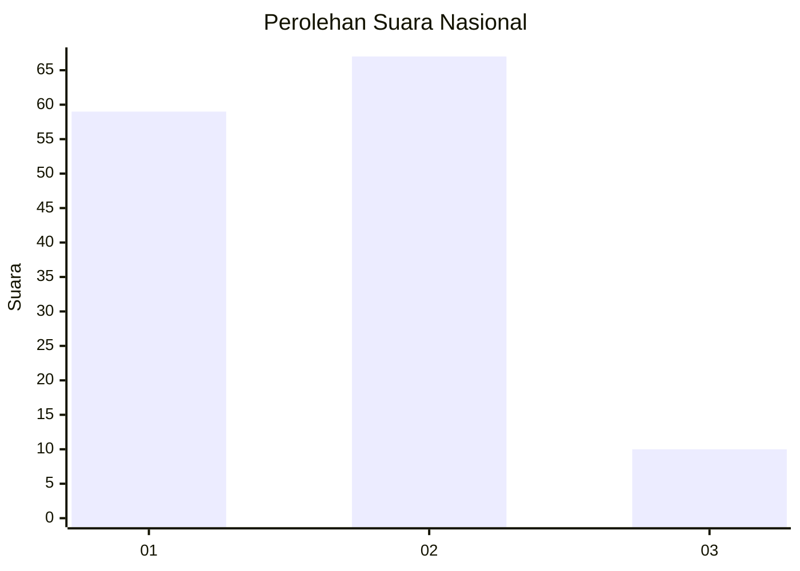
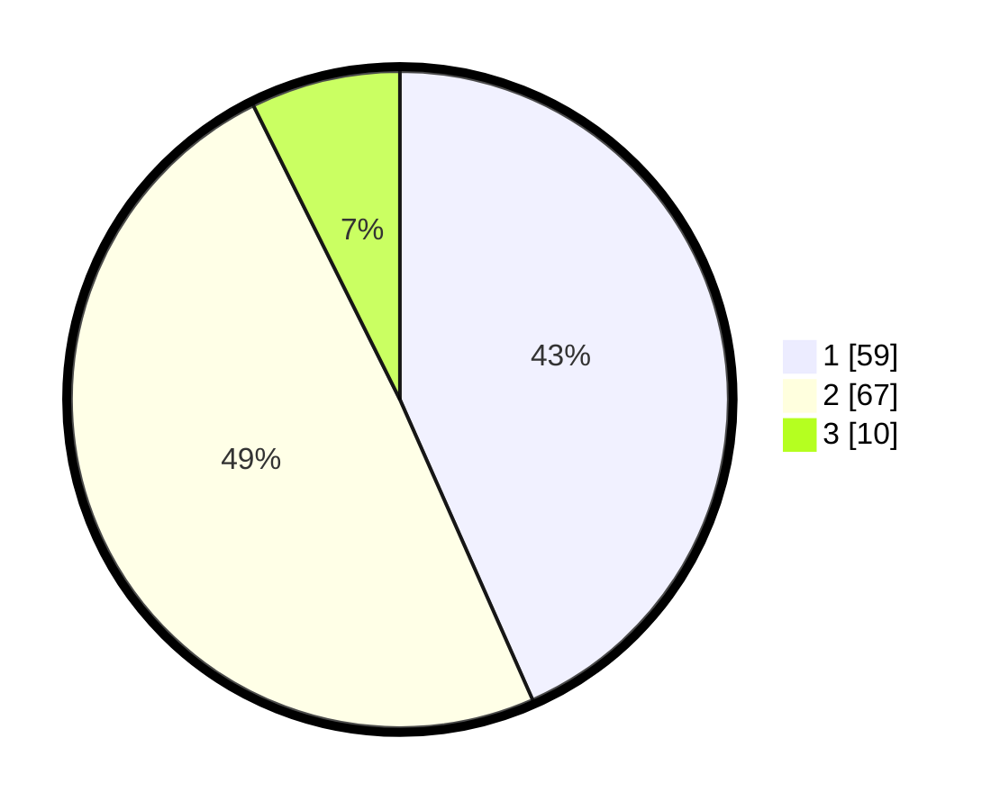

# Hasil

## Grafik

## Tabel

| No. | Nama Paslon    | Suara | Suara (raw) | Persentase |
|:--- |:-------------- | -----:| -----------:| ----------:|
| 1   | ANIES MUHAIMIN | 59    | [59][p-1]   | 43,38      |
| 2   | PRABOWO GIBRAN | 67    | [67][p-2]   | 49,26      |
| 3   | GANJAR MAHFUD  | 10    | [10][p-3]   | 7,35       |

[p-1]: https://github.com/gigit-pemilu/pemilu-2024/blob/main/pilpres/hitung-suara/sub/16-sumatera-selatan/sub/71-kota-palembang/sub/10-kalidoni/sub/1004-sungaiselincah/sub/086-tps/sub/paslon-1.txt
[p-2]: https://github.com/gigit-pemilu/pemilu-2024/blob/main/pilpres/hitung-suara/sub/16-sumatera-selatan/sub/71-kota-palembang/sub/10-kalidoni/sub/1004-sungaiselincah/sub/086-tps/sub/paslon-2.txt
[p-3]: https://github.com/gigit-pemilu/pemilu-2024/blob/main/pilpres/hitung-suara/sub/16-sumatera-selatan/sub/71-kota-palembang/sub/10-kalidoni/sub/1004-sungaiselincah/sub/086-tps/sub/paslon-3.txt

## Foto C Plano

https://sirekap-obj-formc.kpu.go.id/d486/pemilu/ppwp/16/71/10/10/04/1671101004086-20240214-203017--0c2bd87a-4cec-4f02-90a2-2efea5ad2fa5.jpg

https://sirekap-obj-formc.kpu.go.id/d486/pemilu/ppwp/16/71/10/10/04/1671101004086-20240214-203108--baf6a433-642a-44aa-9197-95b8f4862d25.jpg

https://sirekap-obj-formc.kpu.go.id/d486/pemilu/ppwp/16/71/10/10/04/1671101004086-20240214-203148--b55e456c-c888-4e8a-bf59-c290c960a08c.jpg

## Metadata

| Key        | Value               |
| ---------- | ------------------- |
| Time Stamp | 2024-02-25 22:00:00 |

