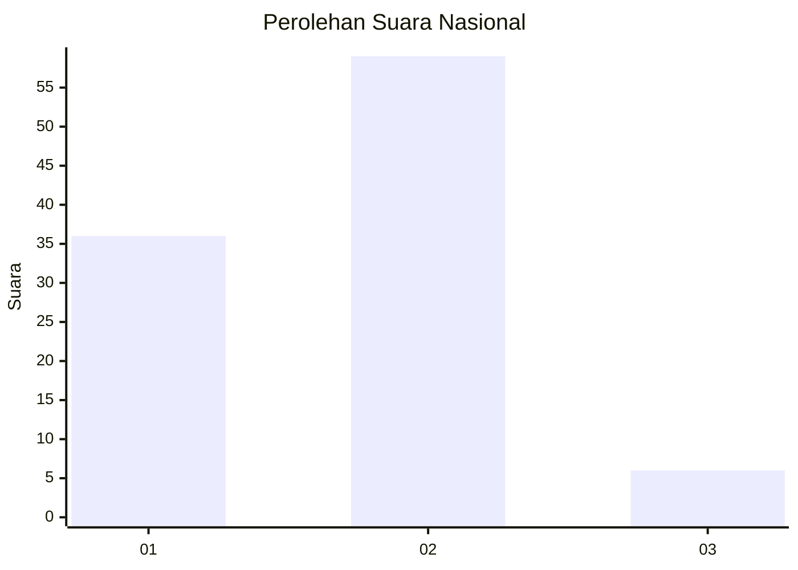
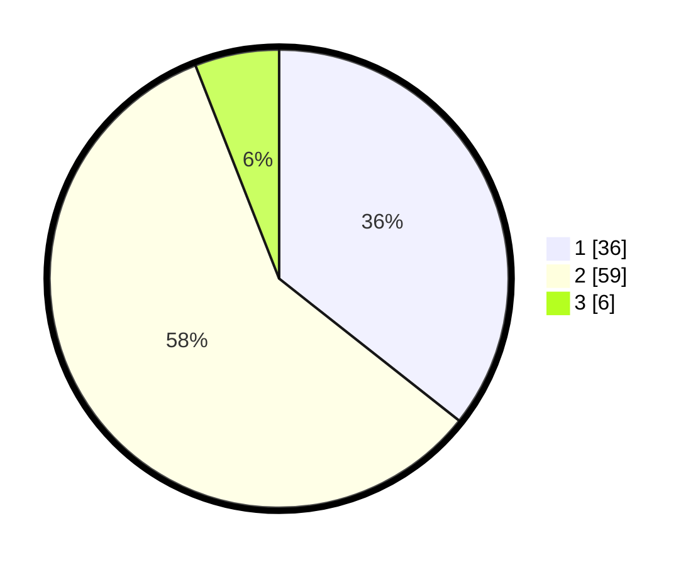

# Hasil

## Grafik

## Tabel

| No. | Nama Paslon    | Suara | Suara (raw) | Persentase |
|:--- |:-------------- | -----:| -----------:| ----------:|
| 1   | ANIES MUHAIMIN | 36    | [36][p-1]   | 35,64      |
| 2   | PRABOWO GIBRAN | 59    | [59][p-2]   | 58,42      |
| 3   | GANJAR MAHFUD  | 6     | [6][p-3]    | 5,94       |

[p-1]: https://github.com/gigit-pemilu/pemilu-2024/blob/main/pilpres/hitung-suara/sub/16-sumatera-selatan/sub/71-kota-palembang/sub/10-kalidoni/sub/1004-sungaiselincah/sub/087-tps/sub/paslon-1.txt
[p-2]: https://github.com/gigit-pemilu/pemilu-2024/blob/main/pilpres/hitung-suara/sub/16-sumatera-selatan/sub/71-kota-palembang/sub/10-kalidoni/sub/1004-sungaiselincah/sub/087-tps/sub/paslon-2.txt
[p-3]: https://github.com/gigit-pemilu/pemilu-2024/blob/main/pilpres/hitung-suara/sub/16-sumatera-selatan/sub/71-kota-palembang/sub/10-kalidoni/sub/1004-sungaiselincah/sub/087-tps/sub/paslon-3.txt

## Foto C Plano

https://sirekap-obj-formc.kpu.go.id/a5c2/pemilu/ppwp/16/71/10/10/04/1671101004087-20240214-224134--1aaacc87-9526-41ab-97a5-6ecb4f0261b5.jpg

https://sirekap-obj-formc.kpu.go.id/a5c2/pemilu/ppwp/16/71/10/10/04/1671101004087-20240214-224359--365abf14-4b02-403a-9d16-79828decdb64.jpg

https://sirekap-obj-formc.kpu.go.id/a5c2/pemilu/ppwp/16/71/10/10/04/1671101004087-20240214-224408--411bc1c6-b4d0-478f-8434-0322dabaaf87.jpg

## Metadata

| Key        | Value               |
| ---------- | ------------------- |
| Time Stamp | 2024-02-25 12:00:00 |

