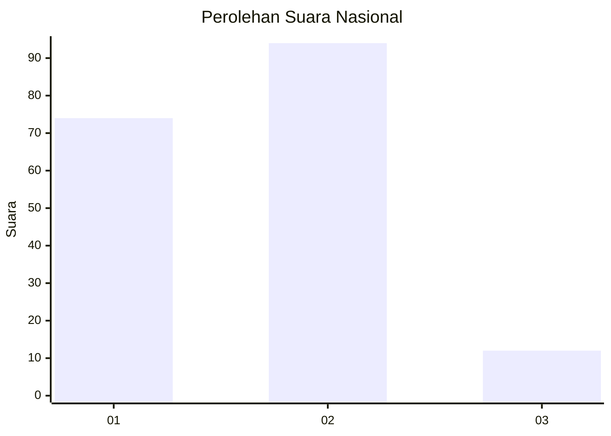
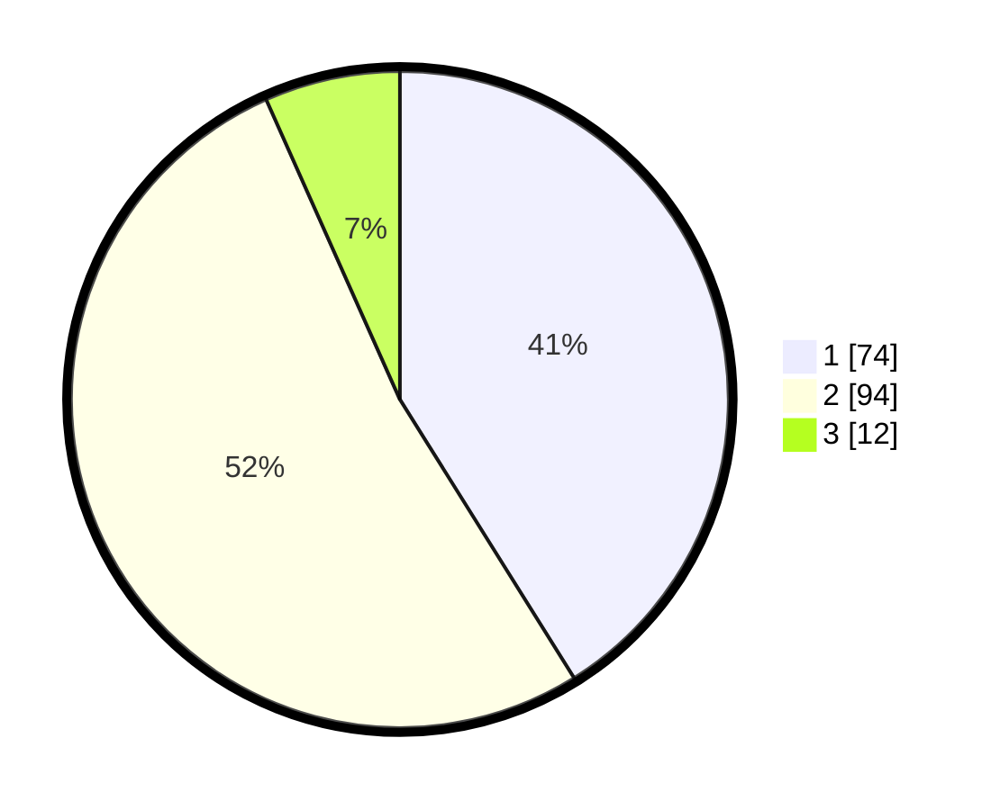

# Hasil

## Grafik

## Tabel

| No. | Nama Paslon    | Suara | Suara (raw) | Persentase |
|:--- |:-------------- | -----:| -----------:| ----------:|
| 1   | ANIES MUHAIMIN | 74    | [74][p-1]   | 41,11      |
| 2   | PRABOWO GIBRAN | 94    | [94][p-2]   | 52,22      |
| 3   | GANJAR MAHFUD  | 12    | [12][p-3]   | 6,67       |

[p-1]: https://github.com/gigit-pemilu/pemilu-2024/blob/main/pilpres/hitung-suara/sub/16-sumatera-selatan/sub/71-kota-palembang/sub/10-kalidoni/sub/1005-sungailais/sub/014-tps/sub/paslon-1.txt
[p-2]: https://github.com/gigit-pemilu/pemilu-2024/blob/main/pilpres/hitung-suara/sub/16-sumatera-selatan/sub/71-kota-palembang/sub/10-kalidoni/sub/1005-sungailais/sub/014-tps/sub/paslon-2.txt
[p-3]: https://github.com/gigit-pemilu/pemilu-2024/blob/main/pilpres/hitung-suara/sub/16-sumatera-selatan/sub/71-kota-palembang/sub/10-kalidoni/sub/1005-sungailais/sub/014-tps/sub/paslon-3.txt

## Foto C Plano

https://sirekap-obj-formc.kpu.go.id/487f/pemilu/ppwp/16/71/10/10/05/1671101005014-20240215-011746--abbad912-3c94-42ba-8764-9cd4f18c3ab7.jpg

https://sirekap-obj-formc.kpu.go.id/487f/pemilu/ppwp/16/71/10/10/05/1671101005014-20240215-005959--d7d3d040-e496-45ce-b033-c26dcb642a04.jpg

https://sirekap-obj-formc.kpu.go.id/487f/pemilu/ppwp/16/71/10/10/05/1671101005014-20240215-010001--4e00954b-b4d3-4e22-a999-66676eaf2287.jpg

## Metadata

| Key        | Value               |
| ---------- | ------------------- |
| Time Stamp | 2024-02-24 22:31:28 |

