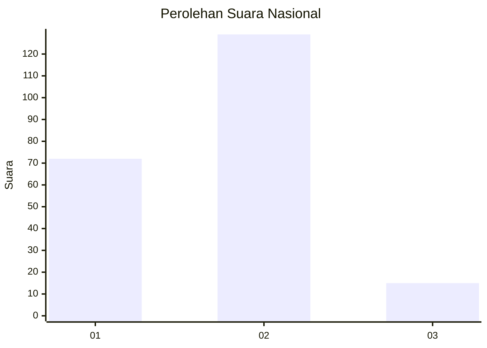
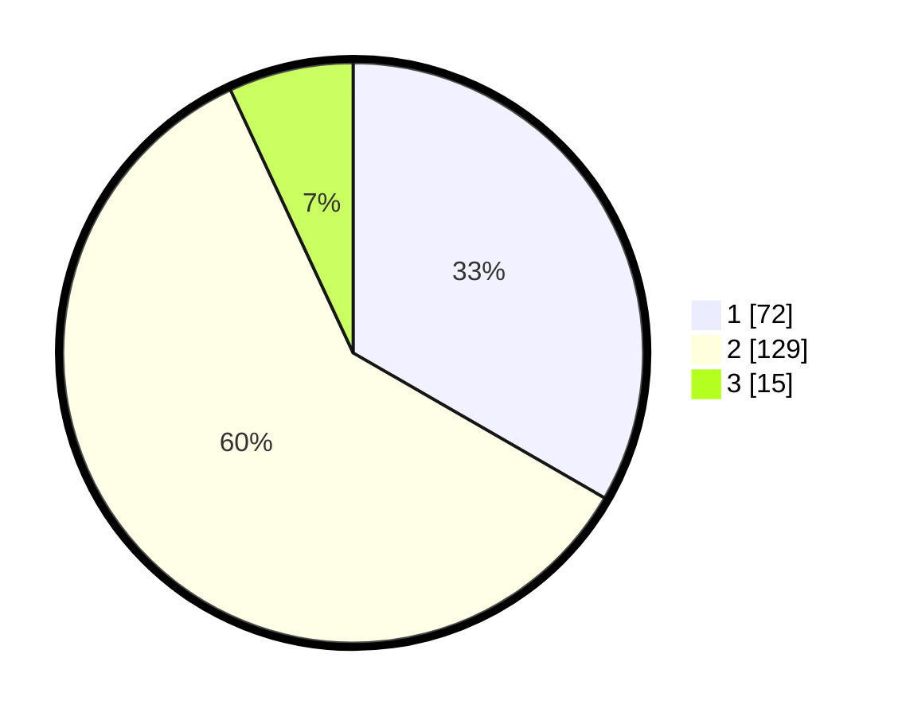

# Hasil

## Grafik

## Tabel

| No. | Nama Paslon    | Suara | Suara (raw) | Persentase |
|:--- |:-------------- | -----:| -----------:| ----------:|
| 1   | ANIES MUHAIMIN | 72    | [72][p-1]   | 33,33      |
| 2   | PRABOWO GIBRAN | 129   | [129][p-2]  | 59,72      |
| 3   | GANJAR MAHFUD  | 15    | [15][p-3]   | 6,94       |

[p-1]: https://github.com/gigit-pemilu/pemilu-2024/blob/main/pilpres/hitung-suara/sub/16-sumatera-selatan/sub/71-kota-palembang/sub/10-kalidoni/sub/1005-sungailais/sub/016-tps/sub/paslon-1.txt
[p-2]: https://github.com/gigit-pemilu/pemilu-2024/blob/main/pilpres/hitung-suara/sub/16-sumatera-selatan/sub/71-kota-palembang/sub/10-kalidoni/sub/1005-sungailais/sub/016-tps/sub/paslon-2.txt
[p-3]: https://github.com/gigit-pemilu/pemilu-2024/blob/main/pilpres/hitung-suara/sub/16-sumatera-selatan/sub/71-kota-palembang/sub/10-kalidoni/sub/1005-sungailais/sub/016-tps/sub/paslon-3.txt

## Foto C Plano

https://sirekap-obj-formc.kpu.go.id/421a/pemilu/ppwp/16/71/10/10/05/1671101005016-20240215-021641--328c2cac-c1b9-4229-a48a-7eb87b4a3f0a.jpg

https://sirekap-obj-formc.kpu.go.id/421a/pemilu/ppwp/16/71/10/10/05/1671101005016-20240215-005238--0f697f6e-4b8e-44b8-83e9-7c20f2d3bbd0.jpg

https://sirekap-obj-formc.kpu.go.id/421a/pemilu/ppwp/16/71/10/10/05/1671101005016-20240215-005412--a9b5adc9-e844-45cf-b06b-d8857c30867c.jpg

## Metadata

| Key        | Value               |
| ---------- | ------------------- |
| Time Stamp | 2024-02-24 22:31:28 |

