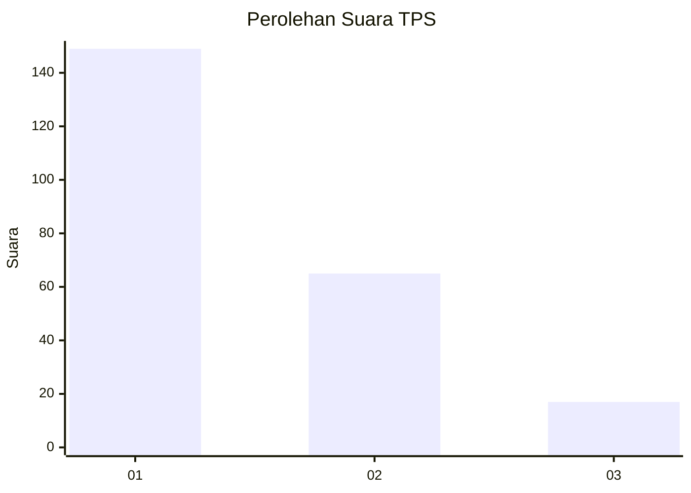
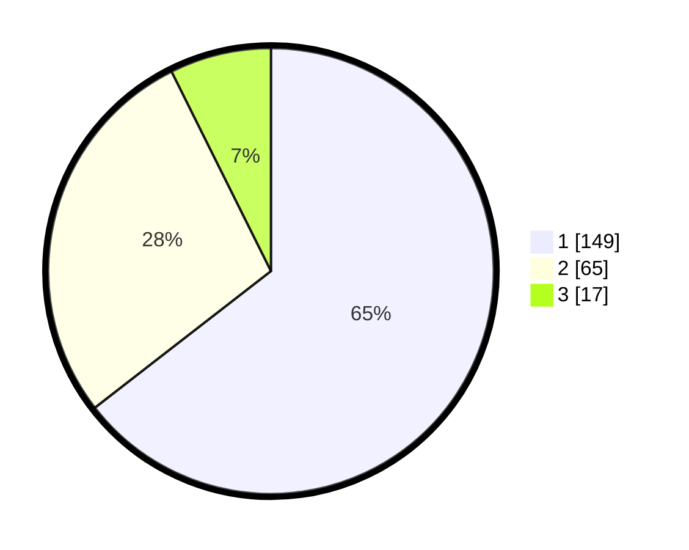

# Hasil

## Grafik

## Tabel

| No. | Nama Paslon    | Suara | Suara (raw) | Persentase |
|:--- |:-------------- | -----:| -----------:| ----------:|
| 1   | ANIES MUHAIMIN | 149   | [149][p-1]  | 64,50      |
| 2   | PRABOWO GIBRAN | 65    | [65][p-2]   | 28,14      |
| 3   | GANJAR MAHFUD  | 17    | [17][p-3]   | 7,36       |

[p-1]: https://github.com/gigit-pemilu/pemilu-2024-16-sumatera-selatan/blob/main/pilpres/hitung-suara/sub/16-sumatera-selatan/sub/71-kota-palembang/sub/11-bukitkecil/sub/1001-sembilan-belas-ilir/sub/005-tps/sub/paslon-1.txt
[p-2]: https://github.com/gigit-pemilu/pemilu-2024-16-sumatera-selatan/blob/main/pilpres/hitung-suara/sub/16-sumatera-selatan/sub/71-kota-palembang/sub/11-bukitkecil/sub/1001-sembilan-belas-ilir/sub/005-tps/sub/paslon-2.txt
[p-3]: https://github.com/gigit-pemilu/pemilu-2024-16-sumatera-selatan/blob/main/pilpres/hitung-suara/sub/16-sumatera-selatan/sub/71-kota-palembang/sub/11-bukitkecil/sub/1001-sembilan-belas-ilir/sub/005-tps/sub/paslon-3.txt

## Foto C Plano

https://sirekap-obj-formc.kpu.go.id/56ac/pemilu/ppwp/16/71/11/10/01/1671111001005-20240214-210257--ca2398f0-9b70-4746-b4ee-3c9fc940d809.jpg

https://sirekap-obj-formc.kpu.go.id/56ac/pemilu/ppwp/16/71/11/10/01/1671111001005-20240214-210312--880ed3fb-6a73-426f-98a2-ad8b950a1bb7.jpg

https://sirekap-obj-formc.kpu.go.id/56ac/pemilu/ppwp/16/71/11/10/01/1671111001005-20240214-210326--8cba026f-4e36-4ad6-9669-b19b7f0836cb.jpg

## Metadata

| Key        | Value               |
| ---------- | ------------------- |
| Time Stamp | 2024-02-15 00:41:44 |

