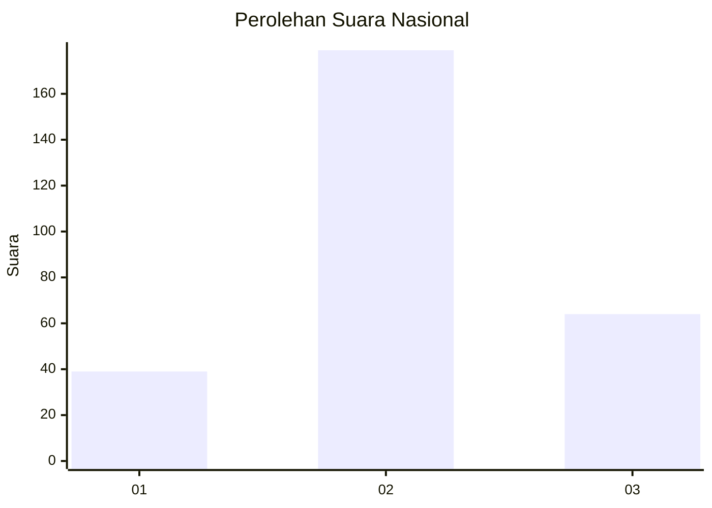
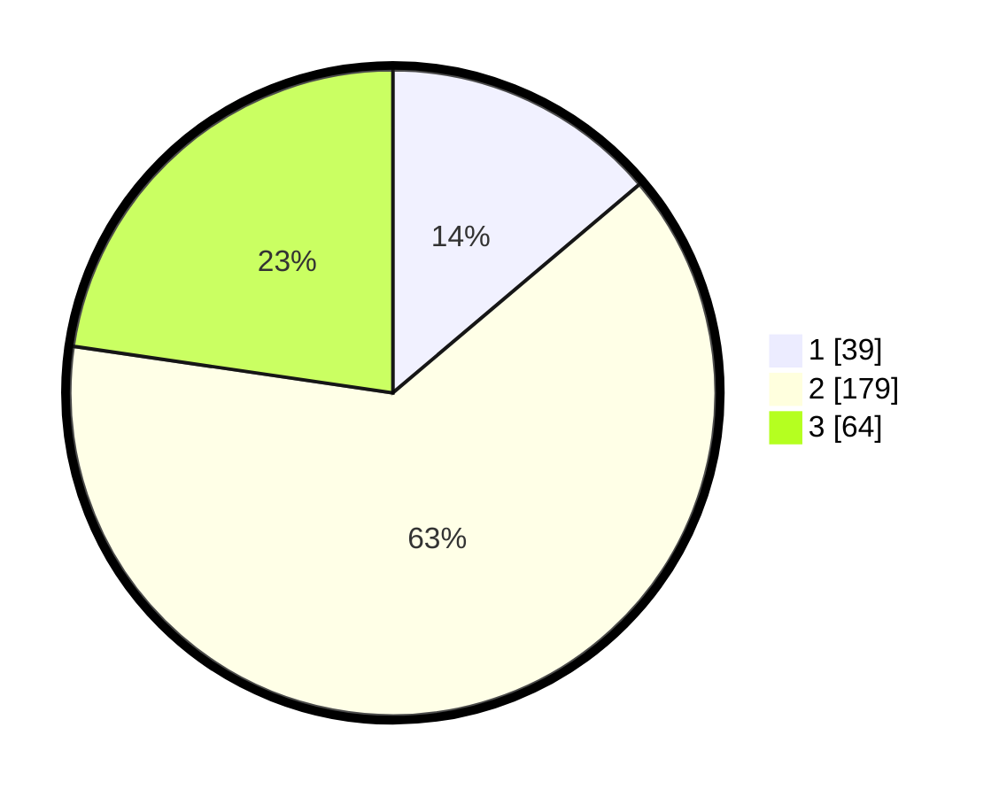

# Hasil

## Grafik

## Tabel

| No. | Nama Paslon    | Suara | Suara (raw) | Persentase |
|:--- |:-------------- | -----:| -----------:| ----------:|
| 1   | ANIES MUHAIMIN | 39    | [39][p-1]   | 13,83      |
| 2   | PRABOWO GIBRAN | 179   | [179][p-2]  | 63,48      |
| 3   | GANJAR MAHFUD  | 64    | [64][p-3]   | 22,70      |

[p-1]: https://github.com/gigit-pemilu/pemilu-2024/blob/main/pilpres/hitung-suara/sub/16-sumatera-selatan/sub/71-kota-palembang/sub/11-bukitkecil/sub/1001-sembilan-belas-ilir/sub/902-tps/sub/paslon-1.txt
[p-2]: https://github.com/gigit-pemilu/pemilu-2024/blob/main/pilpres/hitung-suara/sub/16-sumatera-selatan/sub/71-kota-palembang/sub/11-bukitkecil/sub/1001-sembilan-belas-ilir/sub/902-tps/sub/paslon-2.txt
[p-3]: https://github.com/gigit-pemilu/pemilu-2024/blob/main/pilpres/hitung-suara/sub/16-sumatera-selatan/sub/71-kota-palembang/sub/11-bukitkecil/sub/1001-sembilan-belas-ilir/sub/902-tps/sub/paslon-3.txt

## Foto C Plano

https://sirekap-obj-formc.kpu.go.id/d429/pemilu/ppwp/16/71/11/10/01/1671111001902-20240222-054919--d9b95c26-319a-4618-befe-634125a2f0ae.jpg

https://sirekap-obj-formc.kpu.go.id/d429/pemilu/ppwp/16/71/11/10/01/1671111001902-20240222-054930--3f562b49-2a2f-42bb-8520-a3829d1a0708.jpg

https://sirekap-obj-formc.kpu.go.id/d429/pemilu/ppwp/16/71/11/10/01/1671111001902-20240222-054939--4873683b-0524-40ff-adb1-a21a3bdc02ce.jpg

## Metadata

| Key        | Value               |
| ---------- | ------------------- |
| Time Stamp | 2024-02-25 17:00:00 |

