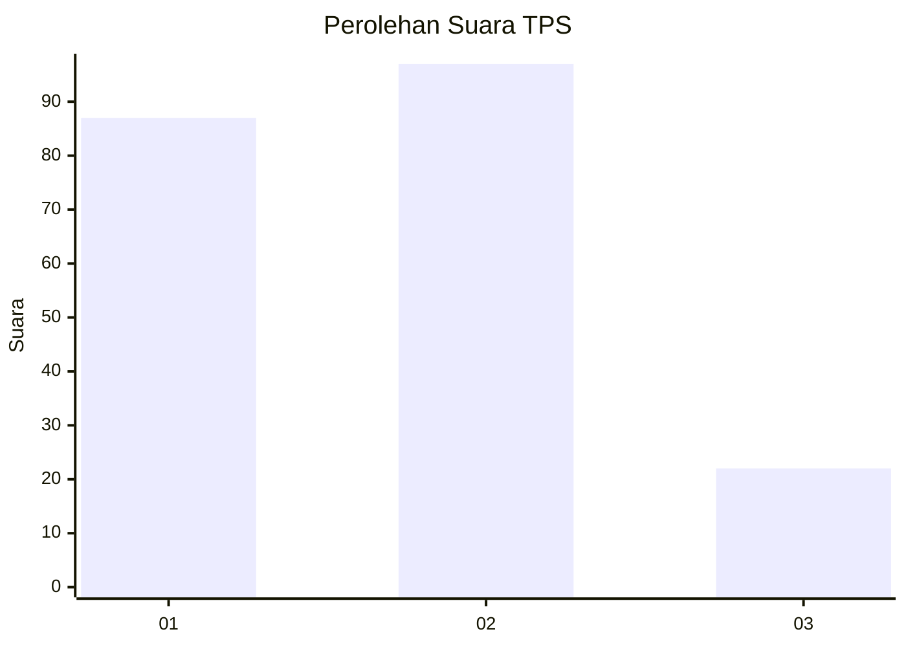
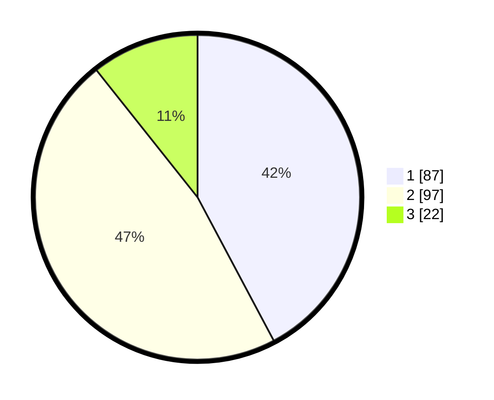

# Hasil

## Grafik

## Tabel

| No. | Nama Paslon    | Suara | Suara (raw) | Persentase |
|:--- |:-------------- | -----:| -----------:| ----------:|
| 1   | ANIES MUHAIMIN | 87    | [87][p-1]   | 42,23      |
| 2   | PRABOWO GIBRAN | 97    | [97][p-2]   | 47,09      |
| 3   | GANJAR MAHFUD  | 22    | [22][p-3]   | 10,68      |

[p-1]: https://github.com/gigit-pemilu/pemilu-2024-16-sumatera-selatan/blob/main/pilpres/hitung-suara/sub/16-sumatera-selatan/sub/71-kota-palembang/sub/11-bukitkecil/sub/1002-dua-puluh-dua-ilir/sub/005-tps/sub/paslon-1.txt
[p-2]: https://github.com/gigit-pemilu/pemilu-2024-16-sumatera-selatan/blob/main/pilpres/hitung-suara/sub/16-sumatera-selatan/sub/71-kota-palembang/sub/11-bukitkecil/sub/1002-dua-puluh-dua-ilir/sub/005-tps/sub/paslon-2.txt
[p-3]: https://github.com/gigit-pemilu/pemilu-2024-16-sumatera-selatan/blob/main/pilpres/hitung-suara/sub/16-sumatera-selatan/sub/71-kota-palembang/sub/11-bukitkecil/sub/1002-dua-puluh-dua-ilir/sub/005-tps/sub/paslon-3.txt

## Foto C Plano

https://sirekap-obj-formc.kpu.go.id/a7a7/pemilu/ppwp/16/71/11/10/02/1671111002005-20240215-013443--d99e3d1f-fc2b-45cd-b978-2284bf37f090.jpg

https://sirekap-obj-formc.kpu.go.id/a7a7/pemilu/ppwp/16/71/11/10/02/1671111002005-20240215-015332--b637e489-bd90-4dbc-9894-06d09adf5d8d.jpg

https://sirekap-obj-formc.kpu.go.id/a7a7/pemilu/ppwp/16/71/11/10/02/1671111002005-20240215-015553--d1ea9f15-2002-43cb-91d2-30b80b9ea393.jpg

## Metadata

| Key        | Value               |
| ---------- | ------------------- |
| Time Stamp | 2024-02-25 09:00:00 |

