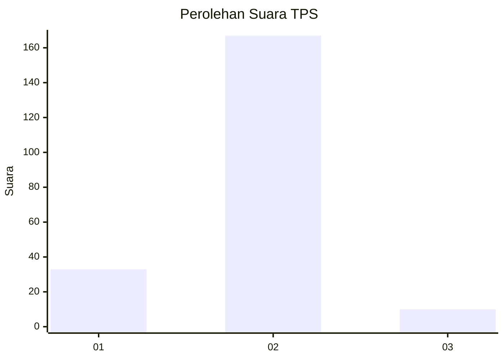
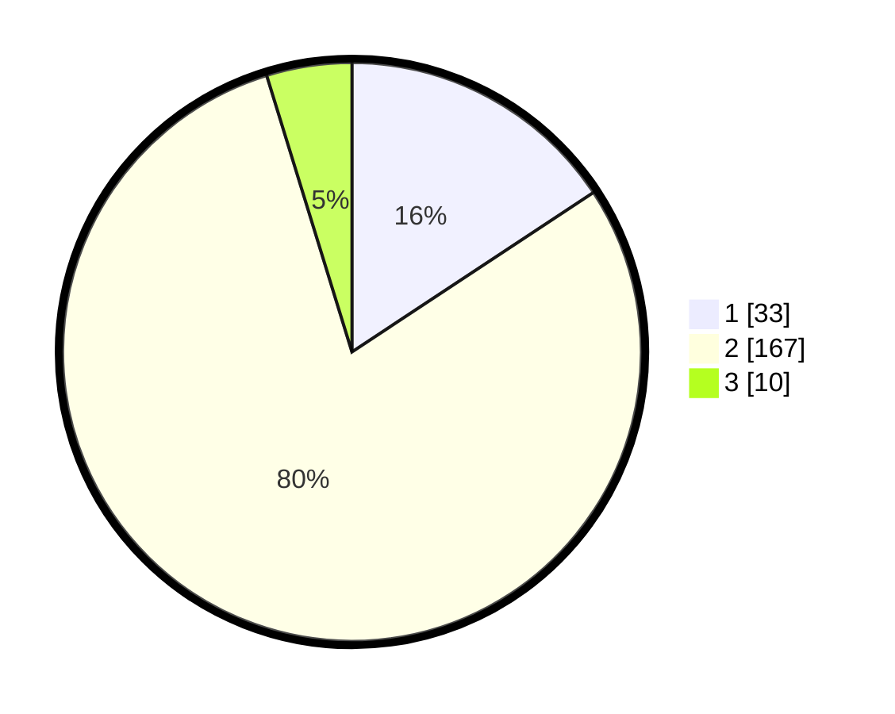

# Hasil

## Grafik

## Tabel

| No. | Nama Paslon    | Suara | Suara (raw) | Persentase |
|:--- |:-------------- | -----:| -----------:| ----------:|
| 1   | ANIES MUHAIMIN | 33    | [33][p-1]   | 15,71      |
| 2   | PRABOWO GIBRAN | 167   | [167][p-2]  | 79,52      |
| 3   | GANJAR MAHFUD  | 10    | [10][p-3]   | 4,76       |

[p-1]: https://github.com/gigit-pemilu/pemilu-2024-16-sumatera-selatan/blob/main/pilpres/hitung-suara/sub/16-sumatera-selatan/sub/71-kota-palembang/sub/12-gandus/sub/1001-gandus/sub/001-tps/sub/paslon-1.txt
[p-2]: https://github.com/gigit-pemilu/pemilu-2024-16-sumatera-selatan/blob/main/pilpres/hitung-suara/sub/16-sumatera-selatan/sub/71-kota-palembang/sub/12-gandus/sub/1001-gandus/sub/001-tps/sub/paslon-2.txt
[p-3]: https://github.com/gigit-pemilu/pemilu-2024-16-sumatera-selatan/blob/main/pilpres/hitung-suara/sub/16-sumatera-selatan/sub/71-kota-palembang/sub/12-gandus/sub/1001-gandus/sub/001-tps/sub/paslon-3.txt

## Foto C Plano

https://sirekap-obj-formc.kpu.go.id/7362/pemilu/ppwp/16/71/12/10/01/1671121001001-20240214-230850--3ab59e85-80e3-4967-8c43-2334ee28abcb.jpg

https://sirekap-obj-formc.kpu.go.id/7362/pemilu/ppwp/16/71/12/10/01/1671121001001-20240214-231318--247ae2fd-4747-4351-ae0a-ef4ede27eecf.jpg

https://sirekap-obj-formc.kpu.go.id/7362/pemilu/ppwp/16/71/12/10/01/1671121001001-20240214-231710--26bde048-5eaf-4d59-b86e-1edeeab15ff5.jpg

## Metadata

| Key        | Value               |
| ---------- | ------------------- |
| Time Stamp | 2024-02-24 22:31:28 |

