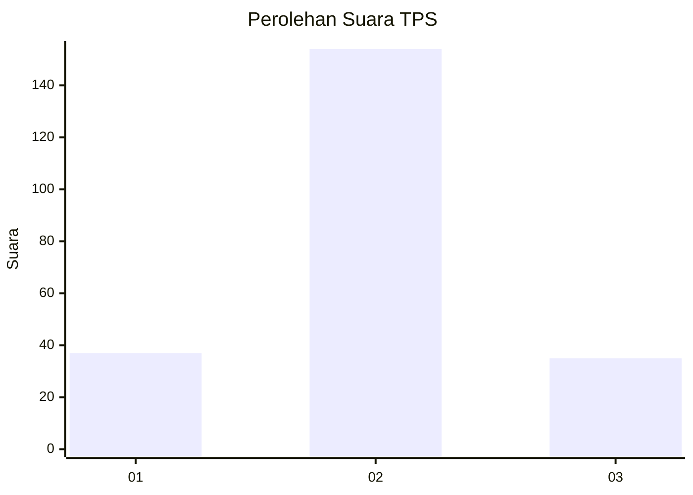
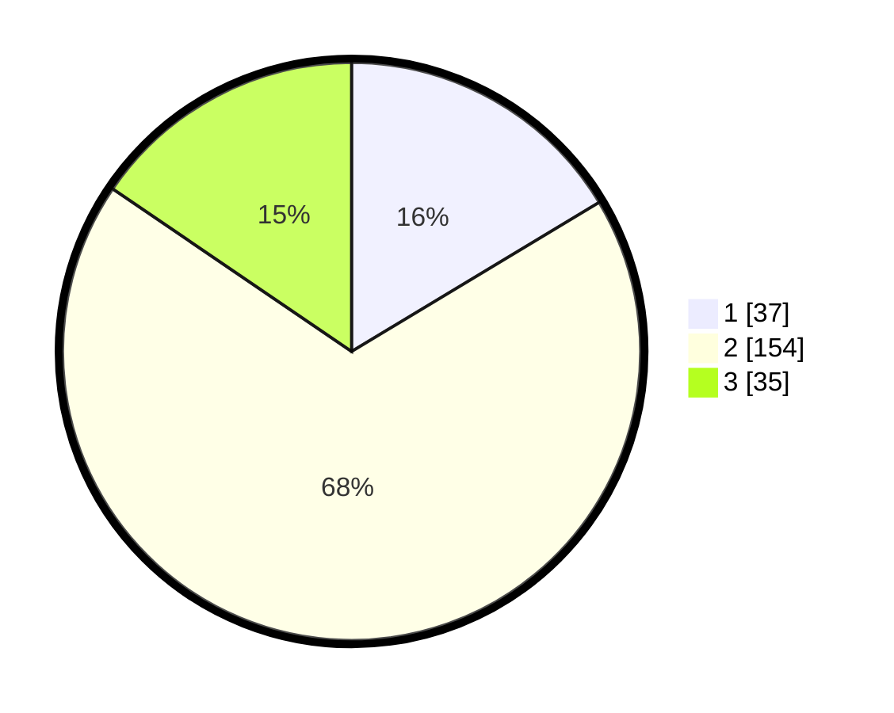

# Hasil

## Grafik

## Tabel

| No. | Nama Paslon    | Suara | Suara (raw) | Persentase |
|:--- |:-------------- | -----:| -----------:| ----------:|
| 1   | ANIES MUHAIMIN | 37    | [37][p-1]   | 16,37      |
| 2   | PRABOWO GIBRAN | 154   | [154][p-2]  | 68,14      |
| 3   | GANJAR MAHFUD  | 35    | [35][p-3]   | 15,49      |

[p-1]: https://github.com/gigit-pemilu/pemilu-2024-16-sumatera-selatan/blob/main/pilpres/hitung-suara/sub/16-sumatera-selatan/sub/71-kota-palembang/sub/12-gandus/sub/1001-gandus/sub/010-tps/sub/paslon-1.txt
[p-2]: https://github.com/gigit-pemilu/pemilu-2024-16-sumatera-selatan/blob/main/pilpres/hitung-suara/sub/16-sumatera-selatan/sub/71-kota-palembang/sub/12-gandus/sub/1001-gandus/sub/010-tps/sub/paslon-2.txt
[p-3]: https://github.com/gigit-pemilu/pemilu-2024-16-sumatera-selatan/blob/main/pilpres/hitung-suara/sub/16-sumatera-selatan/sub/71-kota-palembang/sub/12-gandus/sub/1001-gandus/sub/010-tps/sub/paslon-3.txt

## Foto C Plano

https://sirekap-obj-formc.kpu.go.id/0de4/pemilu/ppwp/16/71/12/10/01/1671121001010-20240302-202739--8c72ee23-7322-4f48-bedb-8c71fe3110f8.jpg

https://sirekap-obj-formc.kpu.go.id/0de4/pemilu/ppwp/16/71/12/10/01/1671121001010-20240214-193433--01564829-f758-4004-8e9e-ed5344809db6.jpg

https://sirekap-obj-formc.kpu.go.id/0de4/pemilu/ppwp/16/71/12/10/01/1671121001010-20240214-193730--80293dc2-6b29-4e8e-b823-bbf15b8b3d21.jpg

## Metadata

| Key        | Value               |
| ---------- | ------------------- |
| Time Stamp | 2024-03-02 21:00:00 |

