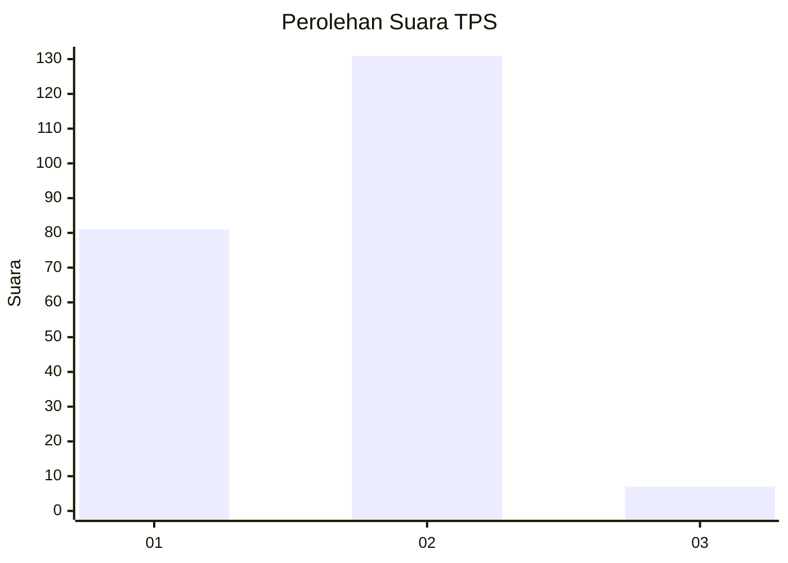
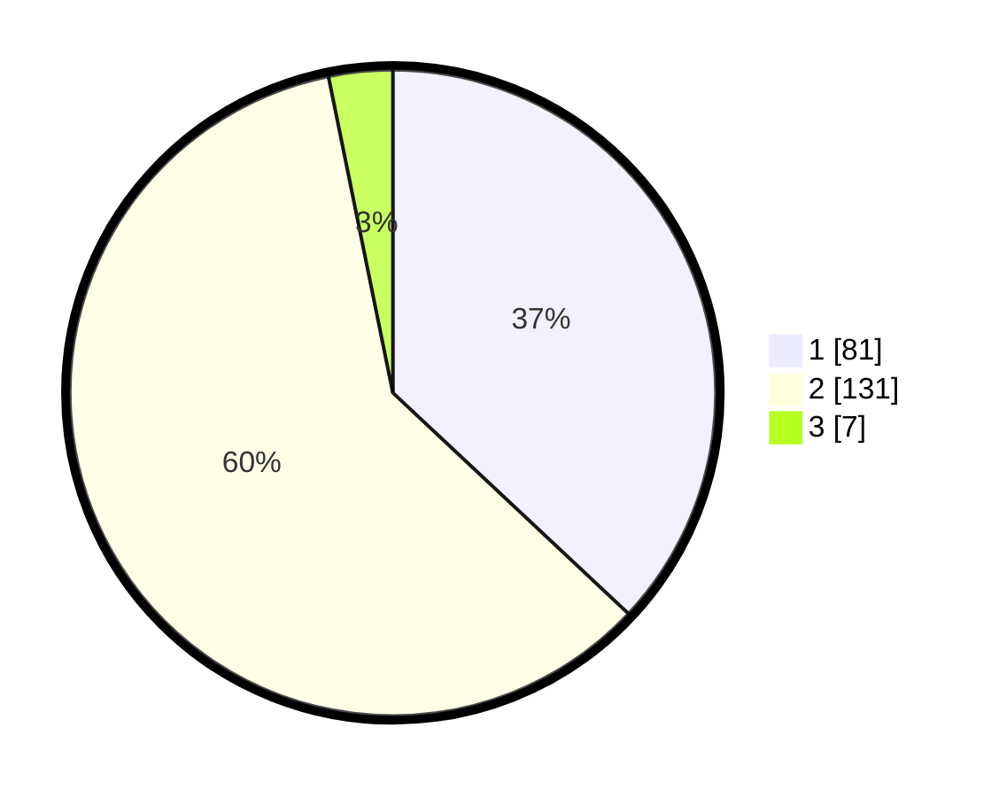

# Hasil

## Grafik

## Tabel

| No. | Nama Paslon    | Suara | Suara (raw) | Persentase |
|:--- |:-------------- | -----:| -----------:| ----------:|
| 1   | ANIES MUHAIMIN | 81    | [81][p-1]   | 36,99      |
| 2   | PRABOWO GIBRAN | 131   | [131][p-2]  | 59,82      |
| 3   | GANJAR MAHFUD  | 7     | [7][p-3]    | 3,20       |

[p-1]: https://github.com/gigit-pemilu/pemilu-2024-16-sumatera-selatan/blob/main/pilpres/hitung-suara/sub/16-sumatera-selatan/sub/71-kota-palembang/sub/12-gandus/sub/1001-gandus/sub/012-tps/sub/paslon-1.txt
[p-2]: https://github.com/gigit-pemilu/pemilu-2024-16-sumatera-selatan/blob/main/pilpres/hitung-suara/sub/16-sumatera-selatan/sub/71-kota-palembang/sub/12-gandus/sub/1001-gandus/sub/012-tps/sub/paslon-2.txt
[p-3]: https://github.com/gigit-pemilu/pemilu-2024-16-sumatera-selatan/blob/main/pilpres/hitung-suara/sub/16-sumatera-selatan/sub/71-kota-palembang/sub/12-gandus/sub/1001-gandus/sub/012-tps/sub/paslon-3.txt

## Foto C Plano

https://sirekap-obj-formc.kpu.go.id/5d42/pemilu/ppwp/16/71/12/10/01/1671121001012-20240302-204249--b61c4721-338c-4908-a155-fcb2491fffa4.jpg

https://sirekap-obj-formc.kpu.go.id/5d42/pemilu/ppwp/16/71/12/10/01/1671121001012-20240215-035043--6fffbaf4-5264-4341-b3a6-f6b4f886aff0.jpg

https://sirekap-obj-formc.kpu.go.id/5d42/pemilu/ppwp/16/71/12/10/01/1671121001012-20240215-035204--c2256590-8774-4eb3-bbe0-377a1bce1450.jpg

## Metadata

| Key        | Value               |
| ---------- | ------------------- |
| Time Stamp | 2024-03-02 21:00:00 |

