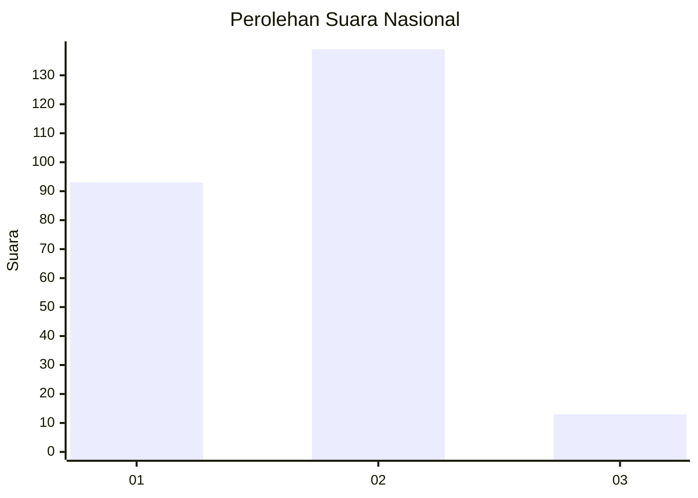
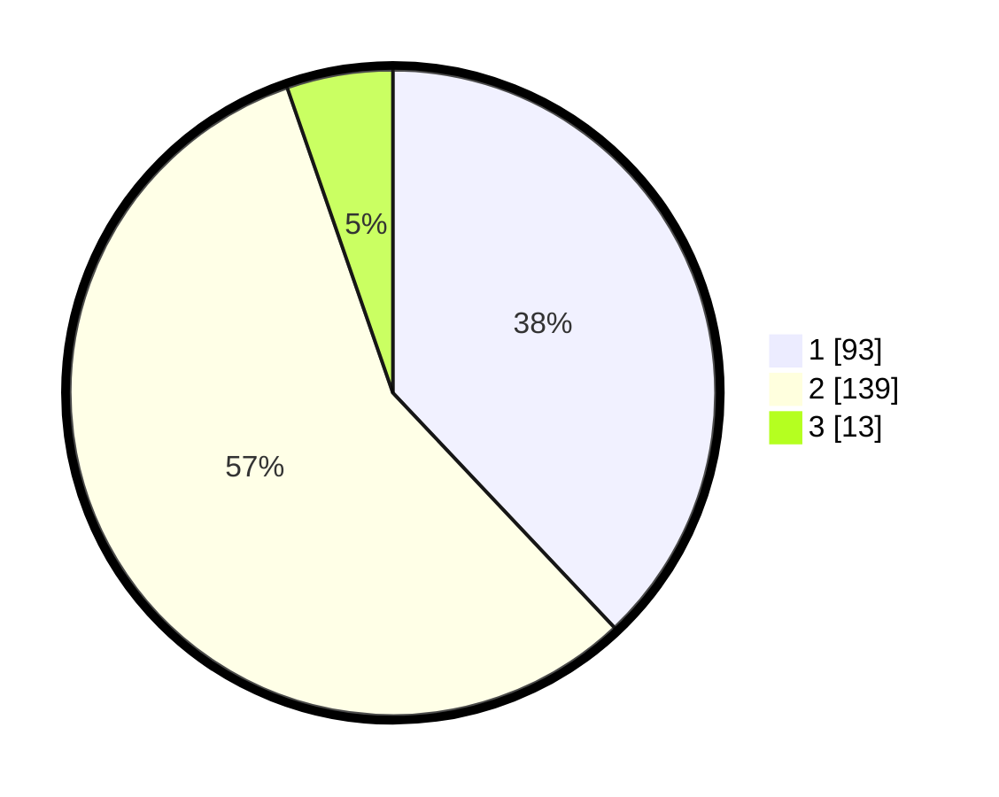

# Hasil

## Grafik

## Tabel

| No. | Nama Paslon    | Suara | Suara (raw) | Persentase |
|:--- |:-------------- | -----:| -----------:| ----------:|
| 1   | ANIES MUHAIMIN | 93    | [93][p-1]   | 37,96      |
| 2   | PRABOWO GIBRAN | 139   | [139][p-2]  | 56,73      |
| 3   | GANJAR MAHFUD  | 13    | [13][p-3]   | 5,31       |

[p-1]: https://github.com/gigit-pemilu/pemilu-2024/blob/main/pilpres/hitung-suara/sub/16-sumatera-selatan/sub/71-kota-palembang/sub/12-gandus/sub/1002-karanganyar/sub/003-tps/sub/paslon-1.txt
[p-2]: https://github.com/gigit-pemilu/pemilu-2024/blob/main/pilpres/hitung-suara/sub/16-sumatera-selatan/sub/71-kota-palembang/sub/12-gandus/sub/1002-karanganyar/sub/003-tps/sub/paslon-2.txt
[p-3]: https://github.com/gigit-pemilu/pemilu-2024/blob/main/pilpres/hitung-suara/sub/16-sumatera-selatan/sub/71-kota-palembang/sub/12-gandus/sub/1002-karanganyar/sub/003-tps/sub/paslon-3.txt

## Foto C Plano

https://sirekap-obj-formc.kpu.go.id/1a3a/pemilu/ppwp/16/71/12/10/02/1671121002003-20240302-213137--d3fa2268-c913-4e36-9802-824732d9189f.jpg

https://sirekap-obj-formc.kpu.go.id/1a3a/pemilu/ppwp/16/71/12/10/02/1671121002003-20240215-014511--d9bead5f-1c4f-47b7-84e5-48110c945f6a.jpg

https://sirekap-obj-formc.kpu.go.id/1a3a/pemilu/ppwp/16/71/12/10/02/1671121002003-20240215-021718--b1a49568-3abd-4b80-8d37-657eb7abe708.jpg

## Metadata

| Key        | Value               |
| ---------- | ------------------- |
| Time Stamp | 2024-03-02 22:00:00 |

