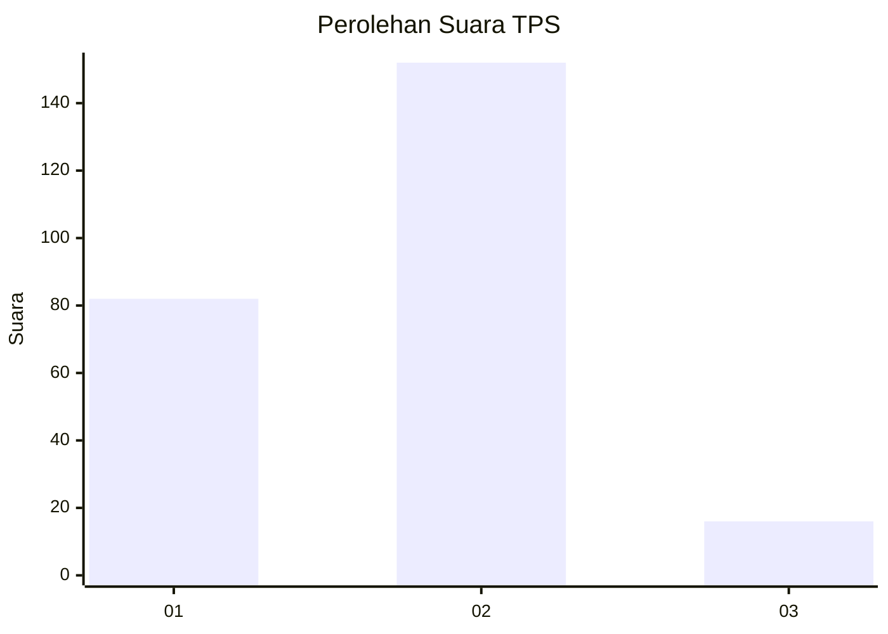
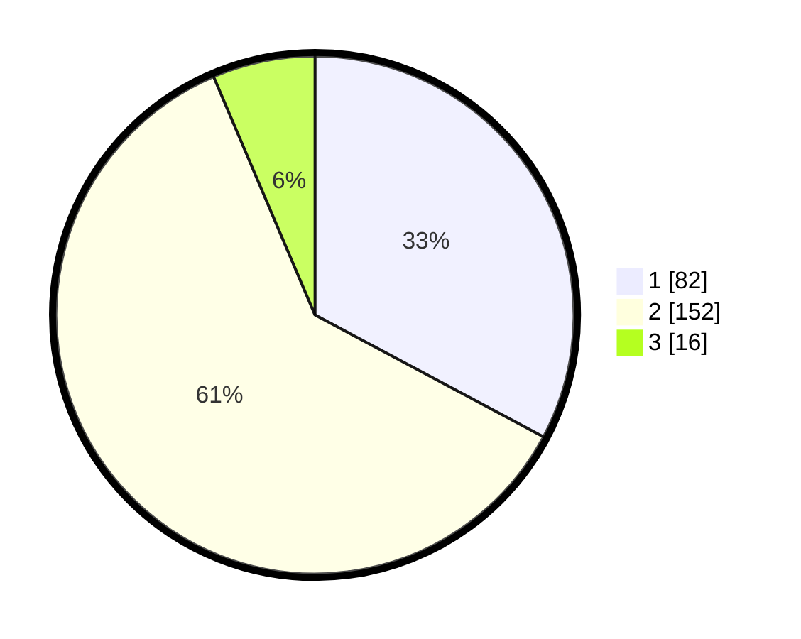

# Hasil

## Grafik

## Tabel

| No. | Nama Paslon    | Suara | Suara (raw) | Persentase |
|:--- |:-------------- | -----:| -----------:| ----------:|
| 1   | ANIES MUHAIMIN | 82    | [82][p-1]   | 32,80      |
| 2   | PRABOWO GIBRAN | 152   | [152][p-2]  | 60,80      |
| 3   | GANJAR MAHFUD  | 16    | [16][p-3]   | 6,40       |

[p-1]: https://github.com/gigit-pemilu/pemilu-2024-16-sumatera-selatan/blob/main/pilpres/hitung-suara/sub/16-sumatera-selatan/sub/71-kota-palembang/sub/12-gandus/sub/1002-karanganyar/sub/005-tps/sub/paslon-1.txt
[p-2]: https://github.com/gigit-pemilu/pemilu-2024-16-sumatera-selatan/blob/main/pilpres/hitung-suara/sub/16-sumatera-selatan/sub/71-kota-palembang/sub/12-gandus/sub/1002-karanganyar/sub/005-tps/sub/paslon-2.txt
[p-3]: https://github.com/gigit-pemilu/pemilu-2024-16-sumatera-selatan/blob/main/pilpres/hitung-suara/sub/16-sumatera-selatan/sub/71-kota-palembang/sub/12-gandus/sub/1002-karanganyar/sub/005-tps/sub/paslon-3.txt

## Foto C Plano

https://sirekap-obj-formc.kpu.go.id/b3ba/pemilu/ppwp/16/71/12/10/02/1671121002005-20240302-215106--b3c7d144-cd7e-4763-b176-2f1fbd9b4ac7.jpg

https://sirekap-obj-formc.kpu.go.id/b3ba/pemilu/ppwp/16/71/12/10/02/1671121002005-20240214-155431--f8bab4db-142b-4e34-913a-4e80037e0655.jpg

https://sirekap-obj-formc.kpu.go.id/b3ba/pemilu/ppwp/16/71/12/10/02/1671121002005-20240214-155510--4198bc75-363e-44ef-bbfe-a921a080a533.jpg

## Metadata

| Key        | Value               |
| ---------- | ------------------- |
| Time Stamp | 2024-03-02 22:00:00 |

