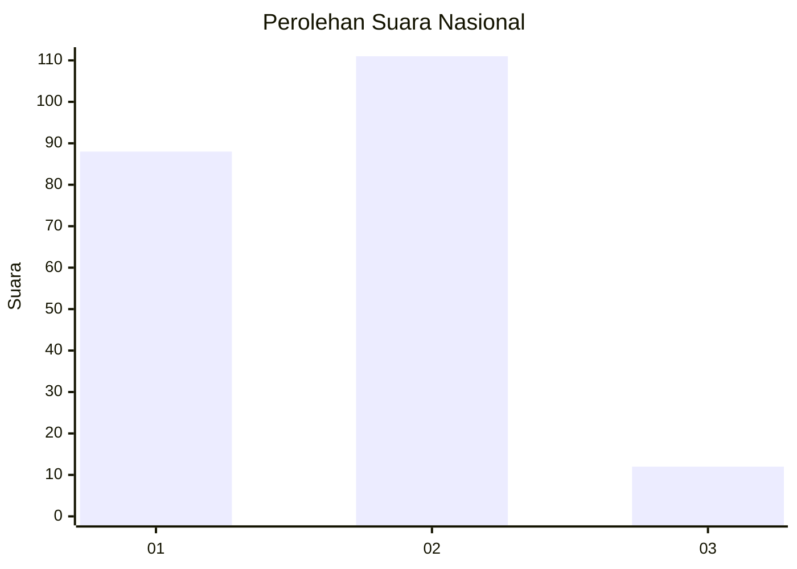
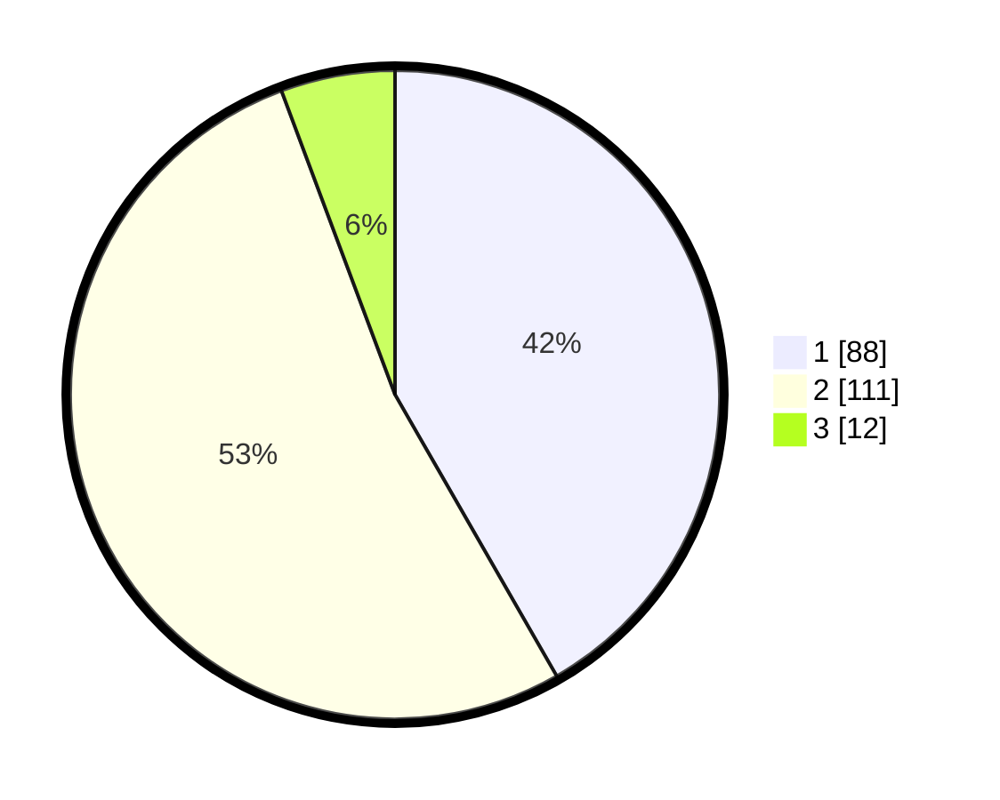

# Hasil

## Grafik

## Tabel

| No. | Nama Paslon    | Suara | Suara (raw) | Persentase |
|:--- |:-------------- | -----:| -----------:| ----------:|
| 1   | ANIES MUHAIMIN | 88    | [88][p-1]   | 41,71      |
| 2   | PRABOWO GIBRAN | 111   | [111][p-2]  | 52,61      |
| 3   | GANJAR MAHFUD  | 12    | [12][p-3]   | 5,69       |

[p-1]: https://github.com/gigit-pemilu/pemilu-2024/blob/main/pilpres/hitung-suara/sub/16-sumatera-selatan/sub/71-kota-palembang/sub/12-gandus/sub/1003-tiga-puluh-enam-ilir/sub/006-tps/sub/paslon-1.txt
[p-2]: https://github.com/gigit-pemilu/pemilu-2024/blob/main/pilpres/hitung-suara/sub/16-sumatera-selatan/sub/71-kota-palembang/sub/12-gandus/sub/1003-tiga-puluh-enam-ilir/sub/006-tps/sub/paslon-2.txt
[p-3]: https://github.com/gigit-pemilu/pemilu-2024/blob/main/pilpres/hitung-suara/sub/16-sumatera-selatan/sub/71-kota-palembang/sub/12-gandus/sub/1003-tiga-puluh-enam-ilir/sub/006-tps/sub/paslon-3.txt

## Foto C Plano

https://sirekap-obj-formc.kpu.go.id/461a/pemilu/ppwp/16/71/12/10/03/1671121003006-20240215-022330--0bc1686e-fab1-429a-9561-6ffb69bff0d2.jpg

https://sirekap-obj-formc.kpu.go.id/461a/pemilu/ppwp/16/71/12/10/03/1671121003006-20240215-022415--f5868a27-c842-43d1-9e2b-59d6dd63d7b7.jpg

https://sirekap-obj-formc.kpu.go.id/461a/pemilu/ppwp/16/71/12/10/03/1671121003006-20240215-022518--752b3a49-ac25-4464-bda2-5bea3d2366bd.jpg

## Metadata

| Key        | Value               |
| ---------- | ------------------- |
| Time Stamp | 2024-02-25 23:00:00 |

