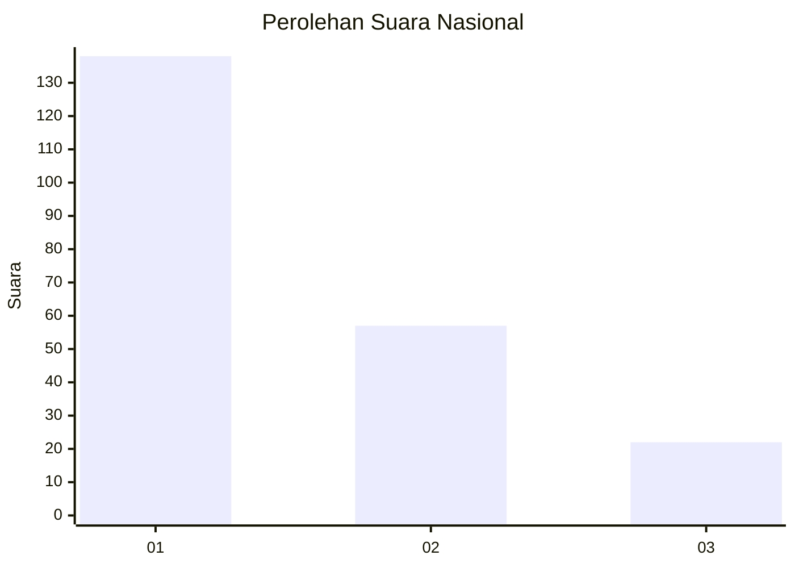
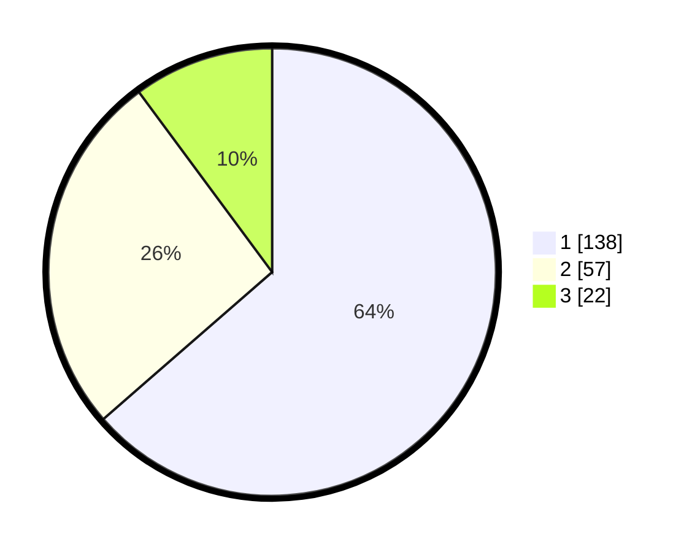

# Hasil

## Grafik

## Tabel

| No. | Nama Paslon    | Suara | Suara (raw) | Persentase |
|:--- |:-------------- | -----:| -----------:| ----------:|
| 1   | ANIES MUHAIMIN | 138   | [138][p-1]  | 63,59      |
| 2   | PRABOWO GIBRAN | 57    | [57][p-2]   | 26,27      |
| 3   | GANJAR MAHFUD  | 22    | [22][p-3]   | 10,14      |

[p-1]: https://github.com/gigit-pemilu/pemilu-2024/blob/main/pilpres/hitung-suara/sub/16-sumatera-selatan/sub/71-kota-palembang/sub/12-gandus/sub/1004-karangjaya/sub/019-tps/sub/paslon-1.txt
[p-2]: https://github.com/gigit-pemilu/pemilu-2024/blob/main/pilpres/hitung-suara/sub/16-sumatera-selatan/sub/71-kota-palembang/sub/12-gandus/sub/1004-karangjaya/sub/019-tps/sub/paslon-2.txt
[p-3]: https://github.com/gigit-pemilu/pemilu-2024/blob/main/pilpres/hitung-suara/sub/16-sumatera-selatan/sub/71-kota-palembang/sub/12-gandus/sub/1004-karangjaya/sub/019-tps/sub/paslon-3.txt

## Foto C Plano

https://sirekap-obj-formc.kpu.go.id/c8ae/pemilu/ppwp/16/71/12/10/04/1671121004019-20240214-203950--c0d07f0b-08b1-497f-b3aa-976ddd5318f4.jpg

https://sirekap-obj-formc.kpu.go.id/c8ae/pemilu/ppwp/16/71/12/10/04/1671121004019-20240214-225428--7c901596-f554-4b42-afe9-c3988cff0e64.jpg

https://sirekap-obj-formc.kpu.go.id/c8ae/pemilu/ppwp/16/71/12/10/04/1671121004019-20240214-225313--38645339-e16d-43ee-8df7-b488e36699c3.jpg

## Metadata

| Key        | Value               |
| ---------- | ------------------- |
| Time Stamp | 2024-02-24 22:31:28 |

