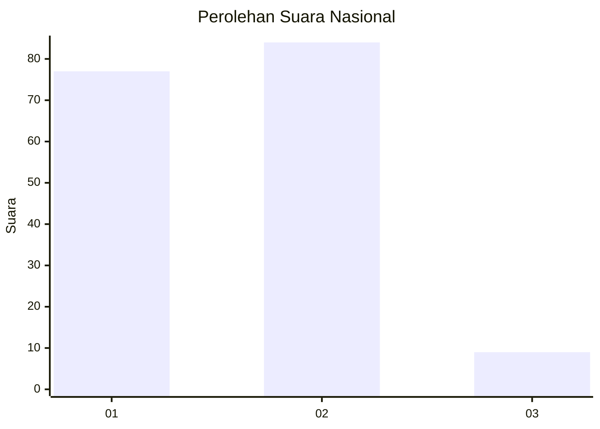
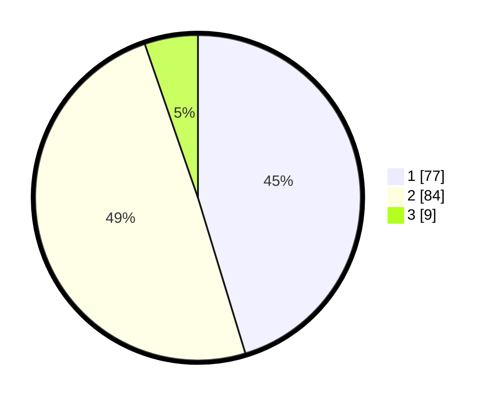

# Hasil

## Grafik

## Tabel

| No. | Nama Paslon    | Suara | Suara (raw) | Persentase |
|:--- |:-------------- | -----:| -----------:| ----------:|
| 1   | ANIES MUHAIMIN | 77    | [77][p-1]   | 45,29      |
| 2   | PRABOWO GIBRAN | 84    | [84][p-2]   | 49,41      |
| 3   | GANJAR MAHFUD  | 9     | [9][p-3]    | 5,29       |

[p-1]: https://github.com/gigit-pemilu/pemilu-2024/blob/main/pilpres/hitung-suara/sub/16-sumatera-selatan/sub/71-kota-palembang/sub/12-gandus/sub/1005-pulokerto/sub/040-tps/sub/paslon-1.txt
[p-2]: https://github.com/gigit-pemilu/pemilu-2024/blob/main/pilpres/hitung-suara/sub/16-sumatera-selatan/sub/71-kota-palembang/sub/12-gandus/sub/1005-pulokerto/sub/040-tps/sub/paslon-2.txt
[p-3]: https://github.com/gigit-pemilu/pemilu-2024/blob/main/pilpres/hitung-suara/sub/16-sumatera-selatan/sub/71-kota-palembang/sub/12-gandus/sub/1005-pulokerto/sub/040-tps/sub/paslon-3.txt

## Foto C Plano

https://sirekap-obj-formc.kpu.go.id/c500/pemilu/ppwp/16/71/12/10/05/1671121005040-20240215-042430--2701d2ec-3cf5-40f0-a9d0-a9671bd12b74.jpg

https://sirekap-obj-formc.kpu.go.id/c500/pemilu/ppwp/16/71/12/10/05/1671121005040-20240215-042549--181a496f-4a7f-4a7b-8a59-9ad70e787232.jpg

https://sirekap-obj-formc.kpu.go.id/c500/pemilu/ppwp/16/71/12/10/05/1671121005040-20240215-042656--4130ee05-7243-4a66-ae50-d25f5577684d.jpg

## Metadata

| Key        | Value               |
| ---------- | ------------------- |
| Time Stamp | 2024-02-25 17:00:00 |

