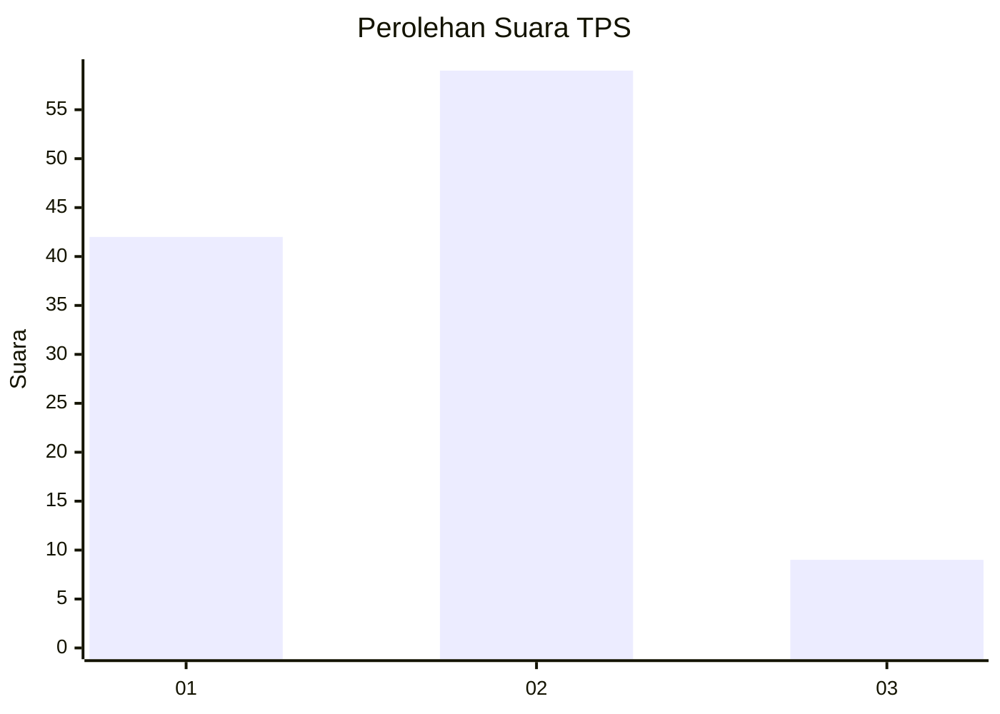
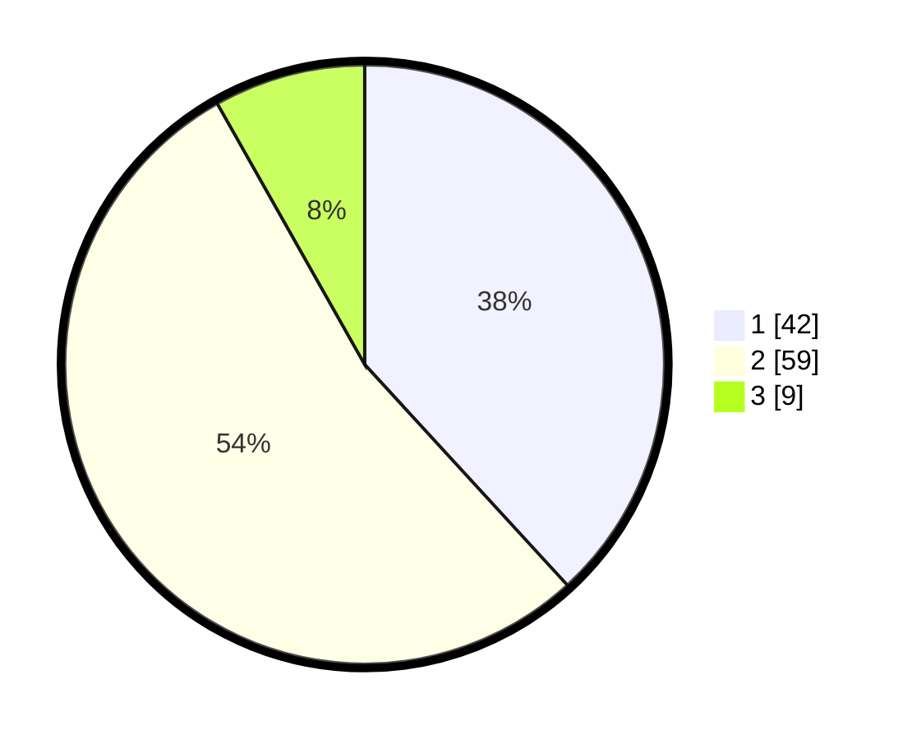

# Hasil

## Grafik

## Tabel

| No. | Nama Paslon    | Suara | Suara (raw) | Persentase |
|:--- |:-------------- | -----:| -----------:| ----------:|
| 1   | ANIES MUHAIMIN | 42    | [42][p-1]   | 38,18      |
| 2   | PRABOWO GIBRAN | 59    | [59][p-2]   | 53,64      |
| 3   | GANJAR MAHFUD  | 9     | [9][p-3]    | 8,18       |

[p-1]: https://github.com/gigit-pemilu/pemilu-2024-16-sumatera-selatan/blob/main/pilpres/hitung-suara/sub/16-sumatera-selatan/sub/71-kota-palembang/sub/13-kertapati/sub/1001-kemasrindo/sub/010-tps/sub/paslon-1.txt
[p-2]: https://github.com/gigit-pemilu/pemilu-2024-16-sumatera-selatan/blob/main/pilpres/hitung-suara/sub/16-sumatera-selatan/sub/71-kota-palembang/sub/13-kertapati/sub/1001-kemasrindo/sub/010-tps/sub/paslon-2.txt
[p-3]: https://github.com/gigit-pemilu/pemilu-2024-16-sumatera-selatan/blob/main/pilpres/hitung-suara/sub/16-sumatera-selatan/sub/71-kota-palembang/sub/13-kertapati/sub/1001-kemasrindo/sub/010-tps/sub/paslon-3.txt

## Foto C Plano

https://sirekap-obj-formc.kpu.go.id/894a/pemilu/ppwp/16/71/13/10/01/1671131001010-20240215-044105--b987e1f3-ccbb-4114-ac44-65f405d8db12.jpg

https://sirekap-obj-formc.kpu.go.id/894a/pemilu/ppwp/16/71/13/10/01/1671131001010-20240215-044144--e4556228-4573-4c48-b529-342277e55ee0.jpg

https://sirekap-obj-formc.kpu.go.id/894a/pemilu/ppwp/16/71/13/10/01/1671131001010-20240215-044241--2e9b0cc5-a553-429b-a099-db2101ffa752.jpg

## Metadata

| Key        | Value               |
| ---------- | ------------------- |
| Time Stamp | 2024-02-24 23:00:00 |

