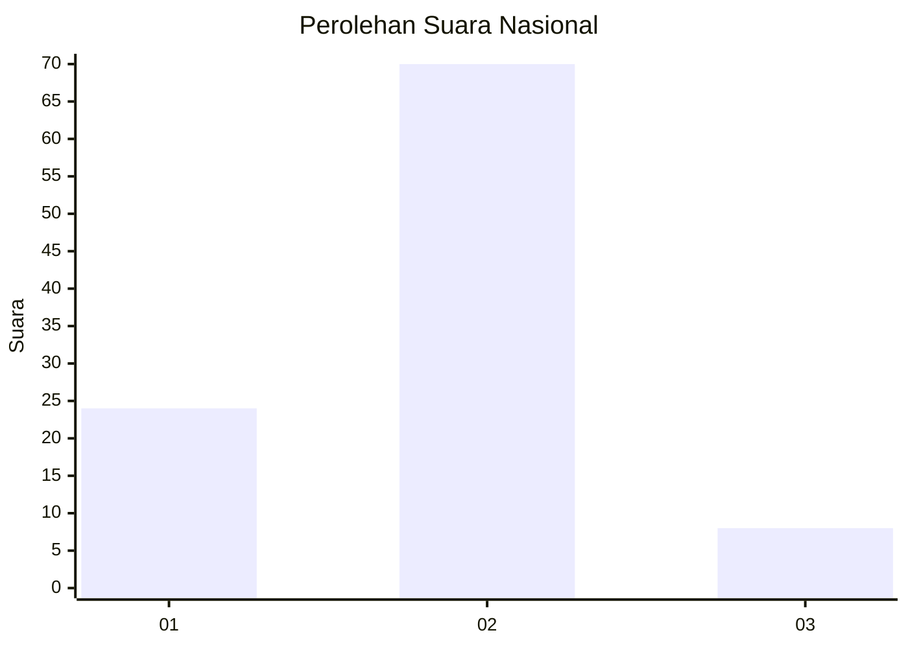
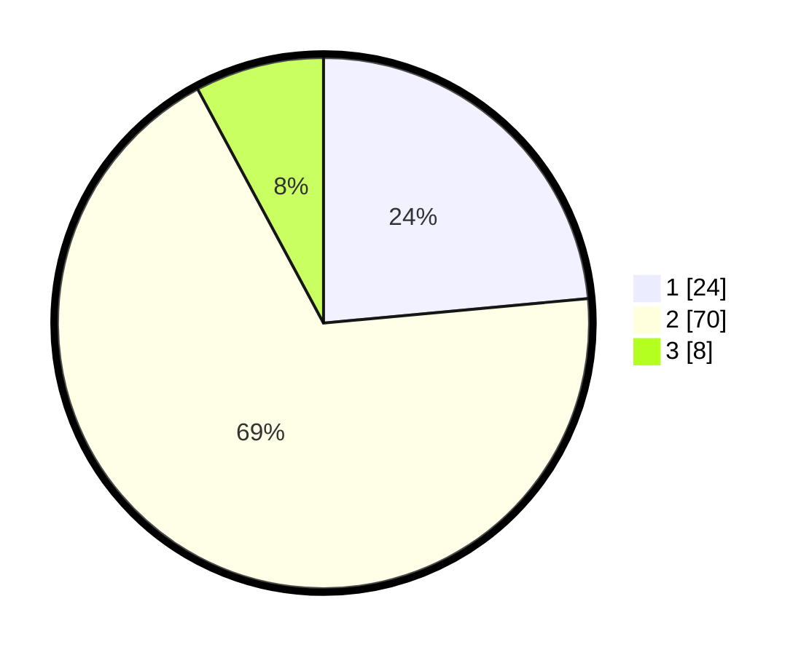

# Hasil

## Grafik

## Tabel

| No. | Nama Paslon    | Suara | Suara (raw) | Persentase |
|:--- |:-------------- | -----:| -----------:| ----------:|
| 1   | ANIES MUHAIMIN | 24    | [24][p-1]   | 23,53      |
| 2   | PRABOWO GIBRAN | 70    | [70][p-2]   | 68,63      |
| 3   | GANJAR MAHFUD  | 8     | [8][p-3]    | 7,84       |

[p-1]: https://github.com/gigit-pemilu/pemilu-2024/blob/main/pilpres/hitung-suara/sub/16-sumatera-selatan/sub/71-kota-palembang/sub/13-kertapati/sub/1002-kemangagung/sub/019-tps/sub/paslon-1.txt
[p-2]: https://github.com/gigit-pemilu/pemilu-2024/blob/main/pilpres/hitung-suara/sub/16-sumatera-selatan/sub/71-kota-palembang/sub/13-kertapati/sub/1002-kemangagung/sub/019-tps/sub/paslon-2.txt
[p-3]: https://github.com/gigit-pemilu/pemilu-2024/blob/main/pilpres/hitung-suara/sub/16-sumatera-selatan/sub/71-kota-palembang/sub/13-kertapati/sub/1002-kemangagung/sub/019-tps/sub/paslon-3.txt

## Foto C Plano

https://sirekap-obj-formc.kpu.go.id/7d45/pemilu/ppwp/16/71/13/10/02/1671131002019-20240214-211842--21ac7301-23bd-4e61-a01d-b6e74eecfc5e.jpg

https://sirekap-obj-formc.kpu.go.id/7d45/pemilu/ppwp/16/71/13/10/02/1671131002019-20240214-212253--2c187401-6b87-4a7e-8669-04c8ed7d02d8.jpg

https://sirekap-obj-formc.kpu.go.id/7d45/pemilu/ppwp/16/71/13/10/02/1671131002019-20240214-212631--766d44ea-f0db-4d3d-a68e-b99542abab9a.jpg

## Metadata

| Key        | Value               |
| ---------- | ------------------- |
| Time Stamp | 2024-02-24 22:31:28 |

