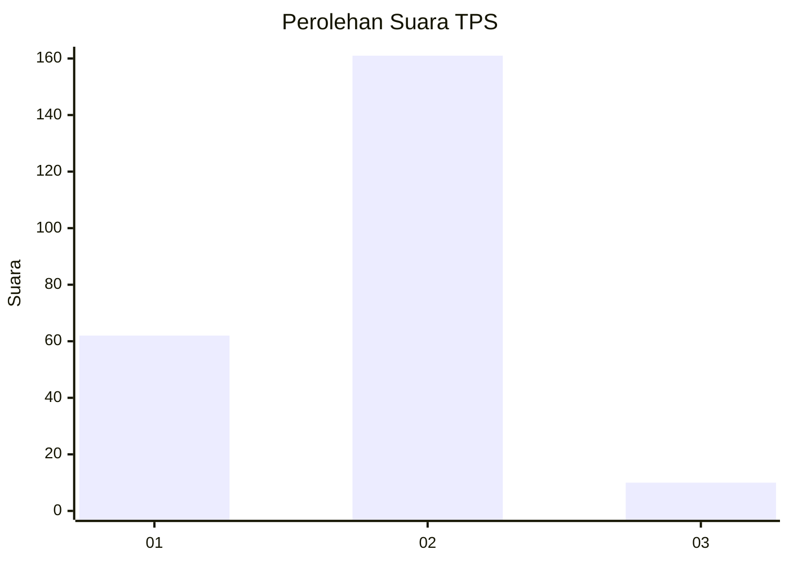
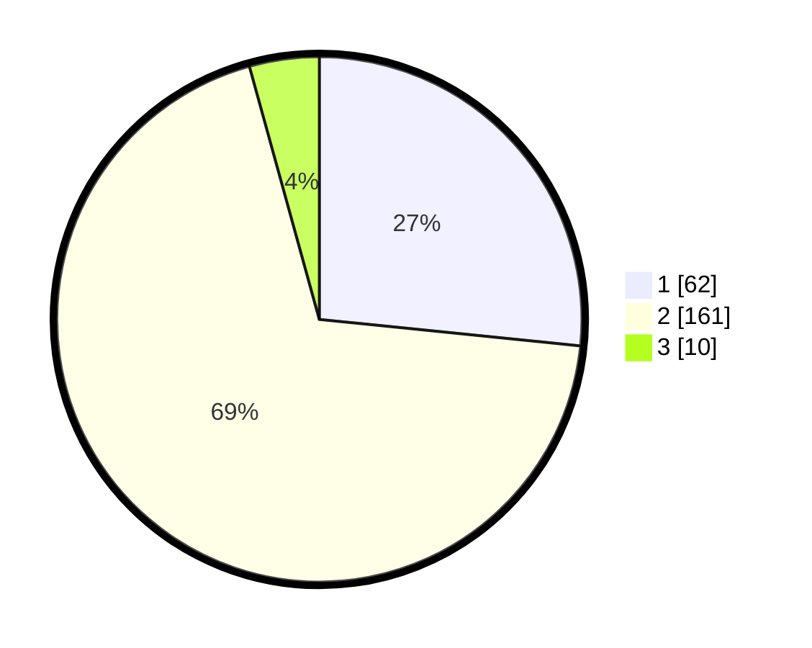

# Hasil

## Grafik

## Tabel

| No. | Nama Paslon    | Suara | Suara (raw) | Persentase |
|:--- |:-------------- | -----:| -----------:| ----------:|
| 1   | ANIES MUHAIMIN | 62    | [62][p-1]   | 26,61      |
| 2   | PRABOWO GIBRAN | 161   | [161][p-2]  | 69,10      |
| 3   | GANJAR MAHFUD  | 10    | [10][p-3]   | 4,29       |

[p-1]: https://github.com/gigit-pemilu/pemilu-2024-16-sumatera-selatan/blob/main/pilpres/hitung-suara/sub/16-sumatera-selatan/sub/71-kota-palembang/sub/13-kertapati/sub/1002-kemangagung/sub/037-tps/sub/paslon-1.txt
[p-2]: https://github.com/gigit-pemilu/pemilu-2024-16-sumatera-selatan/blob/main/pilpres/hitung-suara/sub/16-sumatera-selatan/sub/71-kota-palembang/sub/13-kertapati/sub/1002-kemangagung/sub/037-tps/sub/paslon-2.txt
[p-3]: https://github.com/gigit-pemilu/pemilu-2024-16-sumatera-selatan/blob/main/pilpres/hitung-suara/sub/16-sumatera-selatan/sub/71-kota-palembang/sub/13-kertapati/sub/1002-kemangagung/sub/037-tps/sub/paslon-3.txt

## Foto C Plano

https://sirekap-obj-formc.kpu.go.id/c5a5/pemilu/ppwp/16/71/13/10/02/1671131002037-20240214-233023--f2275ac9-2cdf-4e33-a585-6ec700c84721.jpg

https://sirekap-obj-formc.kpu.go.id/c5a5/pemilu/ppwp/16/71/13/10/02/1671131002037-20240214-233128--3c7bab86-9abb-4ca0-b2ce-ce85c8d5355b.jpg

https://sirekap-obj-formc.kpu.go.id/c5a5/pemilu/ppwp/16/71/13/10/02/1671131002037-20240214-233306--21de772a-ebc7-4803-97ba-e4133cc3a70c.jpg

## Metadata

| Key        | Value               |
| ---------- | ------------------- |
| Time Stamp | 2024-02-19 06:16:00 |

## DATA PEMILIH TETAP

Jumlah pemilih dalam DPT: **540**.
 * L: **819**.
 * P: **127**.

## DATA PENGGUNA HAK PILIH

Jumlah pengguna hak pilih dalam DPT: **220**.
 * L: **556**.
 * P: **0**.

Jumlah pengguna hak pilih dalam DPTb: **20**.
 * L: **556**.
 * P: **505**.

Jumlah pengguna hak pilih dalam DPK: **0**.
 * L: **756**.
 * P: **505**.

Jumlah pengguna hak pilih: **0**.
 * L: **0**.
 * P: **5**.

## JUMLAH SUARA SAH DAN TIDAK SAH

JUMLAH SELURUH SUARA SAH: **233**.

JUMLAH SUARA TIDAK SAH: **3**.

JUMLAH SELURUH SUARA SAH DAN SUARA TIDAK SAH: **236**.

