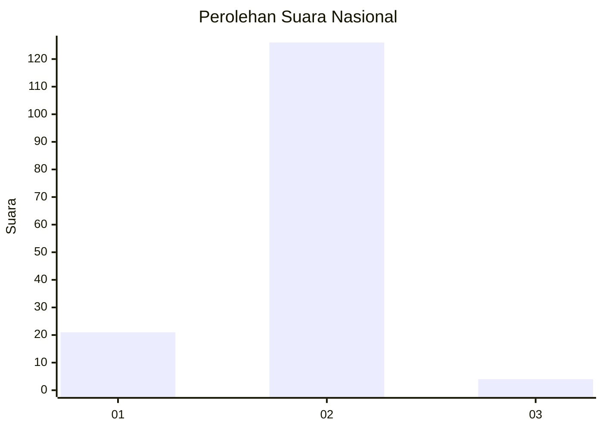
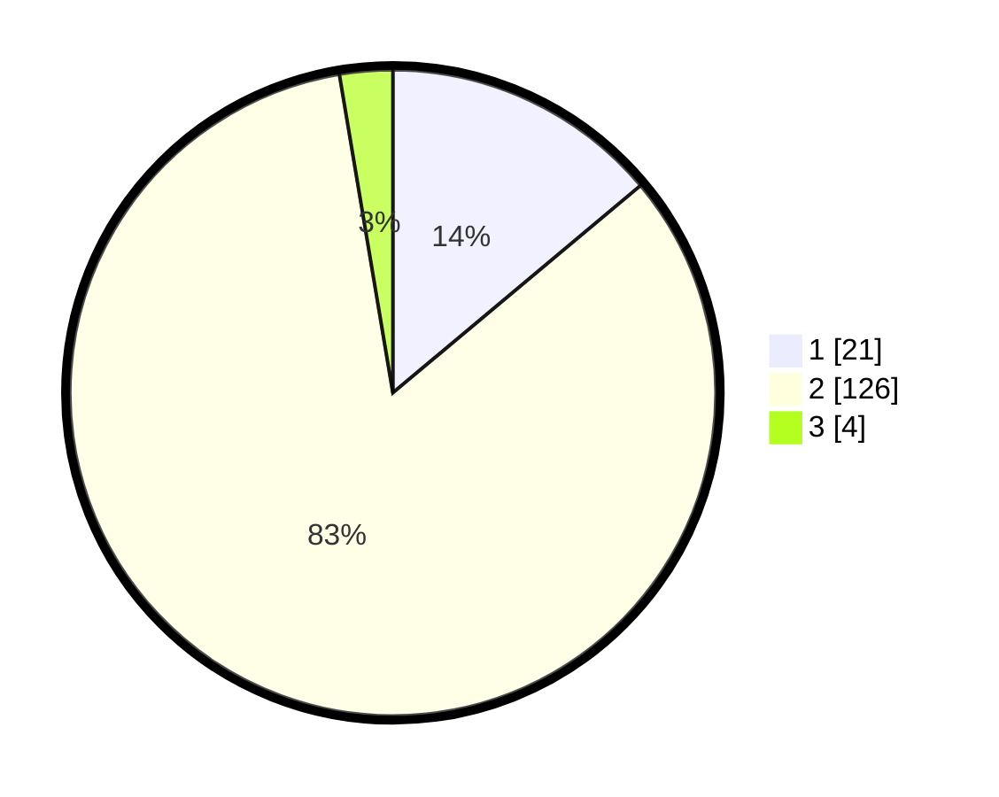

# Hasil

## Grafik

## Tabel

| No. | Nama Paslon    | Suara | Suara (raw) | Persentase |
|:--- |:-------------- | -----:| -----------:| ----------:|
| 1   | ANIES MUHAIMIN | 21    | [21][p-1]   | 13,91      |
| 2   | PRABOWO GIBRAN | 126   | [126][p-2]  | 83,44      |
| 3   | GANJAR MAHFUD  | 4     | [4][p-3]    | 2,65       |

[p-1]: https://github.com/gigit-pemilu/pemilu-2024/blob/main/pilpres/hitung-suara/sub/16-sumatera-selatan/sub/71-kota-palembang/sub/13-kertapati/sub/1003-keramasan/sub/036-tps/sub/paslon-1.txt
[p-2]: https://github.com/gigit-pemilu/pemilu-2024/blob/main/pilpres/hitung-suara/sub/16-sumatera-selatan/sub/71-kota-palembang/sub/13-kertapati/sub/1003-keramasan/sub/036-tps/sub/paslon-2.txt
[p-3]: https://github.com/gigit-pemilu/pemilu-2024/blob/main/pilpres/hitung-suara/sub/16-sumatera-selatan/sub/71-kota-palembang/sub/13-kertapati/sub/1003-keramasan/sub/036-tps/sub/paslon-3.txt

## Foto C Plano

https://sirekap-obj-formc.kpu.go.id/a628/pemilu/ppwp/16/71/13/10/03/1671131003036-20240215-100325--ee1c1de3-7fdb-4856-bb3a-92e678e4a795.jpg

https://sirekap-obj-formc.kpu.go.id/a628/pemilu/ppwp/16/71/13/10/03/1671131003036-20240217-133800--6f2d21a9-5501-4225-9d15-db06baa9af26.jpg

https://sirekap-obj-formc.kpu.go.id/a628/pemilu/ppwp/16/71/13/10/03/1671131003036-20240215-100355--8bf91fe7-fa1b-47b4-a358-281930b04af4.jpg

## Metadata

| Key        | Value               |
| ---------- | ------------------- |
| Time Stamp | 2024-02-17 13:42:09 |

