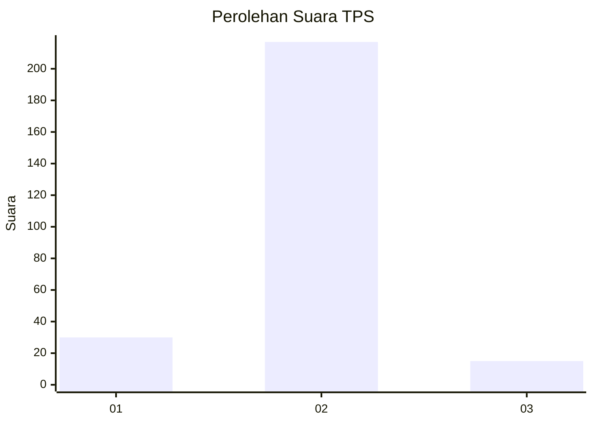
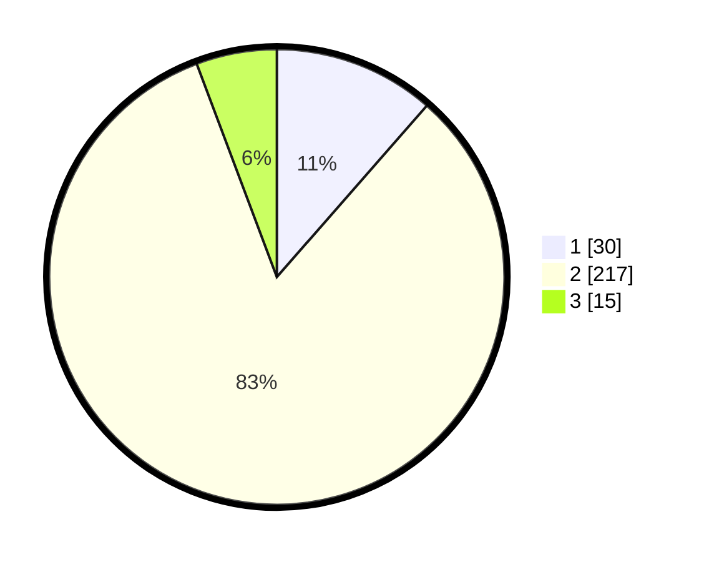

# Hasil

## Grafik

## Tabel

| No. | Nama Paslon    | Suara | Suara (raw) | Persentase |
|:--- |:-------------- | -----:| -----------:| ----------:|
| 1   | ANIES MUHAIMIN | 30    | [30][p-1]   | 11,45      |
| 2   | PRABOWO GIBRAN | 217   | [217][p-2]  | 82,82      |
| 3   | GANJAR MAHFUD  | 15    | [15][p-3]   | 5,73       |

[p-1]: https://github.com/gigit-pemilu/pemilu-2024-16-sumatera-selatan/blob/main/pilpres/hitung-suara/sub/16-sumatera-selatan/sub/71-kota-palembang/sub/13-kertapati/sub/1005-karyajaya/sub/004-tps/sub/paslon-1.txt
[p-2]: https://github.com/gigit-pemilu/pemilu-2024-16-sumatera-selatan/blob/main/pilpres/hitung-suara/sub/16-sumatera-selatan/sub/71-kota-palembang/sub/13-kertapati/sub/1005-karyajaya/sub/004-tps/sub/paslon-2.txt
[p-3]: https://github.com/gigit-pemilu/pemilu-2024-16-sumatera-selatan/blob/main/pilpres/hitung-suara/sub/16-sumatera-selatan/sub/71-kota-palembang/sub/13-kertapati/sub/1005-karyajaya/sub/004-tps/sub/paslon-3.txt

## Foto C Plano

https://sirekap-obj-formc.kpu.go.id/8d1f/pemilu/ppwp/16/71/13/10/05/1671131005004-20240218-214356--0147951b-f6ab-454d-8616-8288fb64eb34.jpg

https://sirekap-obj-formc.kpu.go.id/8d1f/pemilu/ppwp/16/71/13/10/05/1671131005004-20240218-214042--5551a771-045f-4e98-bc25-aac2756943d2.jpg

https://sirekap-obj-formc.kpu.go.id/8d1f/pemilu/ppwp/16/71/13/10/05/1671131005004-20240218-214839--679a6c2c-d5c4-46fc-85d6-e63d6866f916.jpg

## Metadata

| Key        | Value               |
| ---------- | ------------------- |
| Time Stamp | 2024-02-19 06:16:00 |

## DATA PEMILIH TETAP

Jumlah pemilih dalam DPT: **0**.
 * L: **143**.
 * P: **535**.

## DATA PENGGUNA HAK PILIH

Jumlah pengguna hak pilih dalam DPT: **0**.
 * L: **110**.
 * P: **160**.

Jumlah pengguna hak pilih dalam DPTb: **220**.
 * L: **0**.
 * P: **555**.

Jumlah pengguna hak pilih dalam DPK: **4**.
 * L: **6**.
 * P: **20**.

Jumlah pengguna hak pilih: **617**.
 * L: **0**.
 * P: **11**.

## JUMLAH SUARA SAH DAN TIDAK SAH

JUMLAH SELURUH SUARA SAH: **257**.

JUMLAH SUARA TIDAK SAH: **10**.

JUMLAH SELURUH SUARA SAH DAN SUARA TIDAK SAH: **267**.

