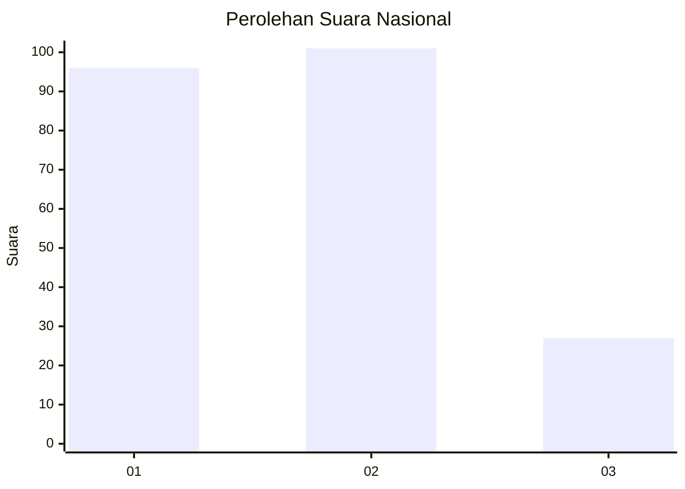
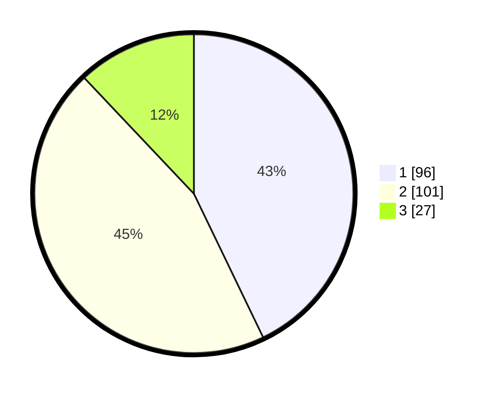

# Hasil

## Grafik

## Tabel

| No. | Nama Paslon    | Suara | Suara (raw) | Persentase |
|:--- |:-------------- | -----:| -----------:| ----------:|
| 1   | ANIES MUHAIMIN | 96    | [96][p-1]   | 42,86      |
| 2   | PRABOWO GIBRAN | 101   | [101][p-2]  | 45,09      |
| 3   | GANJAR MAHFUD  | 27    | [27][p-3]   | 12,05      |

[p-1]: https://github.com/gigit-pemilu/pemilu-2024/blob/main/pilpres/hitung-suara/sub/16-sumatera-selatan/sub/71-kota-palembang/sub/14-plaju/sub/1001-plaju-ulu/sub/005-tps/sub/paslon-1.txt
[p-2]: https://github.com/gigit-pemilu/pemilu-2024/blob/main/pilpres/hitung-suara/sub/16-sumatera-selatan/sub/71-kota-palembang/sub/14-plaju/sub/1001-plaju-ulu/sub/005-tps/sub/paslon-2.txt
[p-3]: https://github.com/gigit-pemilu/pemilu-2024/blob/main/pilpres/hitung-suara/sub/16-sumatera-selatan/sub/71-kota-palembang/sub/14-plaju/sub/1001-plaju-ulu/sub/005-tps/sub/paslon-3.txt

## Foto C Plano

https://sirekap-obj-formc.kpu.go.id/4ddc/pemilu/ppwp/16/71/14/10/01/1671141001005-20240219-124239--b14fdebb-1296-42d4-a4a2-98bdf316d43a.jpg

https://sirekap-obj-formc.kpu.go.id/4ddc/pemilu/ppwp/16/71/14/10/01/1671141001005-20240219-123223--a417f483-1b06-4224-b3e4-95ef3afe5a18.jpg

https://sirekap-obj-formc.kpu.go.id/4ddc/pemilu/ppwp/16/71/14/10/01/1671141001005-20240219-124221--b576b964-1164-43af-9348-88792da39bb6.jpg

## Metadata

| Key        | Value               |
| ---------- | ------------------- |
| Time Stamp | 2024-02-25 00:00:00 |

