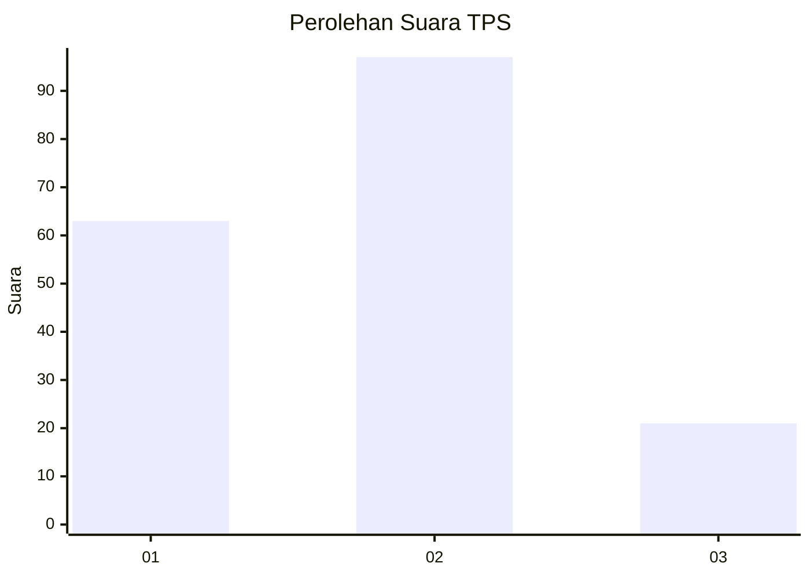
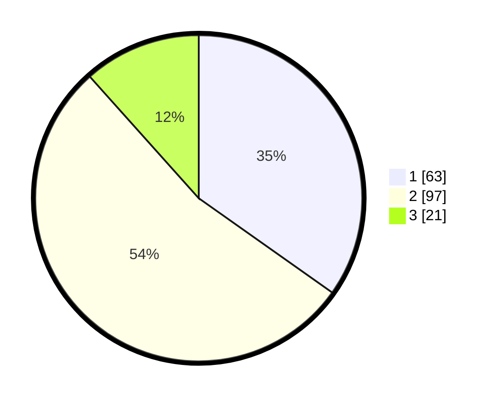

# Hasil

## Grafik

## Tabel

| No. | Nama Paslon    | Suara | Suara (raw) | Persentase |
|:--- |:-------------- | -----:| -----------:| ----------:|
| 1   | ANIES MUHAIMIN | 63    | [63][p-1]   | 34,81      |
| 2   | PRABOWO GIBRAN | 97    | [97][p-2]   | 53,59      |
| 3   | GANJAR MAHFUD  | 21    | [21][p-3]   | 11,60      |

[p-1]: https://github.com/gigit-pemilu/pemilu-2024-16-sumatera-selatan/blob/main/pilpres/hitung-suara/sub/16-sumatera-selatan/sub/71-kota-palembang/sub/14-plaju/sub/1001-plaju-ulu/sub/027-tps/sub/paslon-1.txt
[p-2]: https://github.com/gigit-pemilu/pemilu-2024-16-sumatera-selatan/blob/main/pilpres/hitung-suara/sub/16-sumatera-selatan/sub/71-kota-palembang/sub/14-plaju/sub/1001-plaju-ulu/sub/027-tps/sub/paslon-2.txt
[p-3]: https://github.com/gigit-pemilu/pemilu-2024-16-sumatera-selatan/blob/main/pilpres/hitung-suara/sub/16-sumatera-selatan/sub/71-kota-palembang/sub/14-plaju/sub/1001-plaju-ulu/sub/027-tps/sub/paslon-3.txt

## Foto C Plano

https://sirekap-obj-formc.kpu.go.id/12a0/pemilu/ppwp/16/71/14/10/01/1671141001027-20240215-023122--b0d5b9dc-ed2a-4ca6-b607-9986abc74529.jpg

https://sirekap-obj-formc.kpu.go.id/12a0/pemilu/ppwp/16/71/14/10/01/1671141001027-20240215-212752--4e0d6609-aa4f-4332-8a6f-205be01df101.jpg

https://sirekap-obj-formc.kpu.go.id/12a0/pemilu/ppwp/16/71/14/10/01/1671141001027-20240214-185144--e617f3f9-d8f4-4d25-bcbb-8e772ab7fe60.jpg

## Metadata

| Key        | Value               |
| ---------- | ------------------- |
| Time Stamp | 2024-02-25 00:00:00 |

