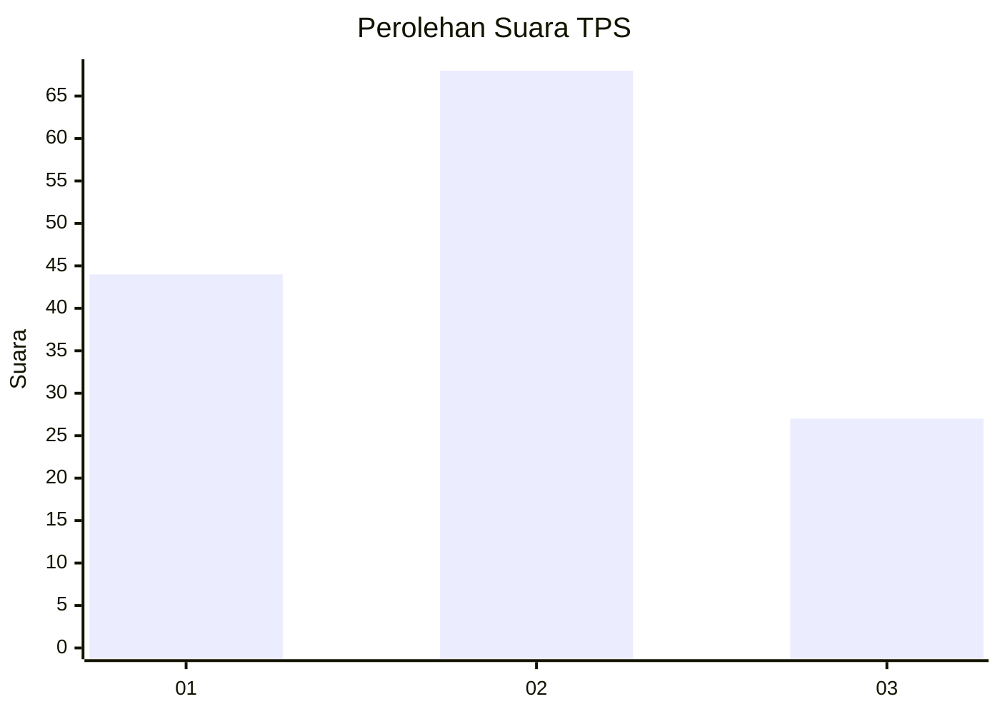
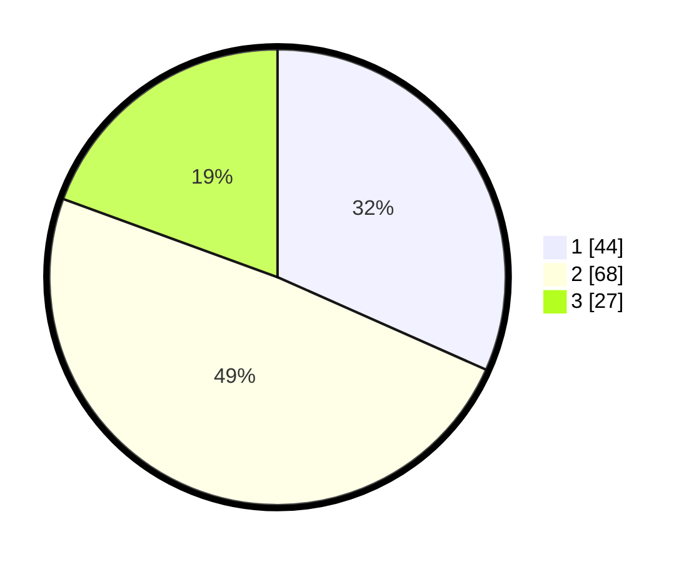

# Hasil

## Grafik

## Tabel

| No. | Nama Paslon    | Suara | Suara (raw) | Persentase |
|:--- |:-------------- | -----:| -----------:| ----------:|
| 1   | ANIES MUHAIMIN | 44    | [44][p-1]   | 31,65      |
| 2   | PRABOWO GIBRAN | 68    | [68][p-2]   | 48,92      |
| 3   | GANJAR MAHFUD  | 27    | [27][p-3]   | 19,42      |

[p-1]: https://github.com/gigit-pemilu/pemilu-2024-16-sumatera-selatan/blob/main/pilpres/hitung-suara/sub/16-sumatera-selatan/sub/71-kota-palembang/sub/14-plaju/sub/1002-plaju-darat/sub/013-tps/sub/paslon-1.txt
[p-2]: https://github.com/gigit-pemilu/pemilu-2024-16-sumatera-selatan/blob/main/pilpres/hitung-suara/sub/16-sumatera-selatan/sub/71-kota-palembang/sub/14-plaju/sub/1002-plaju-darat/sub/013-tps/sub/paslon-2.txt
[p-3]: https://github.com/gigit-pemilu/pemilu-2024-16-sumatera-selatan/blob/main/pilpres/hitung-suara/sub/16-sumatera-selatan/sub/71-kota-palembang/sub/14-plaju/sub/1002-plaju-darat/sub/013-tps/sub/paslon-3.txt

## Foto C Plano

https://sirekap-obj-formc.kpu.go.id/c5e6/pemilu/ppwp/16/71/14/10/02/1671141002013-20240221-143926--d781c9a4-da39-43b5-82a7-8426e942e664.jpg

https://sirekap-obj-formc.kpu.go.id/c5e6/pemilu/ppwp/16/71/14/10/02/1671141002013-20240219-203324--b60e260e-7cf2-45e3-9954-fc74ff4074d3.jpg

https://sirekap-obj-formc.kpu.go.id/c5e6/pemilu/ppwp/16/71/14/10/02/1671141002013-20240219-203522--1ad2663f-b3bd-4faa-b0b2-8ebf54c1157e.jpg

## Metadata

| Key        | Value               |
| ---------- | ------------------- |
| Time Stamp | 2024-02-21 15:00:00 |

