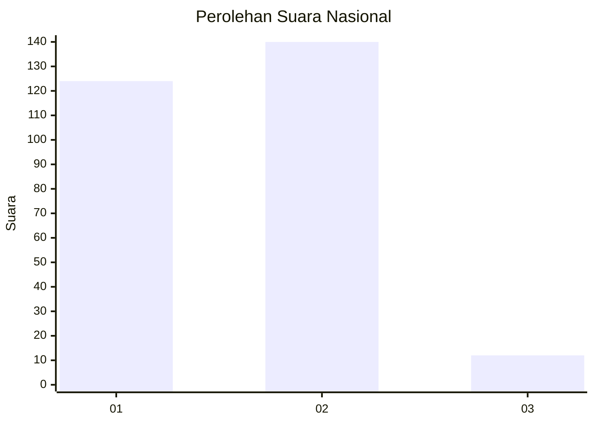
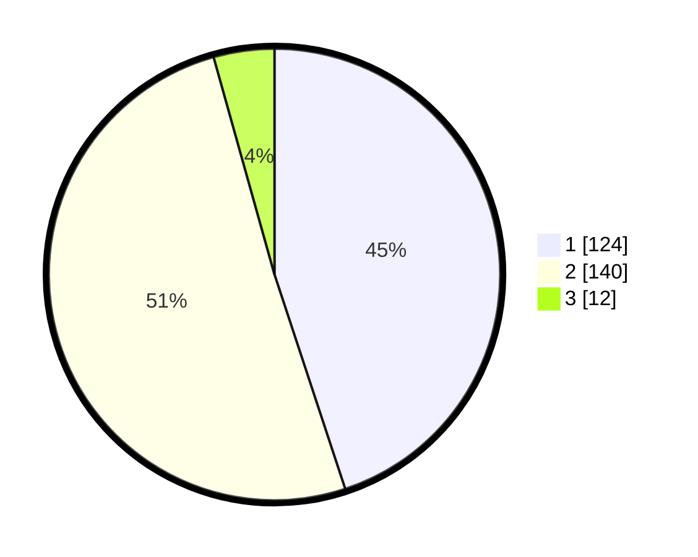

# Hasil

## Grafik

## Tabel

| No. | Nama Paslon    | Suara | Suara (raw) | Persentase |
|:--- |:-------------- | -----:| -----------:| ----------:|
| 1   | ANIES MUHAIMIN | 124   | [124][p-1]  | 44,93      |
| 2   | PRABOWO GIBRAN | 140   | [140][p-2]  | 50,72      |
| 3   | GANJAR MAHFUD  | 12    | [12][p-3]   | 4,35       |

[p-1]: https://github.com/gigit-pemilu/pemilu-2024/blob/main/pilpres/hitung-suara/sub/16-sumatera-selatan/sub/71-kota-palembang/sub/14-plaju/sub/1003-plaju-ilir/sub/002-tps/sub/paslon-1.txt
[p-2]: https://github.com/gigit-pemilu/pemilu-2024/blob/main/pilpres/hitung-suara/sub/16-sumatera-selatan/sub/71-kota-palembang/sub/14-plaju/sub/1003-plaju-ilir/sub/002-tps/sub/paslon-2.txt
[p-3]: https://github.com/gigit-pemilu/pemilu-2024/blob/main/pilpres/hitung-suara/sub/16-sumatera-selatan/sub/71-kota-palembang/sub/14-plaju/sub/1003-plaju-ilir/sub/002-tps/sub/paslon-3.txt

## Foto C Plano

https://sirekap-obj-formc.kpu.go.id/eba6/pemilu/ppwp/16/71/14/10/03/1671141003002-20240214-205959--8a54a487-8179-448e-8113-fc0313a441a6.jpg

https://sirekap-obj-formc.kpu.go.id/eba6/pemilu/ppwp/16/71/14/10/03/1671141003002-20240214-141245--4420d0d8-dfc5-4eb7-91d1-d904685865c9.jpg

https://sirekap-obj-formc.kpu.go.id/eba6/pemilu/ppwp/16/71/14/10/03/1671141003002-20240214-210814--47b46ec3-477c-485b-8bcd-89cc7384e1b6.jpg

## Metadata

| Key        | Value               |
| ---------- | ------------------- |
| Time Stamp | 2024-02-15 02:10:27 |

